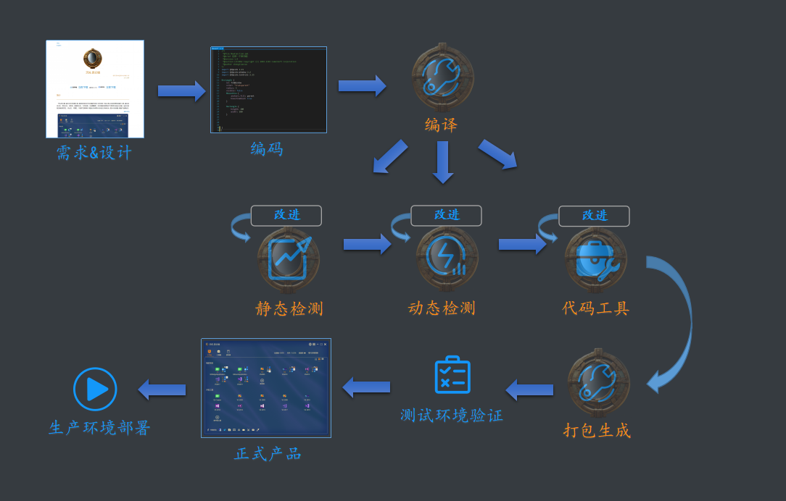

# 天佐.昆仑镜

### 天佐.昆仑镜

||||
|--|--|--|
|操作系统|   ||
|编译器|      ||
|编程语言| ||

# 简介

**天佐.昆仑镜** 强大的本地构建工具, 提供给项目全方位的静态检测, 动态检测, 代码工具以及各种便利的插件工具, 通过词法分析、语法分析、控制流、数据流分析、内存检测、代码覆盖率、热点函数检测等技术对程序代码进行扫描，验证代码是否满足规范性、安全性、可靠性、可维护性等指标. 根据分析结果对代码进行深度优化. 提升代码质量, 增强产品健壮性.

**传说:**
仙人故乡昆仑山中的昆仑天宫中，传说有一面神镜，是拥有自由穿梭时空之力。但在一次仙人的盛会中，神镜被人所偷，至今一直下落不明。

# 目标
搭建一种方便运行的本地构建工具, 集成各种代码检测。

# 功能
- 工作台 项目指标 统计出项目的各种指标, 作为衡量项目复杂度的部分标准
- 工作台 编译运行 可以手动或自动化编译项目
- 工作台 静态检测 通过词法分析、语法分析、控制流、数据流分析等技术对程序代码进行扫描，检查代码和设计的一致性，代码对标准的遵循、可读性，代码的逻辑表达的正确性，代码结构的合理性等方面
- 工作台 动态检测 通过内存检测、代码覆盖率、热点函数检测等技术根据分析结果对代码进行深度优化. 提升代码质量, 增强产品健壮性
- 工作台 代码工具 自动化代码格式化, 生成项目文档
- 工具箱 涵盖通讯/图形/设计/转换/生成/杂项等各方面的小工具
- 资料袋 可记录平时常用的代码到资料袋, 随时查阅浏览拷贝

# 截图

### 支持
#### 支持内容 

||||
|--|--|--|
|名称|支持|开发中|
|操作系统|||
|编程语言|||
|项目类型|||

# 下载

|||||
|--|--|--|--|
|||||
