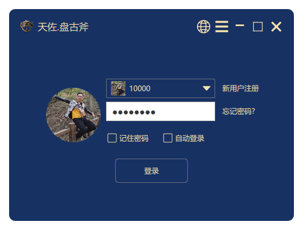
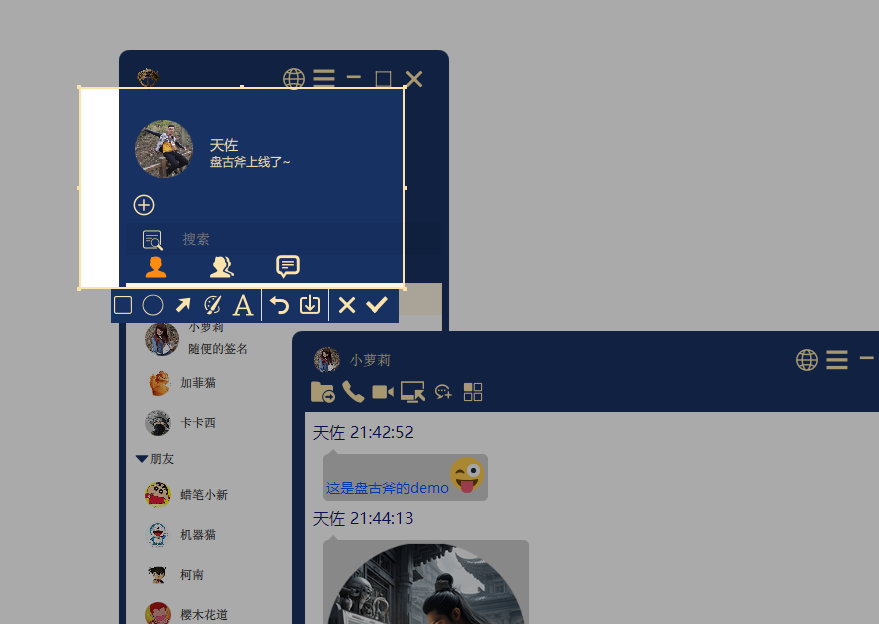
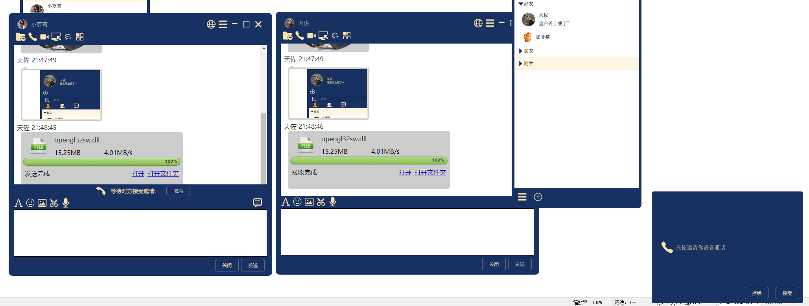
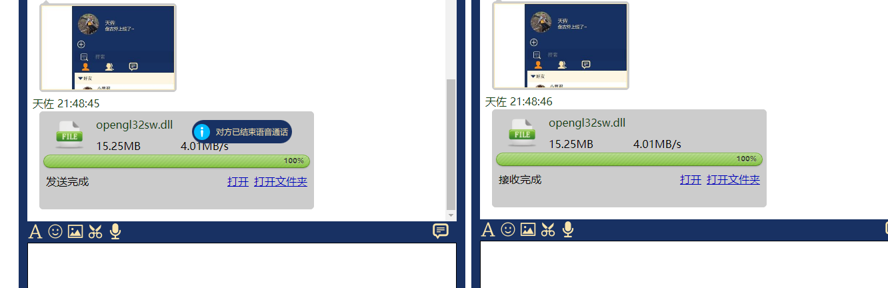
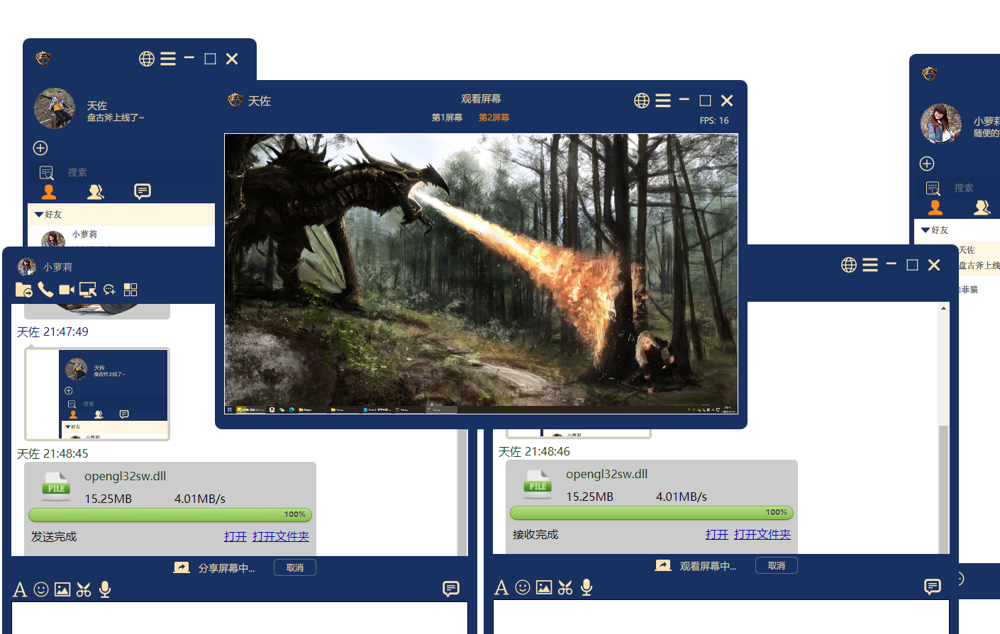
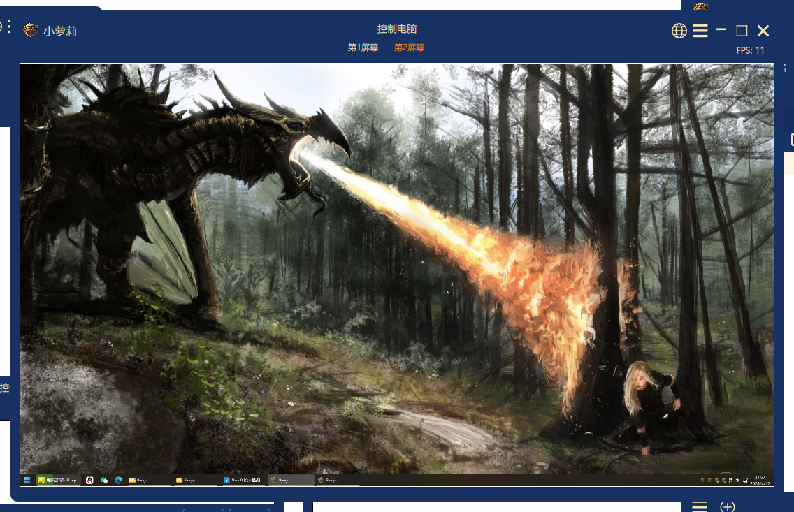

# 天佐.盘古斧

### 天佐.盘古斧

||||
|--|--|--|
|操作系统|    ||
|编译器|       ||
|编程语言| ||

# 简介

**天佐.盘古斧** 即时通讯平台, 采用自主研发的分布式存储与UDP可靠P2P网络传输技术, 自主研发的IM通讯协议, 覆盖主流平台, 插件式高扩展性, OpenGL渲染高流畅UI, 支持集成Web应用, 可以私有化部署, 公有云部署.

**传说:**
传说天地混沌之初，盘古由睡梦醒来，见天地晦暗，于是伸手一挥拿出一把巨大的斧子劈开天地，自此才有我们的世界。此斧拥有分天地、穿梭太虚之力，威力不下轩辕剑。传言掌控盘古斧者，可掌控力量法则。

# 目标
搭建CS架构的IM通讯系统，支持文字/表情/图片/语音/视频/远程桌面/远程控制/白板等功能。

# 功能

- 🧩 集成简单
- 📦 支持私有部署
- 🪢 聊天数据点对点加密，自主研发IM协议，网络库使用'天佐.追日靴'软件开发工具包
- 📒 聊天记录本地保存，数据库使用'天佐.乾坤袋'软件开发工具包

# 截图

**天佐.盘古斧demo:**

# 下载

|||||
|--|--|--|--|
|||||
