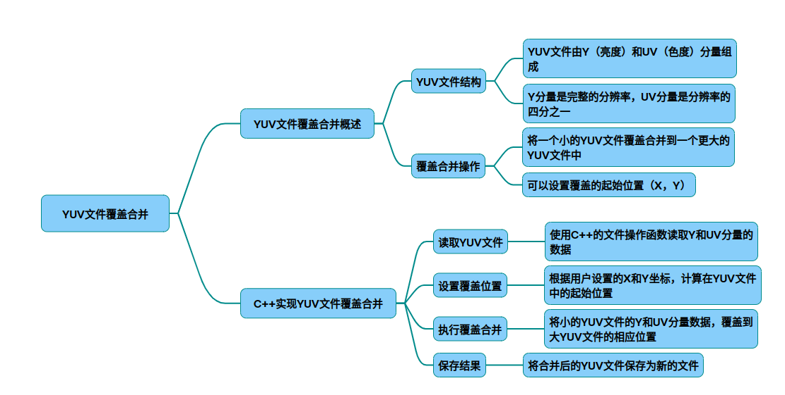

# overlayYUV

以下是一个支持将小尺寸YUV420文件覆盖到更大尺寸YUV420文件指定位置的C++完整实现，支持坐标设置和边界处理：
### 示例代码
~~~cpp
#include <iostream>
#include <fstream>
#include <vector>
#include <algorithm>

struct YUVConfig {
    int width;      // 大文件宽度
    int height;     // 大文件高度
    int small_width;
    int small_height;
    int pos_x;      // 覆盖起始X坐标
    int pos_y;      // 覆盖起始Y坐标
    std::string format = "I420"; // 支持I420/NV12格式
};

bool overlayYUV(const std::string& dst_file, 
                const std::string& src_file,
                const YUVConfig& config) 
{
    // 计算各分量尺寸
    const int y_size = config.width  * config.height; 
    const int uv_size = y_size / 4;
    const int total_size = y_size + 2 * uv_size;

    // 读取大文件
    std::ifstream fin_dst(dst_file, std::ios::binary);
    if (!fin_dst) return false;
    std::vector<uint8_t> dst_data(total_size);
    fin_dst.read(reinterpret_cast<char*>(dst_data.data()),  total_size);

    // 读取小文件
    std::ifstream fin_src(src_file, std::ios::binary);
    if (!fin_src) return false;
    std::vector<uint8_t> src_data(y_size + 2*(config.small_width*config.small_height)/4); 
    fin_src.read(reinterpret_cast<char*>(src_data.data()),  src_data.size()); 

    // Y分量覆盖处理
    const int copy_width = std::min(config.small_width,  
                                  config.width  - config.pos_x); 
    const int copy_height = std::min(config.small_height,  
                                   config.height  - config.pos_y); 
    
    // 处理Y平面
    for (int row = 0; row < copy_height; ++row) {
        auto* dst_start = dst_data.data()  + 
                         (config.pos_y  + row) * config.width  + config.pos_x; 
        auto* src_start = src_data.data()  + row * config.small_width; 
        std::copy_n(src_start, copy_width, dst_start);
    }

    // UV分量处理（I420格式）
    if (config.format  == "I420") {
        // U分量偏移计算
        const int uv_offset = y_size;
        const int uv_pos_x = config.pos_x  / 2;
        const int uv_pos_y = config.pos_y  / 2;
        const int uv_src_width = config.small_width  / 2;
        const int uv_src_height = config.small_height  / 2;

        // 处理U平面
        for (int row = 0; row < uv_src_height; ++row) {
            auto* dst_u = dst_data.data()  + uv_offset + 
                         (uv_pos_y + row) * (config.width/2)  + uv_pos_x;
            auto* src_u = src_data.data()  + y_size + row * uv_src_width;
            std::copy_n(src_u, uv_src_width, dst_u);
        }

        // 处理V平面
        const int v_offset = y_size + uv_size;
        for (int row = 0; row < uv_src_height; ++row) {
            auto* dst_v = dst_data.data()  + v_offset + 
                         (uv_pos_y + row) * (config.width/2)  + uv_pos_x;
            auto* src_v = src_data.data()  + y_size + uv_src_width*uv_src_height + 
                         row * uv_src_width;
            std::copy_n(src_v, uv_src_width, dst_v);
        }
    }
    // NV12格式处理（UV交织）
    else if (config.format  == "NV12") {
        const int uv_offset = y_size;
        const int uv_pos_x = config.pos_x  / 2;
        const int uv_pos_y = config.pos_y  / 2;
        const int uv_stride = config.width; 

        for (int row = 0; row < config.small_height/2;  ++row) {
            auto* dst_uv = dst_data.data()  + uv_offset + 
                          (uv_pos_y + row) * uv_stride + uv_pos_x*2;
            auto* src_uv = src_data.data()  + y_size + row * config.small_width; 
            std::copy_n(src_uv, config.small_width,  dst_uv);
        }
    }

    // 写入结果文件
    std::ofstream fout("output.yuv",  std::ios::binary);
    fout.write(reinterpret_cast<char*>(dst_data.data()),  dst_data.size()); 
    return true;
}

int main() {
    YUVConfig config;
    config.width  = 1920;
    config.height  = 1080;
    config.small_width  = 640;
    config.small_height  = 480;
    config.pos_x  = 100;
    config.pos_y  = 200;
    config.format  = "I420"; // 或"NV12"

    if (overlayYUV("big.yuv",  "small.yuv",  config)) {
        std::cout << "Overlay completed. Saved to output.yuv"  << std::endl;
    } else {
        std::cerr << "Error processing files" << std::endl;
    }
    return 0;
}
~~~
关键特性说明 ：
* 格式兼容性：支持YUV420的I420和NV12格式，通过format参数切换：

  * I420：Y平面 + U平面 + V平面
  * NV12：Y平面 + 交织的UV平面

坐标系统：
~~~cpp
pos_x, pos_y  // 覆盖起始坐标（以Y分量坐标系为基准）
uv_pos_x = pos_x / 2  // UV分量坐标自动折半计算
~~~

边界处理：
~~~cpp
copy_width = min(小图宽度, 大图宽度 - x坐标)  // 自动裁剪越界部分
~~~

内存优化：使用std::vector<uint8_t>存储数据，避免动态内存分配问题

### 使用建议：
参数设置需满足：
~~~cpp
small_width <= (width - pos_x) * 2    // 色度分量对齐要求
~~~

验证输出文件：
~~~bash
ffplay -video_size 1920x1080 -pixel_format nv12 output.yuv 
~~~

性能优化方向：

* 使用内存映射文件处理大尺寸文件
* 多线程处理Y/UV分量
* SIMD指令优化数据拷贝

完整实现考虑了YUV420格式的色度采样特性，通过坐标折半计算实现准确的色度分量定位，同时包含了对不同存储格式的适配逻辑。边界处理机制确保覆盖操作不会导致内存越界。

## 完整代码
[Github](https://github.com/zhengtianzuo/zhengtianzuo.github.io/tree/master/code/032-overlayYUV)
