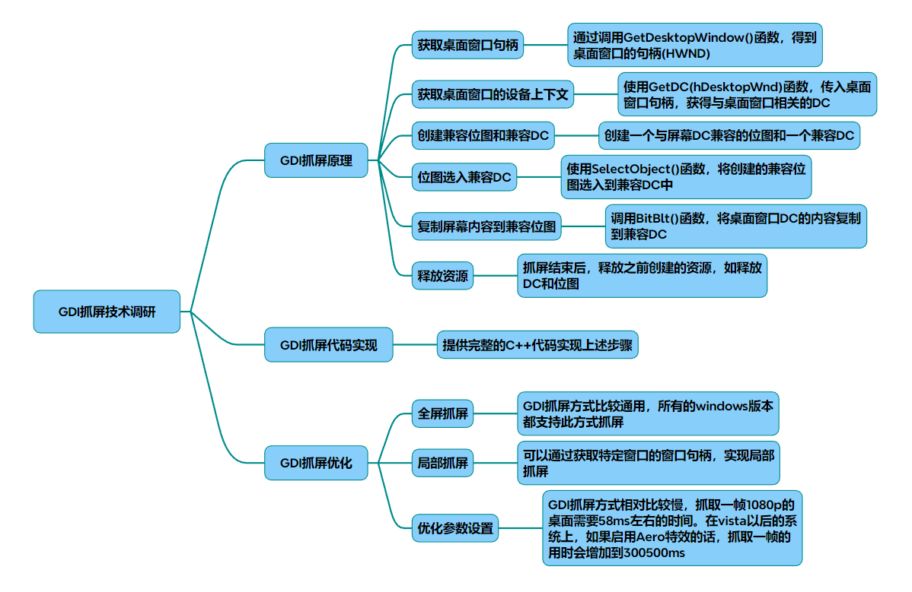

# Windows抓屏-GDI

### 一、技术原理
GDI（Graphics Device Interface）抓屏基于Windows系统提供的图形设备接口，通过设备上下文（DC）

实现屏幕内容捕获。核心流程如下：

#### 获取桌面窗口句柄：通过

~~~cpp
//获取整个屏幕的句柄
GetDesktopWindow()
~~~

#### 获取设备上下文：使用

~~~cpp
//获取屏幕DC
GetDC()
~~~

#### 创建兼容DC和位图：通过

~~~cpp
//创建与屏幕DC兼容的绘图环境
CreateCompatibleDC()
CreateCompatibleBitmap()
~~~

#### 位图选入兼容DC：使用

~~~cpp
//将位图绑定到兼容DC
SelectObject()
~~~

#### 复制屏幕内容：通过

~~~cpp
//将屏幕DC内容复制到兼容位图
BitBlt()
~~~

#### 释放资源：使用

~~~cpp
//释放资源
DeleteDC()
ReleaseDC()
~~~

流程图

~~~mermaid
graph TD
A[获取桌面窗口句柄] --> B[获取设备上下文DC]
B --> C[创建兼容DC和位图]
C --> D[复制屏幕数据到兼容位图]
D --> E[保存或处理位图数据]
E --> F[释放资源]
~~~

关键组件

* 窗口句柄（HWND）：通过GetDesktopWindow()获取整个屏幕的句柄。
* 设备上下文（DC）：GetDC()获取桌面DC，用于图形操作。
* 兼容位图（Bitmap）：CreateCompatibleBitmap()创建与屏幕分辨率匹配的位图。
* 数据复制：BitBlt()函数将屏幕像素数据复制到内存位图。

### 二、代码实现
#### 全屏抓取代码
~~~cpp
#include <windows.h>
#include <gdiplus.h>

// 全屏抓取函数
bool CaptureScreen(HWND hWnd, HBITMAP& hBitmap) {
    HDC hScreenDC = GetDC(hWnd);
    HDC hMemoryDC = CreateCompatibleDC(hScreenDC);

    // 获取屏幕分辨率
    int width = GetSystemMetrics(SM_CXSCREEN);
    int height = GetSystemMetrics(SM_CYSCREEN);

    hBitmap = CreateCompatibleBitmap(hScreenDC, width, height);
    HGDIOBJ hOldBitmap = SelectObject(hMemoryDC, hBitmap);

    // 复制屏幕内容
    if (!BitBlt(hMemoryDC, 0, 0, width, height, hScreenDC, 0, 0, SRCCOPY)) {
        DeleteObject(hBitmap);
        return false;
    }

    SelectObject(hMemoryDC, hOldBitmap);
    DeleteDC(hMemoryDC);
    ReleaseDC(hWnd, hScreenDC);
    return true;
}
~~~

#### 局部抓取代码
~~~cpp
// 局部区域抓取（通过窗口句柄）
bool CaptureWindow(HWND hWnd, HBITMAP& hBitmap) {
    if (!hWnd) return false;

    HDC hWindowDC = GetDC(hWnd);
    RECT rect;
    GetWindowRect(hWnd, &rect);
    int width = rect.right  - rect.left; 
    int height = rect.bottom  - rect.top; 

    HDC hMemoryDC = CreateCompatibleDC(hWindowDC);
    hBitmap = CreateCompatibleBitmap(hWindowDC, width, height);
    HGDIOBJ hOldBitmap = SelectObject(hMemoryDC, hBitmap);

    // 转换窗口坐标到屏幕坐标
    POINT pt = {0, 0};
    ScreenToClient(hWnd, &pt);
    if (!BitBlt(hMemoryDC, 0, 0, width, height, hWindowDC, pt.x, pt.y, SRCCOPY)) {
        DeleteObject(hBitmap);
        return false;
    }

    SelectObject(hMemoryDC, hOldBitmap);
    DeleteDC(hMemoryDC);
    ReleaseDC(hWnd, hWindowDC);
    return true;
}
~~~

### 三、完整实现示例

保存为BMP文件
~~~cpp
void SaveBitmapToFile(HBITMAP hBitmap, const char* filename) {
    BITMAPINFOHEADER bmiHeader;
    BITMAP bmp;
    GetObject(hBitmap, sizeof(bmp), &bmp);

    // 初始化BITMAPINFOHEADER
    bmiHeader.biSize  = sizeof(BITMAPINFOHEADER);
    bmiHeader.biWidth  = bmp.bmWidth; 
    bmiHeader.biHeight  = -bmp.bmHeight;  // 倒转图像
    bmiHeader.biPlanes  = 1;
    bmiHeader.biBitCount  = 32;
    bmiHeader.biCompression  = BI_RGB;
    bmiHeader.biSizeImage  = 0;
    bmiHeader.biXPelsPerMeter  = 0;
    bmiHeader.biYPelsPerMeter  = 0;
    bmiHeader.biClrUsed  = 0;
    bmiHeader.biClrImportant  = 0;

    // 写入文件
    HANDLE hFile = CreateFileA(filename, GENERIC_WRITE, 0, NULL, CREATE_ALWAYS, FILE_ATTRIBUTE_NORMAL, NULL);
    if (hFile == INVALID_HANDLE_VALUE) return;

    DWORD dwWritten;
    BITMAPFILEHEADER bmfHeader;
    bmfHeader.bfType  = 0x4D42; // 'BM'
    bmfHeader.bfSize  = sizeof(BITMAPFILEHEADER) + sizeof(BITMAPINFOHEADER) + bmiHeader.biSizeImage; 
    bmfHeader.bfReserved1  = 0;
    bmfHeader.bfReserved2  = 0;
    bmfHeader.bfOffBits  = sizeof(BITMAPFILEHEADER) + sizeof(BITMAPINFOHEADER);

    WriteFile(hFile, &bmfHeader, sizeof(BITMAPFILEHEADER), &dwWritten, NULL);
    WriteFile(hFile, &bmiHeader, sizeof(BITMAPINFOHEADER), &dwWritten, NULL);

    // 获取位图数据
    DWORD dwSize = ((bmp.bmWidth  * bmiHeader.biBitCount  + 31) / 32) * 4 * bmp.bmHeight; 
    LPVOID pBits = nullptr;
    GetDIBits(GetDC(NULL), hBitmap, 0, bmp.bmHeight,  nullptr, (BITMAPINFO*)&bmiHeader, DIB_RGB_COLORS);
    GetDIBits(GetDC(NULL), hBitmap, 0, bmp.bmHeight,  pBits, (BITMAPINFO*)&bmiHeader, DIB_RGB_COLORS);
    WriteFile(hFile, pBits, dwSize, &dwWritten, NULL);

    CloseHandle(hFile);
}
~~~

### 四、结构图与流程图

#### 系统架构图

~~~plaintext
+-------------------+
|     应用程序       |
+-------------------+
          |
          v
+-------------------+
|     GDI接口       |
+-------------------+
          |
          v
+-------------------+
|     设备驱动       |
+-------------------+
~~~

#### 抓屏流程图

~~~plaintext
开始
  |
  v
获取窗口句柄
  |
  v
创建设备上下文
  |
  v
创建兼容DC和位图
  |
  v
复制屏幕内容
  |
  v
保存/释放资源
  |
  v
结束
~~~

### 五、优化参数与性能提升

#### 性能瓶颈分析
- **Aero特效影响**：启用Aero时，`BitBlt`速度下降至300-500ms/帧。
- **DC频繁创建**：重复创建/销毁DC会增加开销，建议复用资源。
- **内存占用**：高分辨率屏幕（如4K）需优化内存分配。

#### 优化方案

| 参数 | 优化方法 | 效果 |
|------|----------|------|
| **双缓冲技术** | 使用内存DC减少屏幕刷新次数 | 降低闪烁 |
| **异步复制** | 将`BitBlt`操作放入独立线程 | 提升主程序响应 |
| **位深调整** | 使用`SetDeviceCaps`设置16位色彩 | 减少内存占用 |
| **硬件加速** | 调用`EnableMenuItem`禁用Aero特效 | 提升速度至5-8ms/帧 |

### 六、性能优化参数
#### 兼容DC优化
* 位图格式：使用32位色深（BI_RGB）避免颜色转换开销。
* 双缓冲技术：通过内存DC减少直接操作屏幕DC的闪烁问题。
#### 捕获频率控制
* 定时器间隔：通过SetTimer()控制抓帧频率（如30Hz需间隔33ms）。
* 区域更新检测：仅当屏幕变化时触发捕获（需结合差异比较算法）。
#### 资源管理
* 及时释放：DeleteObject()释放位图，ReleaseDC()释放设备上下文。
* 内存复用：复用已分配的DC和位图对象，减少重复创建开销。
### 七、扩展功能实现
#### 鼠标光标叠加
~~~cpp
CURSORINFO cursorInfo = { sizeof(cursorInfo) };
GetCursorInfo(&cursorInfo);
DrawIcon(hdcMem, cursorInfo.ptScreenPos.x,  cursorInfo.ptScreenPos.y,  cursorInfo.hCursor);
~~~
#### 图像保存
使用GDI+库将HBITMAP保存为PNG或JPEG：
~~~cpp
Gdiplus::Bitmap bitmap(hBitmap, NULL);
CLSID pngClsid;
GetEncoderClsid(L"image/png", &pngClsid);
bitmap.Save(L"screenshot.png",  &pngClsid);
~~~
### 八、技术对比与局限性

|技术指标|	GDI抓屏|	DXGI抓屏（推荐替代方案）|
|-|-|-|
|兼容性|	支持所有Windows版本	|Win8+，需DirectX 11支持|
|效率|	1080P约5-8ms（无Aero）	|1080P约1-3ms|
|功能限制|	无法捕获硬件加速内容（如游戏）	|支持DirectX/D3D内容捕获|
|开发复杂度|	简单（纯Win32 API）|	复杂（需DXGI接口知识）|

### 九、流程图与结构图
#### GDI抓屏架构
~~~mermaid
graph LR
UserApp --> GDI_API
GDI_API --> Win32K.sys 
Win32K.sys  --> DisplayDriver
DisplayDriver --> FrameBuffer
~~~
#### 性能优化路径
~~~mermaid
graph TB
A[高CPU占用] --> B[降低捕获频率]
A --> C[减少位图深度]
A --> D[复用资源对象]
B --> E[动态调整帧率]
C --> F[使用16/24位色]
D --> G[全局DC池管理]
~~~

## 完整代码
[Github](https://github.com/zhengtianzuo/zhengtianzuo.github.io/tree/master/code/035-GDIGrab)
