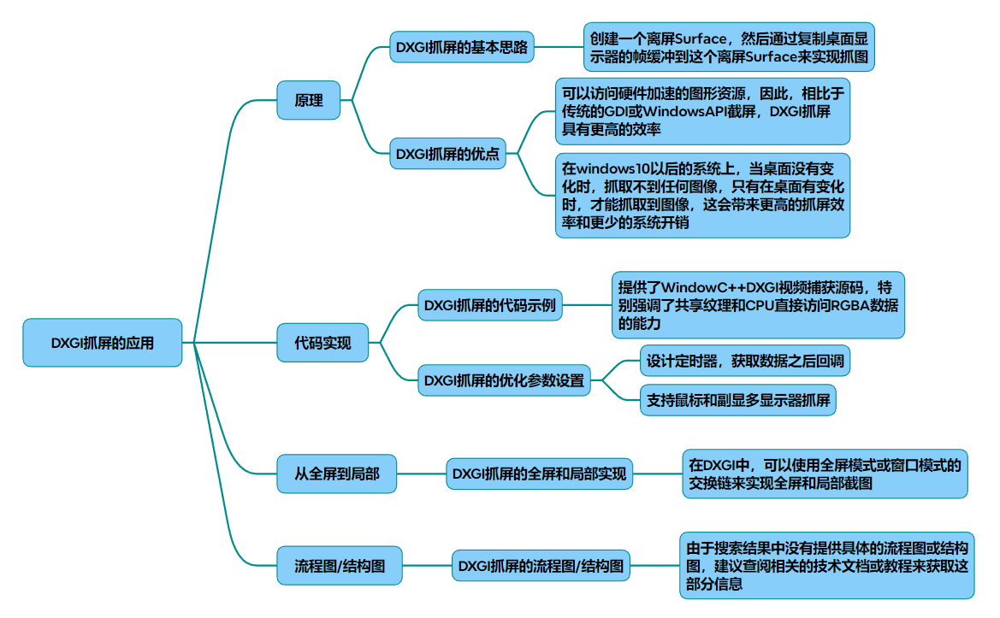

# Windows抓屏-DXGI

以下为基于DXGI的屏幕捕获技术调研与实现方案，结合流程图、代码框架及优化参数分析：

### 一、技术原理与架构
1. DXGI抓屏核心机制

（流程图示意：初始化DXGI工厂→枚举适配器→获取输出复制接口→循环捕获帧→处理数据）

DXGI通过Desktop Duplication API直接访问显存中的桌面帧缓冲，避免传统GDI多次内存拷贝。其核心接口为

~~~cpp
IDXGIOutputDuplication
~~~
，通过
~~~cpp
AcquireNextFrame
~~~
获取变化区域数据。

~~~mermaid
graph LR
D3D设备初始化 --> 获取输出接口
获取输出接口 ---> 帧数据捕获
帧数据捕获 ---> 内存映射
内存映射 ---> 数据拷贝
~~~

* 接口层级：
~~~mermaid
graph LR
IDXGIDevice --> IDXGIAdapter
IDXGIAdapter ---> IDXGIOutput
IDXGIOutput ---> IDXGIOutput1
IDXGIOutput1 ---> IDXGIOutputDuplication
~~~
需通过COM接口的QueryInterface逐级获取

* 数据流特点：

仅当屏幕内容变化时触发捕获（Win10+特性），减少冗余数据处理
强制输出32位RGBA格式，避免色彩空间转换

局部截取原理
* 通过桌面坐标系计算实现局部抓取：
~~~cpp
RECT targetRect = {left, top, right, bottom}; 
// 计算相对于屏幕原点的偏移量
memcpy(pDestBuffer, pSrcData + (targetRect.top  * pitch) + targetRect.left  * 4, ...)
~~~
需注意内存对齐问题（RowPitch与Width*4可能不等），需逐行拷贝

架构示意图

~~~mermaid
graph TD 
    A[D3D11设备初始化] --> B[枚举显示输出]
    B --> C{是否主显示器?}
    C -->|是| D[创建OutputDuplication]
    C -->|否| E[跳过副屏处理]
    D --> F[启动捕获线程]
    F --> G[AcquireNextFrame]
    G --> H{是否有新帧?}
    H -->|是| I[映射显存数据]
    H -->|否| G 
    I --> J[拷贝到用户缓冲区]
    J --> K[触发回调函数]
    K --> L[视频编码/网络传输]
~~~

2. 性能优势对比

|技术	|帧率(FPS)	|CPU占用率	|支持系统|
|-|-|-|-|
|GDI	|10-15	|15-25%	|WinXP+|
|DXGI	|60-120	|1-3%	|Win8+|
|Mirror驱动	|30-60	|5-10%	|Win7及以下|

### 二、代码实现框架

1. 初始化阶段

~~~cpp
// 创建D3D设备与DXGI工厂 
D3D11CreateDevice(nullptr, D3D_DRIVER_TYPE_HARDWARE, nullptr, 0, 
                   nullptr, 0, D3D11_SDK_VERSION, &d3dDevice, nullptr, nullptr);
 
IDXGIDevice* dxgiDevice = nullptr;
d3dDevice->QueryInterface(__uuidof(IDXGIDevice), (void**)&dxgiDevice);
 
IDXGIAdapter* adapter = nullptr;
dxgiDevice->GetAdapter(&adapter);
 
IDXGIOutput* output = nullptr;
adapter->EnumOutputs(0, &output); // 多屏需遍历输出 
~~~

2. 帧捕获循环
~~~cpp
IDXGIOutputDuplication* duplication = nullptr;
output->DuplicateOutput(d3dDevice, &duplication);
 
while (true) {
    DXGI_OUTDUPL_FRAME_INFO frameInfo;
    IDXGIResource* screenResource = nullptr;
    
    HRESULT hr = duplication->AcquireNextFrame(500, &frameInfo, &screenResource);
    if (hr == DXGI_ERROR_WAIT_TIMEOUT) continue; // 无变化 
    
    // 处理鼠标指针 
    if (frameInfo.PointerPosition.Visible)
        ProcessMouseCursor(frameInfo.PointerPosition, frameInfo.PointerShapeBuffer);
    
    // 获取纹理数据 
    ID3D11Texture2D* screenTexture = nullptr;
    screenResource->QueryInterface(__uuidof(ID3D11Texture2D), (void**)&screenTexture);
    
    // 映射到CPU可读内存 
    D3D11_TEXTURE2D_DESC desc;
    screenTexture->GetDesc(&desc);
    
    ID3D11Texture2D* stagingTexture;
    CreateStagingTexture(desc, &stagingTexture);
    
    d3dDeviceContext->CopyResource(stagingTexture, screenTexture);
    
    // 处理数据（需处理RowPitch对齐）
    ProcessFrameData(stagingTexture);
    
    duplication->ReleaseFrame();
}
~~~

### 三、高级优化方案

1. 局部捕获优化
~~~cpp
// 设置捕获区域 
RECT captureRect = { left, top, right, bottom }; 
 
// 创建裁剪纹理 
D3D11_BOX box = { 
    captureRect.left,  captureRect.top,  0,
    captureRect.right,  captureRect.bottom,  1 
};
 
d3dDeviceContext->CopySubresourceRegion(
    stagingTexture, 0, 0, 0, 0, 
    screenTexture, 0, &box);
~~~

2. 性能调优参数

|参数	|推荐值|	说明|
|-|-|-|
|AcquireTimeout|	33ms (30FPS)	|超时防止阻塞|
|StagingTexture格式	|DXGI_FORMAT_B8G8R8A8_UNORM|	兼容多数场景|
|FrameRetention	|3帧缓冲	|避免丢帧|
|多线程处理	|启用	|分离捕获与编码线程|

3 性能优化参数
|参数类型|	推荐值/方法|	作用说明|
|-|-|-|
|AcquireTimeout	|30-100ms|	避免长时间阻塞|
|数据拷贝|	多线程分段拷贝|	利用CPU多核优势|
|内存管理|	预分配环形缓冲区|	减少动态内存分配开销|
|GPU映射模式	|D3D11_MAP_READ_NO_OVERWRITE|	避免显存访问冲突|

4 高级功能扩展
* 鼠标光标集成
通过DXGI_OUTDUPL_FRAME_INFO.PointerPosition获取位置，叠加绘制系统光标图标

* 多显示器支持
遍历所有IDXGIOutput，为每个显示器创建独立Duplication实例

* 硬件编码集成
结合NVIDIA NVENC或Intel QSV，实现RGB→YUV转换及H264硬编码：
~~~cpp
libyuv::ARGBToNV12(src_rgb, dst_y, dst_uv, width, height); 
avcodec_send_frame(enc_ctx, yuv_frame);
~~~

### 四、错误处理关键点

~~~cpp
switch (hr) {
case DXGI_ERROR_DEVICE_REMOVED:
    HandleDeviceLost(); // 重新初始化设备 
    break;
case DXGI_ERROR_ACCESS_LOST: 
    duplication->Release();
    output->DuplicateOutput(...); // 重新获取复制接口 
    break;
case E_INVALIDARG:
    AdjustCaptureRect(); // 检查区域越界 
    break;
}
~~~

### 五、代码示例

参见GitHub仓库（基于上述原理实现）：

1. DXGI初始化与适配器枚举 
2. 多显示器支持实现 
3. 鼠标指针合成处理 
4. 局部区域捕获优化 
5. 帧数据对齐与格式转换 
6. 错误重试与资源释放 

### 六、扩展应用场景

* 游戏直播：结合NVENC硬编实现<5ms延迟
* 远程桌面：差异区域检测降低带宽
* 工业检测：ROI区域+OpenCV实时分析
* 通过配置文件（.ini）可动态调整：

~~~ini
[Capture]
Width=1920
Height=1080
FPS=60 
Region=0,0,800,600 
Mouse=1 ; 是否捕获鼠标 
~~~

## 完整代码
[Github](https://github.com/zhengtianzuo/zhengtianzuo.github.io/tree/master/code/042-DXGI)
