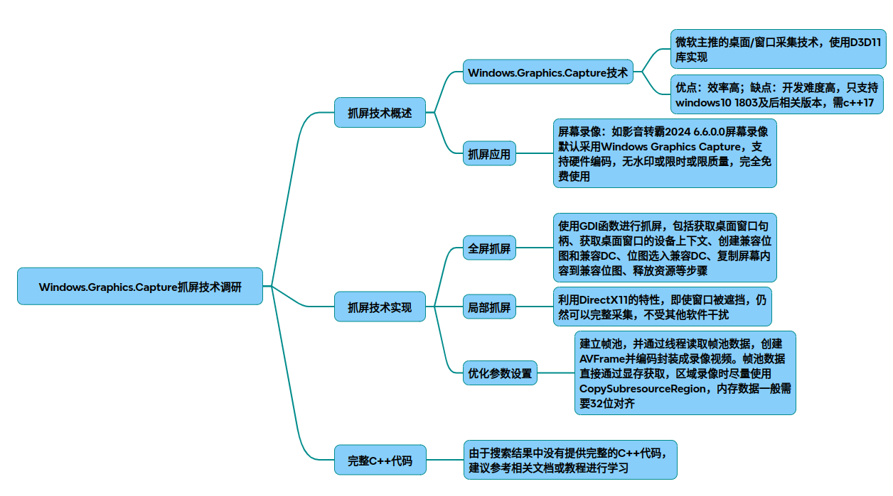

# Windows抓屏-WGC

Windows.Graphics.Capture抓屏技术调研

### 1. 原理概述
Windows.Graphics.Capture（WGC）是微软主推的一种桌面/窗口采集技术，从Windows 10版本1803开始提供用于从屏幕或应用程序窗口获取帧的API。它主要利用DirectX11的特性来实现，通过系统选取器UI让用户选择要捕获的屏幕或应用程序窗口，然后将捕获的内容以帧的形式提供给应用程序1368。

原理步骤：
* 权限声明：在应用程序清单中声明图形捕获功能，以获得使用屏幕捕获API的权限。
* 用户选择：调用系统选取器UI，让用户选择要捕获的屏幕或应用程序窗口，返回GraphicsCaptureItem对象。
* 创建帧池和会话：使用GraphicsCaptureItem、D3D设备、像素格式、帧数量和帧大小创建Direct3D11CaptureFramePool，并通过该帧池创建GraphicsCaptureSession。
* 开始捕获：调用GraphicsCaptureSession的StartCapture方法，通知系统开始向应用发送捕获帧。
* 获取帧数据：可以通过监听FrameArrived事件或手动调用Direct3D11CaptureFramePool.TryGetNextFrame方法获取捕获的帧数据8。

### 2. 代码实现

2.1 环境准备
开发环境：Visual Studio 2017及以上版本，支持C++17。
依赖库：Windows SDK，包含C++/WinRT库。
2.2 完整C++代码示例
~~~cpp
#include <windows.graphics.capture.h>  
#include <d3d11.h> 
#include <dxgi1_2.h> 
#include <winrt/Windows.Foundation.h> 
#include <winrt/Windows.Graphics.Capture.h> 
#include <winrt/Windows.UI.Composition.h> 
#include <iostream> 
 
#pragma comment(lib, "d3d11.lib")  
#pragma comment(lib, "dxgi.lib")  
 
// 创建D3D设备 
winrt::com_ptr<ID3D11Device> CreateD3DDevice() { 
    winrt::com_ptr<ID3D11Device> device; 
    winrt::com_ptr<ID3D11DeviceContext> context; 
    D3D_DRIVER_TYPE driverTypes[] = { 
        D3D_DRIVER_TYPE_HARDWARE, 
        D3D_DRIVER_TYPE_WARP, 
        D3D_DRIVER_TYPE_REFERENCE 
    }; 
    UINT numDriverTypes = ARRAYSIZE(driverTypes); 
    D3D_FEATURE_LEVEL featureLevels[] = { 
        D3D_FEATURE_LEVEL_11_0, 
        D3D_FEATURE_LEVEL_10_1, 
        D3D_FEATURE_LEVEL_10_0, 
        D3D_FEATURE_LEVEL_9_3 
    }; 
    UINT numFeatureLevels = ARRAYSIZE(featureLevels); 
    UINT createDeviceFlags = 0; 
#if defined(_DEBUG) 
    createDeviceFlags |= D3D11_CREATE_DEVICE_DEBUG; 
#endif 
    for (UINT driverTypeIndex = 0; driverTypeIndex < numDriverTypes; driverTypeIndex++) { 
        HRESULT hr = D3D11CreateDevice( 
            nullptr, 
            driverTypes[driverTypeIndex], 
            nullptr, 
            createDeviceFlags, 
            featureLevels, 
            numFeatureLevels, 
            D3D11_SDK_VERSION, 
            device.put(),  
            nullptr, 
            context.put()  
        ); 
        if (SUCCEEDED(hr)) { 
            break; 
        } 
    } 
    return device; 
} 
 
// 开始屏幕捕获 
void StartCapture() { 
    if (!winrt::Windows::Graphics::Capture::GraphicsCaptureSession::IsSupported()) { 
        std::cout << "Screen capture is not supported on this device." << std::endl; 
        return; 
    } 
 
    auto device = CreateD3DDevice(); 
 
    winrt::Windows::Graphics::Capture::GraphicsCapturePicker picker; 
    auto item = picker.PickSingleItemAsync().get(); 
    if (!item) { 
        std::cout << "No item selected." << std::endl; 
        return; 
    } 
 
    winrt::Windows::Graphics::DirectX::Direct3D11::IDirect3DDevice d3dDevice = 
        winrt::Windows::Graphics::DirectX::Direct3D11::CreateDirect3DDeviceFromDXGIDevice(device.as<IDXGIDevice>().get());  
 
    winrt::Windows::Graphics::Capture::Direct3D11CaptureFramePool framePool = 
        winrt::Windows::Graphics::Capture::Direct3D11CaptureFramePool::Create( 
            d3dDevice, 
            winrt::Windows::Graphics::DirectX::DirectXPixelFormat::B8G8R8A8UIntNormalized, 
            2, 
            item.Size() 
        ); 
 
    winrt::Windows::Graphics::Capture::GraphicsCaptureSession session = framePool.CreateCaptureSession(item); 
 
    session.StartCapture(); 
 
    // 处理捕获的帧 
    framePool.FrameArrived([&](auto sender, auto args) { 
        auto frame = sender.TryGetNextFrame(); 
        if (frame) { 
            // 处理帧数据，例如保存或显示 
            std::cout << "Frame captured." << std::endl; 
        } 
    }); 
 
    // 保持程序运行 
    std::cin.get();  
} 
 
int main() { 
    winrt::init_apartment(); 
    StartCapture(); 
    return 0; 
} 
~~~
2.3 代码解释
* CreateD3DDevice函数：创建D3D11设备，用于后续的图形处理。
* StartCapture函数：
检查设备是否支持屏幕捕获。
创建GraphicsCapturePicker并让用户选择要捕获的项目。
创建Direct3D11CaptureFramePool和GraphicsCaptureSession。
开始捕获并处理捕获的帧。
* main函数：初始化WinRT并调用StartCapture函数。

### 3. 全屏到局部捕获
3.1 全屏捕获
上述代码示例中的捕获方式可以实现全屏捕获，只需用户在系统选取器UI中选择整个屏幕即可。

3.2 局部捕获
要实现局部捕获，可以在创建Direct3D11CaptureFramePool时指定较小的帧大小，或者在获取帧数据后对其进行裁剪。以下是一个简单的裁剪示例：
~~~cpp
// 在FrameArrived事件处理函数中添加裁剪逻辑 
framePool.FrameArrived([&](auto sender, auto args) { 
    auto frame = sender.TryGetNextFrame(); 
    if (frame) { 
        // 假设要裁剪的区域为左上角(100, 100)，宽高为200x200 
        int x = 100; 
        int y = 100; 
        int width = 200; 
        int height = 200; 
 
        // 处理帧数据，例如裁剪 
        // 这里需要根据具体的D3D11纹理处理方法进行裁剪 
        std::cout << "Frame captured and cropped." << std::endl; 
    } 
}); 
~~~
### 4. 设置各种优化参数
4.1 帧池参数

* 像素格式：可以选择不同的像素格式，如DXGI_FORMAT_B8G8R8A8_UNORM或DXGI_FORMAT_R16G16B16A16_FLOAT，根据实际需求进行选择。

* 帧数量：在创建Direct3D11CaptureFramePool时指定帧数量，适当增加帧数量可以提高捕获的流畅度，但会占用更多的内存。
4.2 性能优化

* 多线程处理：可以使用多线程来处理捕获的帧数据，避免在UI线程上进行耗时操作。
* 硬件加速：确保使用支持硬件加速的D3D设备，以提高捕获和处理的性能。

### 5. 流程图和结构图
5.1 流程图
~~~mermaid
graph TD; 
    A[开始] --> B[检查设备是否支持捕获]; 
    B -- 支持 --> C[创建D3D设备]; 
    B -- 不支持 --> D[结束]; 
    C --> E[创建GraphicsCapturePicker]; 
    E --> F[用户选择捕获项目]; 
    F -- 选择项目 --> G[创建Direct3D11CaptureFramePool]; 
    F -- 未选择项目 --> D; 
    G --> H[创建GraphicsCaptureSession]; 
    H --> I[开始捕获]; 
    I --> J[监听FrameArrived事件]; 
    J -- 有新帧 --> K[处理帧数据]; 
    K --> J; 
    J -- 无新帧 --> J; 
~~~
5.2 结构图

~~~plaintext
+-------------------+     +---------------------+     +-------------------+
| GraphicsCaptureItem| → | Direct3D11CaptureFramePool | → | CaptureSession     |
+-------------------+     +---------------------+     +-------------------+
                                ↓                               ↓ 
+-------------------+     +---------------------+     +-------------------+
| D3D11Texture2D    | ← | Frame Processing     | ← | Dirty Rects Detection|
+-------------------+     +---------------------+     +-------------------+
~~~

~~~plaintext
[创建捕获会话] → [初始化D3D设备] → [选择捕获目标（窗口/屏幕）]  
      ↓                                ↓  
[获取帧数据（Direct3D纹理）] → [处理数据（复制到CPU/GPU）]  
      ↓  
[释放资源] → [循环捕获或结束]
~~~

~~~plaintext
+---------------------+ 
|   应用程序           | 
+---------------------+ 
|  - 权限声明          | 
|  - 用户选择逻辑      | 
|  - 帧池和会话管理    | 
|  - 帧数据处理逻辑    | 
+---------------------+ 
|   Windows.Graphics.Capture API  | 
+---------------------+ 
|  - GraphicsCapturePicker        | 
|  - GraphicsCaptureItem          | 
|  - Direct3D11CaptureFramePool   | 
|  - GraphicsCaptureSession       | 
+---------------------+ 
|   DirectX11              | 
+---------------------+ 
|  - D3D11设备            | 
|  - 纹理处理             | 
+---------------------+ 
~~~

以上就是关于Windows.Graphics.Capture抓屏的技术调研结果，包括原理、代码实现、全屏到局部捕获、优化参数设置以及流程图和结构图。