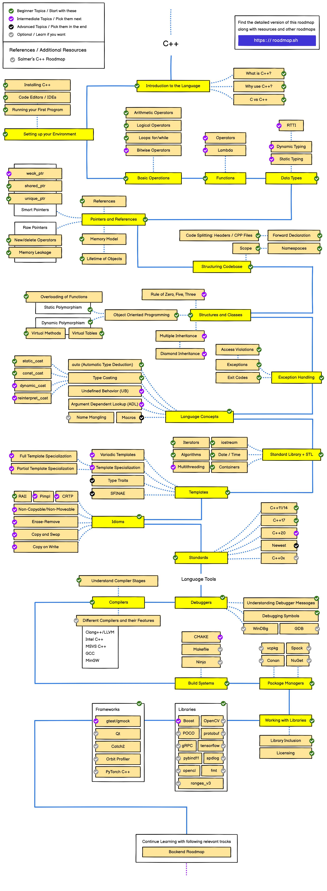

# C++

## 简介

C++是一种面向对象的计算机程序设计语言，由美国AT&T贝尔实验室的本贾尼·斯特劳斯特卢普博士在20世纪80年代初期发明并实现（最初这种语言被称作“C with Classes”带类的C）。它是一种静态数据类型检查的、支持多重编程范式的通用程序设计语言。它支持过程化程序设计、数据抽象、面向对象程序设计、泛型程序设计等多种程序设计风格。 C++是C语言的继承，进一步扩充和完善了C语言，成为一种面向对象的程序设计语言。C++这个词在中国大陆的程序员圈子中通常被读做“C加加”，而西方的程序员通常读做“C plus plus”，“CPP”。

|||
|-|-|
|中文名|C++语言|
|创始人|BjarneStroustrup|
|外文名|The C++ Programming Language|
|创始公司|贝尔实验室|
|类别|计算机程序设计语言|
|基本内容|类、封装、重载、继承、模版|
|首次使用时间|1983年12月|
|创始人|本贾尼·斯特劳斯特卢普|

## 路线图:

