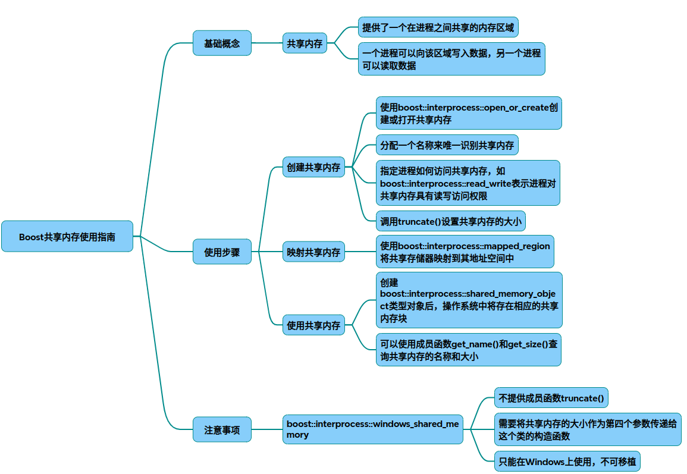

# Boost共享内存

以下是Boost共享内存的详细使用指南，包含完整C++代码和分步解析，涵盖基础操作和高级应用场景：

### 一、Boost共享内存核心组件
* shared_memory_object
用于创建/打开共享内存对象，需指定名称和访问模式。
~~~cpp
#include <boost/interprocess/shared_memory_object.hpp> 
using namespace boost::interprocess;

shared_memory_object shm(
    open_or_create,    // 模式：存在则打开，否则创建 
    "MySharedMemory",  // 唯一标识名称 
    read_write         // 访问权限（read_only / read_write）
);
~~~
* mapped_region
将共享内存映射到进程地址空间，支持读写操作。
~~~cpp
#include <boost/interprocess/mapped_region.hpp> 
mapped_region region(
    shm,               // 共享内存对象 
    read_write,        // 映射权限 
    0,                 // 偏移量（默认0）
    1024               // 映射大小（默认全部）
);
~~~
### 二、基础使用代码示例
* 写入进程
~~~cpp
#include <iostream>
#include <boost/interprocess/shared_memory_object.hpp> 
#include <boost/interprocess/mapped_region.hpp> 
 
int main() {
    // 1. 创建或打开共享内存 
    shared_memory_object shm(
        open_or_create, 
        "MySharedMemory", 
        read_write 
    );
    
    // 2. 设置内存大小（必须拥有写权限）
    shm.truncate(1024);   // 分配1024字节 
    
    // 3. 映射到当前进程 
    mapped_region region(shm, read_write);
    
    // 4. 写入数据 
    char* data = static_cast<char*>(region.get_address()); 
    std::strcpy(data, "Hello from Process A!");
    
    std::cout << "Data written to shared memory." << std::endl;
    // 注意：实际应用中需同步机制（如互斥锁）
    return 0;
}
~~~

* 读取进程
~~~cpp
int main() {
    // 1. 打开已有共享内存 
    shared_memory_object shm(open_only, "MySharedMemory", read_only);
    
    // 2. 映射内存 
    mapped_region region(shm, read_only);
    
    // 3. 读取数据 
    char* data = static_cast<char*>(region.get_address()); 
    std::cout << "Received: " << data << std::endl;
    
    // 4. 清理（通常由最后一个进程执行）
    shared_memory_object::remove("MySharedMemory");
    return 0;
}
~~~
### 三、高级应用：共享内存中使用STL容器
* 使用托管内存和自定义分配器
~~~cpp
#include <boost/interprocess/managed_shared_memory.hpp> 
#include <boost/interprocess/containers/vector.hpp> 
#include <boost/interprocess/allocators/allocator.hpp> 
 
typedef int ValueType;
typedef allocator<ValueType, managed_shared_memory::segment_manager> ShmemAllocator;
typedef vector<ValueType, ShmemAllocator> SharedVector;
 
int main() {
    // 创建托管共享内存（自动管理生命周期）
    managed_shared_memory segment(open_or_create, "ManagedSHM", 65536);
    
    // 构造共享vector 
    SharedVector* vec = segment.find_or_construct<SharedVector>("MyVector") 
        (segment.get_allocator<ValueType>()); 
    
    // 添加数据 
    vec->push_back(42);
    vec->push_back(88);
    
    // 其他进程可通过相同名称访问该vector 
    return 0;
}
~~~
### 四、同步机制（互斥锁示例）
~~~cpp
#include <boost/interprocess/sync/interprocess_mutex.hpp> 
 
struct SharedData {
    interprocess_mutex mutex;
    int counter = 0;
};
 
// 写入进程 
managed_shared_memory segment(open_or_create, "SyncSHM", 4096);
SharedData* data = segment.find_or_construct<SharedData>("Data")(); 
 
{
    scoped_lock<interprocess_mutex> lock(data->mutex); // 自动加锁 
    data->counter++;
}

// 读取进程同理，通过互斥锁保证原子操作 
~~~
### 五、关键注意事项
* 生命周期管理
* 使用shared_memory_object::remove()显式删除共享内存。
* 托管内存（managed_shared_memory）自动管理对象构造/析构。
* 避免直接存储指针，使用offset_ptr处理地址偏移。
* 预分配足够内存避免频繁调整。
* 减少锁粒度提升并发性能。

通过上述方法，可实现跨进程高效数据交换，适用于高频通信场景如实时数据处理。

## 完整代码
[Github](https://github.com/zhengtianzuo/zhengtianzuo.github.io/tree/master/code/002-BoostSharedMemory)
