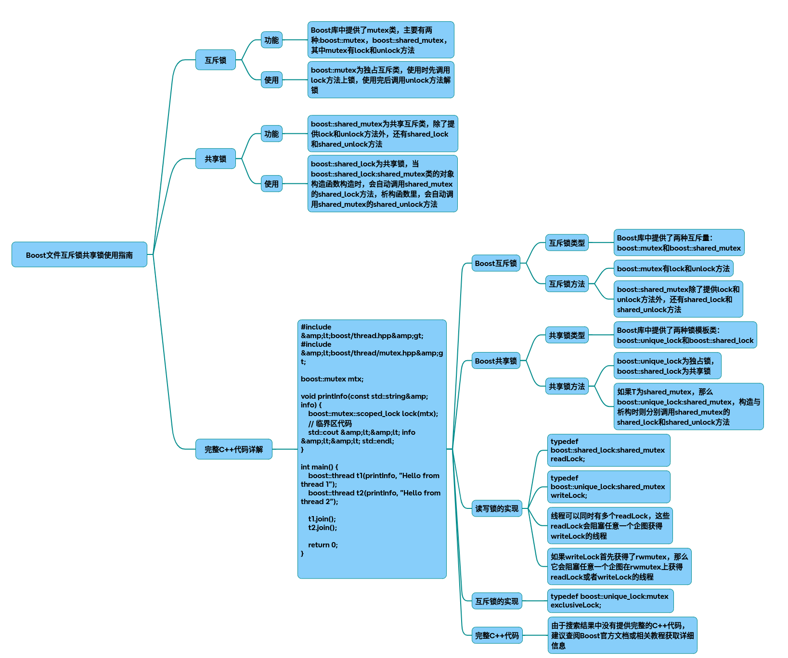

# Boost文件锁

以下为Boost库中文件互斥锁与共享锁的完整使用指南，涵盖锁字节段功能及C++代码实现：

### 一、锁类型与核心类库
Boost提供两组锁机制：线程同步锁（boost::mutex/boost::shared_mutex）和文件锁（boost::interprocess::file_lock）。前者用于多线程共享内存，后者用于跨进程文件访问控制。

### 二、文件互斥锁实现
1. 基础文件锁（全文件锁定）
~~~cpp
#include <boost/interprocess/sync/file_lock.hpp> 
#include <fstream>
 
int main() {
    // 创建或打开文件 
    std::fstream file("test.dat",  std::ios::out | std::ios::binary);
    
    // 创建文件锁对象 
    boost::interprocess::file_lock fl("test.dat"); 
    
    // 独占锁定整个文件（互斥锁）
    fl.lock();   // 阻塞直到获取锁
    // 执行写操作...
    file << "Exclusive write operation";
    fl.unlock(); 
 
    // 尝试非阻塞锁定 
    if(fl.try_lock())  {
        // 临界区操作...
        fl.unlock(); 
    }
}
~~~
2. 字节段锁定（部分文件锁定）
~~~cpp
#include <boost/interprocess/sync/file_lock.hpp> 
#include <iostream>
 
void lock_file_segment() {
    boost::interprocess::file_lock fl("segment.dat"); 
    const int offset = 0;  // 起始偏移量
    const int length = 512;// 锁定字节数
 
    // 锁定指定字节范围 
    fl.lock_range(offset,  length);
    std::cout << "Locked bytes " << offset << "-" << offset+length << std::endl;
    
    // 操作锁定区域...
    
    // 解锁指定范围 
    fl.unlock_range(offset,  length);
}
~~~
### 三、共享锁（读写锁）实现
1. 线程级共享锁（内存共享）
~~~cpp
#include <boost/thread/shared_mutex.hpp> 
boost::shared_mutex rw_mutex;
 
// 读操作（共享锁）
void read_data() {
    boost::shared_lock<boost::shared_mutex> lock(rw_mutex); // 自动加共享锁
    // 多线程可并发执行读操作...
}
 
// 写操作（互斥锁）
void write_data() {
    boost::unique_lock<boost::shared_mutex> lock(rw_mutex); // 自动加独占锁
    // 仅单线程可执行写操作...
}
~~~
2. 文件级共享锁（需操作系统支持）
~~~cpp
#include <boost/interprocess/sync/file_lock.hpp> 
 
void shared_file_access() {
    boost::interprocess::file_lock fl("shared.dat"); 
    
    // 获取共享锁（读锁）
    if(fl.try_lock_sharable())  {
        // 多进程可并发读取...
        fl.unlock_sharable(); 
    }
 
    // 获取独占锁（写锁）
    fl.lock();  
    // 单进程写入操作...
    fl.unlock(); 
}
~~~
### 四、关键特性对比

|锁类型|	适用场景|	是否支持区域锁|	线程/进程级别|
|-|-|-|-|
|mutex|	线程间内存互斥|	否|	线程|
|shared_mutex|	线程间读写分离|	否|	线程|
|file_lock|	进程间文件访问控制|	是|	进程|

### 五、最佳实践与注意事项
* RAII锁管理：优先使用lock_guard/unique_lock等RAII包装器，避免忘记解锁。
~~~cpp
boost::interprocess::file_lock fl("file");
boost::interprocess::scoped_lock<boost::interprocess::file_lock> guard(fl);
~~~
* 死锁预防：避免嵌套锁定不同顺序的互斥量，使用try_lock系列方法设置超时。
* 性能优化：细粒度锁（如字节段锁）可减少资源争用，提升并发性能。
* 跨平台差异：文件共享锁在Windows和Linux下的行为可能不同，需测试验证。

## 完整代码
[Github](https://github.com/zhengtianzuo/zhengtianzuo.github.io/tree/master/code/003-BoostFileLock)