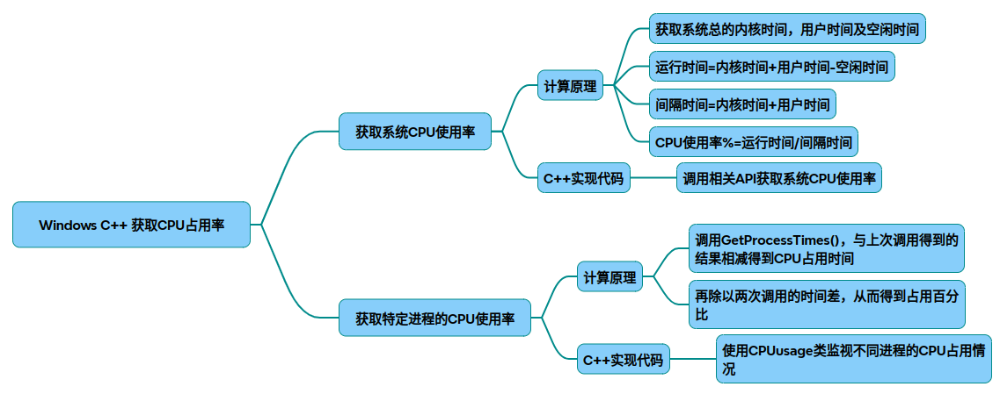
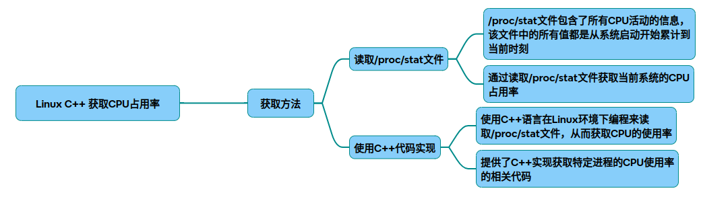
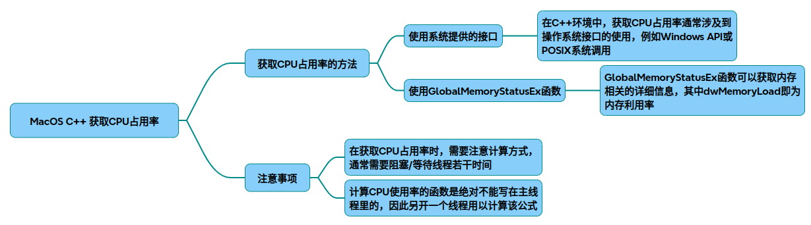

# 获取CPU占用率

## windows平台

在Windows系统下使用C++获取CPU占用率，常见方法可分为系统整体占用率和特定进程占用率两类。以下是具体实现方法及核心代码示例：

### 一、获取系统整体CPU占用率
#### 方法1：基于GetSystemTimes函数
原理：通过计算两次采样的系统空闲时间、内核时间和用户时间差值，结合公式得出整体CPU使用率。

~~~cpp
#include <windows.h>
#include <iostream>

double GetCpuUsage() {
    FILETIME idleTime, kernelTime, userTime;
    static FILETIME preIdleTime, preKernelTime, preUserTime;

    GetSystemTimes(&idleTime, &kernelTime, &userTime);

    // 转换为64位整型
    ULONGLONG idle = (*(ULONGLONG*)&idleTime) - (*(ULONGLONG*)&preIdleTime);
    ULONGLONG kernel = (*(ULONGLONG*)&kernelTime) - (*(ULONGLONG*)&preKernelTime);
    ULONGLONG user = (*(ULONGLONG*)&userTime) - (*(ULONGLONG*)&preUserTime);

    preIdleTime = idleTime;
    preKernelTime = kernelTime;
    preUserTime = userTime;

    if (kernel + user == 0) return 0.0;
    return ((kernel + user - idle) * 100.0) / (kernel + user);
}

// 调用示例
int main() {
    while (true) {
        Sleep(1000); // 间隔1秒采样
        std::cout << "CPU Usage: " << GetCpuUsage() << "%" << std::endl;
    }
    return 0;
}
~~~

* 关键点：
需间隔一定时间（如1秒）采样两次数据。
公式：(内核时间 + 用户时间 - 空闲时间) / (内核时间 + 用户时间)。

#### 方法2：使用性能计数器（PDH库）
适用场景：需要高精度或实时监控多个计数器。

~~~cpp
#include <windows.h>
#include <pdh.h>
#pragma comment(lib, "pdh.lib") 

double GetCpuUsageByPdh() {
    static PDH_HQUERY query;
    static PDH_HCOUNTER counter;
    static bool initialized = false;
    
    if (!initialized) {
        PdhOpenQuery(nullptr, 0, &query);
        PdhAddCounter(query, L"\\Processor(_Total)\\% Processor Time", 0, &counter);
        initialized = true;
    }

    PDH_FMT_COUNTERVALUE value;
    PdhCollectQueryData(query);
    PdhGetFormattedCounterValue(counter, PDH_FMT_DOUBLE, nullptr, &value);
    return value.doubleValue; 
}
~~~

* 优点：与任务管理器数据一致，支持多核统计。

### 二、获取特定进程CPU占用率
原理：通过GetProcessTimes获取进程的内核和用户时间，计算两次采样的时间差占比。

~~~cpp
#include <windows.h>
#include <iostream>

class ProcessCpuMonitor {
public:
    ProcessCpuMonitor(DWORD pid) : pid_(pid) {
        hProcess_ = OpenProcess(PROCESS_QUERY_LIMITED_INFORMATION, FALSE, pid_);
    }

    ~ProcessCpuMonitor() {
        if (hProcess_) CloseHandle(hProcess_);
    }

    float GetUsage() {
        FILETIME createTime, exitTime, kernelTime, userTime;
        if (!GetProcessTimes(hProcess_, &createTime, &exitTime, &kernelTime, &userTime))
            return -1;

        ULONGLONG currentKernel = *(ULONGLONG*)&kernelTime;
        ULONGLONG currentUser = *(ULONGLONG*)&userTime;
        ULONGLONG delta = (currentKernel + currentUser) - (lastKernel_ + lastUser_);

        // 计算时间差（单位：100纳秒）
        ULONGLONG timePassed = GetTickCount64() - lastTick_;
        lastTick_ = GetTickCount64();
        lastKernel_ = currentKernel;
        lastUser_ = currentUser;

        if (timePassed == 0) return 0.0f;
        return (delta / 10000.0f) / timePassed * 100.0f; // 转换为百分比
    }

private:
    DWORD pid_;
    HANDLE hProcess_ = nullptr;
    ULONGLONG lastKernel_ = 0, lastUser_ = 0;
    ULONGLONG lastTick_ = 0;
};

// 调用示例
int main() {
    DWORD pid = 1234; // 目标进程ID
    ProcessCpuMonitor monitor(pid);
    while (true) {
        Sleep(1000);
        std::cout << "Process CPU Usage: " << monitor.GetUsage() << "%" << std::endl;
    }
    return 0;
}
~~~

注意事项：

需以PROCESS_QUERY_LIMITED_INFORMATION权限打开进程。
公式：(进程时间差 / 系统时间差) * 100%。

### 三、常见问题
* 与任务管理器数据不一致：因采样间隔和计算方式差异，结果可能有轻微偏差。
* 多核CPU：上述方法返回的是整体利用率，如需单核数据，需遍历每个逻辑处理器。
* 权限问题：获取系统级数据需管理员权限，进程级数据则不需要。

## linux平台

在Linux系统下使用C++获取CPU占用率，主要通过解析/proc/stat文件实现。以下是具体实现方法和原理说明：

### 一、核心原理
Linux内核通过/proc/stat文件提供CPU活动的统计信息。文件中记录了从系统启动到当前时刻，CPU在不同状态下的累计时间（单位：时钟周期），包括：

user：用户态执行时间
nice：低优先级用户态时间
system：内核态执行时间
idle：空闲时间
iowait：I/O等待时间
irq：硬件中断时间
softirq：软件中断时间
通过两次采样这些数值，计算时间差并分析CPU占用率。

### 二、实现步骤
1. 读取 /proc/stat 文件
~~~cpp
#include <fstream>
#include <vector>
#include <string>

struct CpuTime {
    unsigned long user, nice, system, idle, iowait, irq, softirq;
};

CpuTime readCpuStats() {
    std::ifstream file("/proc/stat");
    std::string cpu_label;
    CpuTime time;
    file >> cpu_label >> time.user  >> time.nice  >> time.system  >> time.idle  
         >> time.iowait  >> time.irq  >> time.softirq; 
    return time;
}
~~~

2. 计算CPU使用率
通过两次采样时间差计算CPU利用率：

~~~cpp
double calculateCpuUsage(const CpuTime& prev, const CpuTime& curr) {
    const unsigned long prev_total = prev.user  + prev.nice  + prev.system  + prev.idle  
                                   + prev.iowait  + prev.irq  + prev.softirq; 
    const unsigned long curr_total = curr.user  + curr.nice  + curr.system  + curr.idle  
                                   + curr.iowait  + curr.irq  + curr.softirq; 
    const unsigned long total_diff = curr_total - prev_total;

    const unsigned long idle_diff = curr.idle  - prev.idle; 
    return (total_diff - idle_diff) * 100.0 / total_diff;
}
~~~

3. 完整示例

~~~cpp
#include <iostream>
#include <unistd.h>

int main() {
    CpuTime prev = readCpuStats();
    sleep(1); // 采样间隔1秒
    CpuTime curr = readCpuStats();
    
    double usage = calculateCpuUsage(prev, curr);
    std::cout << "CPU Usage: " << usage << "%" << std::endl;
    return 0;
}
~~~

### 三、扩展说明
多核CPU处理
/proc/stat中每行对应一个CPU核心（如cpu0, cpu1），需分别解析。

进程级CPU占用率
通过读取/proc/[pid]/stat获取进程的utime（用户态时间）和stime（内核态时间），结合系统总时间计算。

注意事项
采样间隔建议≥1秒，避免瞬时波动。
需处理/proc文件读取失败的情况。
高精度场景可使用clock_gettime替代sleep。

### 四、优化与替代方案
使用 sysinfo 系统调用
获取粗略的系统负载信息，但精度较低。

调用 getrusage 函数
适用于统计进程自身的CPU使用情况。

第三方库
如libstatgrab或procps-ng提供封装接口。

## macOS平台

在 macOS 系统下通过 C++ 获取 CPU 占用率，需要调用 Mach 内核 API 实现。以下是基于 、、 等资料的实现方案：

### 一、核心实现原理

Mach API 调用
macOS 基于 Darwin 内核，通过 <mach/mach_host.h> 提供的 host_statistics 函数获取 CPU 时间统计信息。
CPU 占用率计算
需两次采样间隔内的 CPU 使用时间差，公式：
CPU 占用率 = (用户态时间 + 内核态时间) / (总时间差) * 100%

### 二、代码实现示例

~~~cpp
#include <mach/mach_host.h>
#include <mach/processor_info.h>
#include <unistd.h>

double get_cpu_usage() {
    host_cpu_load_info_data_t cpuinfo;
    mach_msg_type_number_t count = HOST_CPU_LOAD_INFO_COUNT;
    kern_return_t kr = host_statistics(mach_host_self(), 
                                      HOST_CPU_LOAD_INFO,
                                      (host_info_t)&cpuinfo,
                                      &count);
    if (kr != KERN_SUCCESS) return -1.0;

    // 第一次采样
    uint64_t total_user_prev = cpuinfo.cpu_ticks[CPU_STATE_USER]; 
    uint64_t total_sys_prev = cpuinfo.cpu_ticks[CPU_STATE_SYSTEM]; 
    uint64_t total_idle_prev = cpuinfo.cpu_ticks[CPU_STATE_IDLE]; 
    uint64_t total_used_prev = total_user_prev + total_sys_prev;

    // 等待 1 秒后再次采样
    sleep(1);
    kr = host_statistics(mach_host_self(),
                        HOST_CPU_LOAD_INFO,
                        (host_info_t)&cpuinfo,
                        &count);
    if (kr != KERN_SUCCESS) return -1.0;

    uint64_t total_user = cpuinfo.cpu_ticks[CPU_STATE_USER]; 
    uint64_t total_sys = cpuinfo.cpu_ticks[CPU_STATE_SYSTEM]; 
    uint64_t total_idle = cpuinfo.cpu_ticks[CPU_STATE_IDLE]; 
    uint64_t total_used = total_user + total_sys;

    // 计算差值
    uint64_t used_diff = total_used - total_used_prev;
    uint64_t idle_diff = total_idle - total_idle_prev;
    uint64_t total_diff = used_diff + idle_diff;

    return (total_diff == 0) ? 0 : (used_diff * 100.0) / total_diff;
}
~~~

### 三、关键点说明
多核 CPU 处理
上述代码返回的是 所有 CPU 核心的平均占用率。若需获取单核数据，需通过 host_processor_info 函数遍历每个核心 。
时间间隔选择
两次采样间隔建议 1 秒（sleep(1)），间隔过短会导致误差增大。
错误处理
检查 host_statistics 返回值是否为 KERN_SUCCESS，避免因权限问题或 API 调用失败导致崩溃。

### 四、扩展功能
获取单进程 CPU 占用
结合 proc_pidinfo 函数和 PROC_PIDTASKINFO 参数，可获取指定进程的 CPU 时间 。
实时监控
通过多线程循环调用上述函数，实现动态曲线绘制（参考 中的 ImGui 方案）。

### 五、编译注意事项
头文件依赖：需包含 <mach/mach.h> 和 <mach/mach_host.h>
链接框架：添加 -framework IOKit 编译选项
示例：clang++ -framework IOKit cpu_usage.cpp  -o cpu_usage

## 完整代码
[Github](https://github.com/zhengtianzuo/zhengtianzuo.github.io/tree/master/code/004-Get_CPU_Useage)
