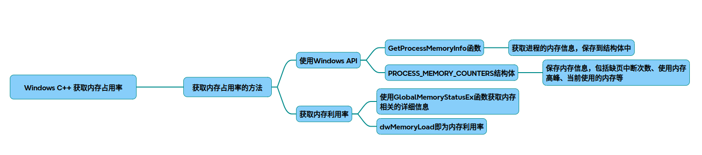
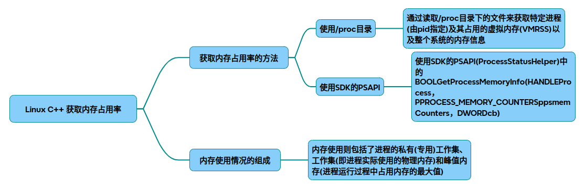
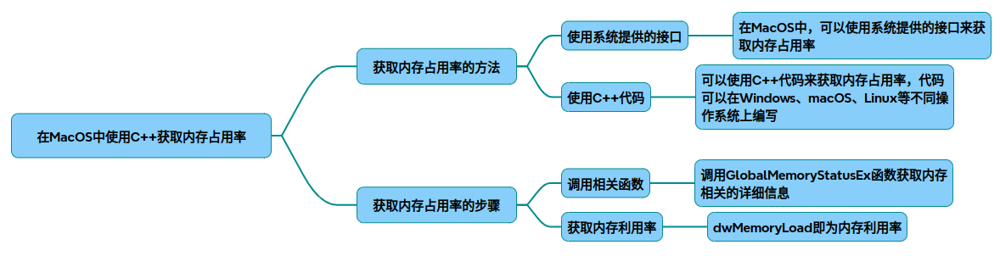

# 获取内存占用率

## windows平台

在Windows环境下使用C++获取内存占用率，可以通过以下两种方式实现，分别针对系统整体和特定进程的内存监控：

### 一、获取系统整体内存占用率
核心函数：GlobalMemoryStatusEx
步骤：

* 定义MEMORYSTATUSEX结构体并初始化dwLength字段
* 调用函数获取内存信息
* 通过dwMemoryLoad字段直接获取内存占用率百分比

~~~cpp
#include <windows.h>

MEMORYSTATUSEX memInfo;
memInfo.dwLength  = sizeof(memInfo);
GlobalMemoryStatusEx(&memInfo);

DWORD memoryUsage = memInfo.dwMemoryLoad;  // 内存占用率百分比
~~~

### 二、获取特定进程内存占用
核心函数：GetProcessMemoryInfo

步骤：
* 获取目标进程句柄（如当前进程用GetCurrentProcess()）
* 定义PROCESS_MEMORY_COUNTERS结构体
* 调用函数获取内存信息

~~~cpp
#include <windows.h>
#include <psapi.h>

PROCESS_MEMORY_COUNTERS pmc;
if (GetProcessMemoryInfo(GetCurrentProcess(), &pmc, sizeof(pmc))) {
    SIZE_T usedMem = pmc.WorkingSetSize; // 进程占用的物理内存
    SIZE_T totalMem = /* 总内存需通过GlobalMemoryStatusEx获取 */;
    double ratio = (usedMem * 100.0) / totalMem; // 计算占用率
}
~~~

### 三、关键注意事项
结构体初始化：
使用MEMORYSTATUSEX或PROCESS_MEMORY_COUNTERS时，必须正确初始化dwLength字段，否则函数调用失败。

权限问题：
访问其他进程内存需PROCESS_QUERY_INFORMATION和PROCESS_VM_READ权限，可通过OpenProcess函数获取。

### 四、扩展应用场景
* 实时监控：结合定时器定期调用上述函数，实现动态内存监控界面
* 性能分析：与CPU占用率（GetSystemTimes）、磁盘I/O等指标结合，构建完整的资源监控系统
* 服务端优化：通过内存占用率数据调整服务资源分配策略

## linux平台

在Linux环境下使用C++获取内存占用率，主要通过读取系统文件或调用系统接口实现。以下是几种常用方法及实现示例：

### 方法一：解析 /proc/meminfo 文件
系统内存信息存储在 /proc/meminfo 中，通过解析该文件获取内存总量和空闲量：

~~~cpp
#include <fstream>
#include <string>
#include <unordered_map>

float get_memory_usage() {
    std::ifstream meminfo("/proc/meminfo");
    std::unordered_map<std::string, long> mem_data;
    std::string key;
    long value;

    while (meminfo >> key >> value) {
        meminfo.ignore(256,  '\n'); // 跳过单位（如 kB）
        mem_data[key] = value;
    }

    long total = mem_data["MemTotal:"];
    long available = mem_data["MemAvailable:"]; // 若系统不支持 MemAvailable，可用 MemFree + Buffers + Cached 替代
    long used = total - available;
    return (used * 100.0) / total;
}
~~~
说明：

MemAvailable 是更准确的可用内存指标（需内核3.14+），否则需计算 MemFree + Buffers + Cached 。
单位为 KB，计算时无需转换。

### 方法二：使用 sysinfo() 系统调用
通过 sysinfo 函数直接获取内存信息：

~~~cpp
#include <sys/sysinfo.h>

float get_memory_usage() {
    struct sysinfo info;
    sysinfo(&info);

    long total = info.totalram  * info.mem_unit; 
    long free = info.freeram  * info.mem_unit; 
    long used = total - free;

    return (used * 100.0) / total;
}
~~~
说明：
* sysinfo() 提供更直接的系统内存统计，无需文件解析 。
* mem_unit 是内存单位（通常为字节），需手动计算总内存和空闲内存。
* 扩展：获取进程内存占用（物理内存）
* 若需获取特定进程的内存占用，可解析 /proc/[pid]/status：

~~~cpp
#include <fstream>
#include <string>

long get_process_memory(int pid) {
    std::ifstream status("/proc/" + std::to_string(pid) + "/status");
    std::string line;
    
    while (std::getline(status, line)) {
        if (line.find("VmRSS")  != std::string::npos) { // 物理内存占用
            long mem_kb;
            sscanf(line.c_str(), "VmRSS: %ld kB", &mem_kb);
            return mem_kb * 1024; // 转换为字节
        }
    }
    return -1;
}
~~~
说明：

VmRSS 表示进程实际使用的物理内存 。
单位为 KB，需转换为字节。
注意事项
* 权限问题：需确保程序有权限读取 /proc 目录下的文件。
* 实时性：/proc/meminfo 和 sysinfo() 的数据是动态更新的。
* 单位转换：不同方法可能涉及 KB 或字节单位，需统一计算。

## macOS平台

在 macOS 环境下通过 C++ 获取内存占用率，需要结合系统级 API 和 Mach 内核接口。以下是具体实现方法及核心知识点总结：

### 一、系统整体内存占用率
实现原理
* 通过 sysctl 和 host_statistics 接口获取物理内存总量和已使用量：

~~~cpp
#include <mach/mach_host.h>
#include <sys/sysctl.h>

// 获取物理内存总量
uint64_t get_total_memory() {
    int mib[2]()  = {CTL_HW, HW_MEMSIZE};
    uint64_t total_mem = 0;
    size_t len = sizeof(total_mem);
    sysctl(mib, 2, &total_mem, &len, NULL, 0);
    return total_mem;
}

// 计算内存占用率
float get_memory_usage() {
    vm_size_t page_size;
    mach_port_t host_port = mach_host_self();
    mach_msg_type_number_t host_size = sizeof(vm_statistics_data_t) / sizeof(integer_t);
    vm_statistics_data_t vm_stat;
    
    host_page_size(host_port, &page_size);
    host_statistics(host_port, HOST_VM_INFO, (host_info_t)&vm_stat, &host_size);
    
    uint64_t total_mem = get_total_memory();
    uint64_t used_mem = (vm_stat.active_count  + vm_stat.wire_count)  * page_size;
    return (float)used_mem / total_mem * 100.0f;
}
~~~

### 二、进程级内存占用
实现原理
* 通过 Mach 任务接口获取进程的驻留内存（RSS）：

~~~cpp
#include <mach/mach_init.h>
#include <mach/task.h>

size_t get_process_memory_usage() {
    task_t task = mach_task_self();
    struct mach_task_basic_info info;
    mach_msg_type_number_t count = MACH_TASK_BASIC_INFO_COUNT;
    
    if (task_info(task, MACH_TASK_BASIC_INFO, (task_info_t)&info, &count) == KERN_SUCCESS) {
        return info.resident_size;  // 返回单位为字节
    }
    return 0;
}
~~~

### 三、关键知识点
* Mach 内核接口
macOS 内存管理基于 Mach 微内核，需使用 mach_host.h 和 mach/task.h 中的函数获取内存统计信息 。

* 内存计算逻辑
系统内存占用率 = (活跃内存 + 固定内存) / 总物理内存。活跃内存（active_count）和固定内存（wire_count）反映当前使用状态 。

* 性能优化
频繁调用 host_statistics 可能影响性能，建议间隔 1-2 秒采样一次 。

### 四、扩展应用场景
* 系统监控工具：实时显示内存曲线（参考 的 QT 实现）
* 性能分析：结合 CPU 占用率监控（需使用 host_processor_info 接口）
* 自动化测试：记录内存泄漏数据（长期监控进程 RSS 变化）

## 完整代码
[Github](https://github.com/zhengtianzuo/zhengtianzuo.github.io/tree/master/code/005-Get_Mem_Useage)
