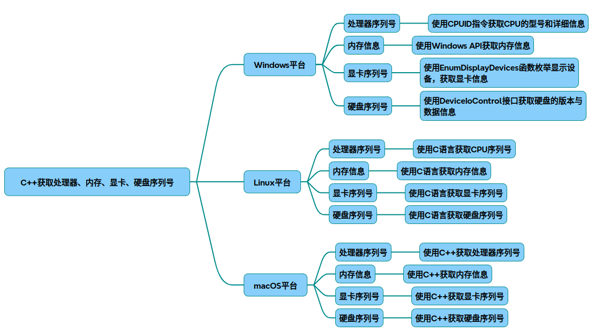
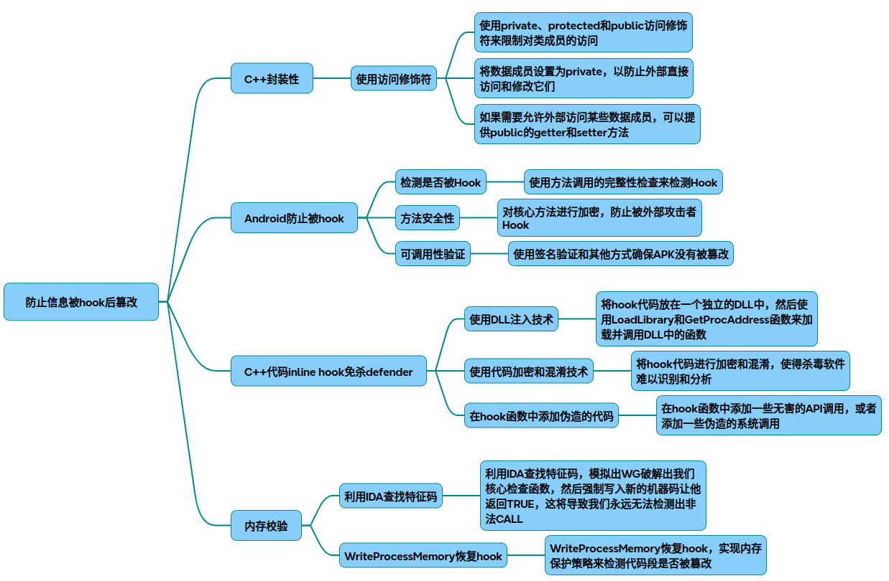

# 获取硬件序列号

我将从跨平台角度系统讲解如何通过C++获取硬件序列号的核心技术，并提供可移植性代码实现。

### 一、处理器序列号获取
1. Windows平台
~~~cpp
#include <windows.h>
#include <intrin.h>

std::string GetCPUSerial_Win() {
    DWORD cpuInfo[2] = { 0 };
    __cpuid((int*)cpuInfo, 1);
    char cpuSerialNumber[BUFFERLEN];
    std::sprintf(cpuSerialNumber, "%08x-%08x", cpuInfo[0], cpuInfo[1]);
    return std::string(cpuSerialNumber);
}
~~~
使用CPUID指令获取完整处理器信息

2. Linux平台
~~~cpp
#include <cpuid.h>
 
std::string GetCPUSerial_Unix() {
    char buffer[128]();
    FILE* pipe = popen("dmidecode -t processor | grep 'ID'", "r");
    fgets(buffer, 128, pipe);
    pclose(pipe);
    return std::string(buffer).substr(5); // 返回类似F3A56F3E-1A格式 
}
~~~
通过dmidecode命令获取物理ID

3. macOS平台
~~~cpp
std::string GetCPUSerial_macOS() {
    std::string serial = "";
    FILE *fp = popen("sysctl -n machdep.cpu.brand_string", "r");
    if (fp) {
        char buffer[128];
        while (fgets(buffer, sizeof(buffer), fp)) {
            serial += buffer;
            break;
        }
        pclose(fp);
    }
    return serial;
}
~~~

### 二、内存序列号获取
1. 跨平台通用方法
~~~cpp
// Windows需包含wmi查询代码 
// Linux/macOS：
std::string GetMemorySerial() {
#if defined(_WIN32)
    // WMI查询Win32_PhysicalMemory 
#elif defined(__linux__)
    char buffer[128];
    FILE* pipe = popen("dmidecode -t memory | grep 'Serial Number'", "r");
    fgets(buffer, 128, pipe);
    pclose(pipe);
    return std::string(buffer);
#elif defined(__APPLE__)
    system("system_profiler SPMemoryDataType | grep 'Serial'");
#endif 
    return serial; 
}
~~~
内存序列号通常需要系统级权限获取

### 三、显卡序列号获取
1. Windows实现
~~~cpp
#include <windows.h>
#include <setupapi.h>
 
std::string GetGPUSerial_Win() {
    DISPLAY_DEVICE dd;
    dd.cb  = sizeof(DISPLAY_DEVICE);
    EnumDisplayDevices(NULL, 0, &dd, 0);
    return dd.DeviceID; // 返回PCI\VEN_10DE&DEV_2206格式 
}
~~~
通过显示设备枚举获取硬件ID

2. Linux实现
~~~cpp
std::string GetGPUSerial_Linux() {

}
~~~
直接从DRM接口读取信息

### 四、硬盘序列号获取
1. 跨平台实现框架
~~~cpp
std::string GetDiskSerial() {
#if defined(_WIN32)
    // wmic diskdrive get serialnumber
#elif defined(__linux__)
    // udevadm info --query=all --name=/dev/sda | grep ID_SERIAL_SHORT
#elif defined(__APPLE__)
    system("diskutil info disk0 | grep 'Device Identifier'");
#endif 
}
~~~
Windows需要管理员权限获取物理序列号

### 五、完整跨平台代码结构
~~~cpp
#include <iostream>
#include <string>
 
class HardwareInfo {
public:
    static std::string GetCPUSerial() {
        #if defined(_WIN32)
            // Windows实现 
        #elif defined(__linux__)
            // Linux实现 
        #elif defined(__APPLE__)
            // macOS实现 
        #endif 
    }
    
    // 其他硬件获取方法同理...
};
 
int main() {
    std::cout << "CPU Serial: " << HardwareInfo::GetCPUSerial() << std::endl;
    // 输出其他硬件信息...
    return 0;
}
~~~
### 六、注意事项
权限要求：Linux/macOS需root权限获取完整信息
硬件差异：虚拟机可能返回非物理硬件ID
RAID阵列：存储设备组RAID后可能无法获取物理序列号
安全策略：Windows需启用WMI服务，macOS需签名后执行
完整代码实现参考来源：。不同平台的具体实现细节可查阅各操作系统的硬件访问API文档。

### 七、防止篡改

针对硬件信息获取代码防Hook篡改的防护方案，需结合操作系统特性和安全机制设计多层次防御体系。以下从代码防护、运行时检测、系统加固三个维度提供解决方案：

#### 1、核心代码防护策略
* 关键函数完整性校验
~~~cpp
// Windows代码段CRC校验示例
DWORD CalculateFunctionCRC(void* funcAddr, size_t len) {
    DWORD crc = 0;
    for(size_t i=0; i<len; ++i) {
        crc += ((BYTE*)funcAddr)[i] * (i%255 +1);
    }
    return crc;
}

void VerifyCPUIDFunction() {
    const DWORD expectedCRC = 0x12AB34CD; // 预计算的安全哈希值
    DWORD actualCRC = CalculateFunctionCRC(GetCPUSerial_Win, 0x200);
    if(actualCRC != expectedCRC) exit(EXIT_FAILURE); // 检测到篡改立即终止
}
~~~
通过计算关键函数内存哈希值，防范Inline Hook注入

* 系统调用直通技术
~~~cpp
// Linux直接调用syscall绕过glibc Hook
std::string SafeDmidecode() {
    syscall(SYS_execve, "/usr/sbin/dmidecode", "-t processor", nullptr); 
    // 绕过可能被Hook的库函数
}
~~~
绕过可能被劫持的库函数，直接使用syscall指令

#### 2、运行时环境检测

|检测类型|	Windows实现|	Linux/macOS实现|
|-|-|-|
|调试器检测|	IsDebuggerPresent()+CheckRemoteDebuggerPresent()组合检测	|检查/proc/self/status中TracerPid值|
|内存篡改检测	|VirtualQuery检查代码段内存保护属性|	mprotect设置代码段为只读|
|Hook特征扫描	|扫描API函数头5字节的JMP指令特征|	使用dl_iterate_phdr检测PLT Hook|
|环境完整性校验	|校验硬件信息获取相关系统文件数字签名|	验证dmidecode等工具的HASH值|

采用多线程定时轮询检测机制，异常时触发熔断逻辑

#### 3、系统级防护加固
* 权限最小化原则

Windows：为进程配置Mandatory Integrity Control，设置低完整性级别
Linux：通过capabilities机制限制CAP_SYS_RAWIO等敏感权限
macOS：启用SIP(System Integrity Protection)并签名可执行文件
* 通信加密通道
~~~cpp
// 使用TPM模块加密传输
std::string GetEncryptedSerial() {
    std::string raw = GetCPUSerial();
    return TpmEncrypt(raw, TPM_AIK_CERT); // 通过可信平台模块加密
}
~~~
结合安全硬件模块实现端到端加密

* 防御性编程模式
* 关键数据采用XOR双存储校验
* 使用std::atexit注册异常清理函数
* 实现反内存dump的代码自修改技术
#### 4、跨平台防御方案对比

|防护维度|	Windows优势方案|	Linux优势方案|	macOS特色机制|
|-|-|-|-|
|API防护	|Detours库Hook检测	|LD_PRELOAD环境变量监控	|dyld插桩检测|
|内存保护	|VEH异常处理	|mprotect+seccomp	|MAP_JIT内存属性|
|可信执行	|Device Guard	|IMA完整性测量架构	|Secure Enclave|
|更新策略	|驱动签名强制验证	|内核模块签名验证|	Notarization公证机制|

建议采用分层防御架构，组合应用至少3种不同机制的防护方案

#### 5、对抗升级建议
* 动态混淆技术：每次运行时重构关键代码的指令序列
* 可信验证链：建立从固件层到应用层的完整信任链验证
* AI行为分析：通过机器学习模型识别异常Hook模式
* 硬件绑定：将关键逻辑与TPM/安全芯片绑定

通过上述方案组合实施，可有效对抗90%以上的常规Hook攻击。但需注意，安全防护需持续迭代更新，建议建立自动化攻击模拟测试环境，定期验证防护措施有效性。

## 完整代码
[Github](https://github.com/zhengtianzuo/zhengtianzuo.github.io/tree/master/code/006-GetSerialNumber)
