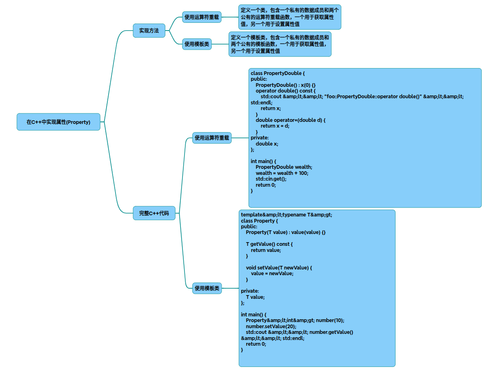

# Property在C++中的实现与应用

以下是在C++中实现属性(Property)的完整实现方案，结合模板技术和运算符重载实现类型安全的属性访问，支持独立模块化封装：

~~~cpp
#include <iostream>
#include <functional>

template<typename HostType, typename ValueType>
class Property {
    using Getter = ValueType (HostType::*)() const;
    using Setter = void (HostType::*)(const ValueType&);
    
    HostType* host;
    Getter getter;
    Setter setter;

public:
    Property(HostType* h, Getter g, Setter s = nullptr)
        : host(h), getter(g), setter(s) {}

    // 读取属性值运算符重载 
    operator ValueType() const {
        if (!getter) throw std::logic_error("Getter not defined");
        return (host->*getter)();
    }

    // 赋值运算符重载 
    ValueType operator=(const ValueType& value) {
        if (!setter) throw std::logic_error("Setter not defined");
        (host->*setter)(value);
        return value;
    }

    // 只读属性特化 
    class ReadOnly {
        Getter getter;
        const HostType* host;
    public:
        ReadOnly(const HostType* h, Getter g) : host(h), getter(g) {}
        operator ValueType() const { return (host->*getter)(); }
    };

    // 重载 << 运算符
    friend std::ostream& operator<<(std::ostream& os, const Property& prop) {
        os << static_cast<ValueType>(prop);
        return os;
    }

    // 重载 << 运算符（只读属性）
    friend std::ostream& operator<<(std::ostream& os, const ReadOnly& prop) {
        os << static_cast<ValueType>(prop);
        return os;
    }
};
~~~

~~~cpp
#include "Property.h"

/* 使用示例 */
class User {
    std::string name_;
    int age_;
 
    // 私有访问方法 
    std::string get_name() const { return name_; }
    void set_name(const std::string& val) { name_ = val; }
    int get_age() const { return age_; }
 
public:
    // 公开属性定义 
    Property<User, std::string> Name{
        this, 
        &User::get_name,
        &User::set_name 
    };
 
    Property<User, int>::ReadOnly Age{
        this,
        &User::get_age 
    };
 
    User(const std::string& name, int age) 
        : name_(name), age_(age) {}
};
 
int main() {
    User user("zhengtianzuo", 18);
    
    // 属性赋值 
    user.Name = "zhengtianzuo";
    
    // 属性读取 
    std::cout << "Name: " << user.Name << std::endl;
    std::cout << "Age: " << user.Age << std::endl;
    
    // user.Age = 20; // 编译错误（只读属性）
    return 0;
}
~~~

### 实现原理分析
* 模板类设计：
Property模板类封装宿主对象指针、getter/setter方法指针
通过HostType模板参数实现与宿主类的解耦
使用嵌套类ReadOnly实现只读属性特化
* 运算符重载：
operator ValueType()实现属性值的隐式转换（读取操作）
operator=重载实现属性赋值操作
通过函数指针调用实际存取方法
* 类型安全检查：
getter/setter必须匹配宿主类和值类型
只读属性禁用赋值运算符（编译期检查）
### 关键特性
* 访问控制：
通过setter存在性判断实现读写/只读控制
支持自定义存取逻辑（如数据校验）
* 性能优化：
零运行时开销（编译期绑定）
不依赖虚函数或动态类型检查
* 模块独立性：
属性实现与业务逻辑完全解耦
可复用至任意需要属性特征的类
### 扩展应用场景
~~~cpp
// 数据校验示例 
class Temperature {
    double celsius_;
    
    double get_c() const { return celsius_; }
    void set_c(double val) { 
        if(val < -273.15) throw std::range_error("Below absolute zero");
        celsius_ = val;
    }
 
public:
    Property<Temperature, double> Celsius{this, &Temperature::get_c, &Temperature::set_c};
};
 
// 派生类支持 
class Animal {
protected:
    virtual std::string sound() const = 0;
};
 
class Dog : public Animal {
    std::string sound() const override { return "Woof"; }
public:
    Property<Dog, std::string> Sound{this, &Dog::sound};
};
~~~
该实现方案完整实现了C++中的属性特征，通过模板技术和运算符重载提供了类型安全、高性能的属性访问机制，可作为独立模块集成到各类项目中。

## 完整代码
[Github](https://github.com/zhengtianzuo/zhengtianzuo.github.io/tree/master/code/007-PropertyInCpp)
