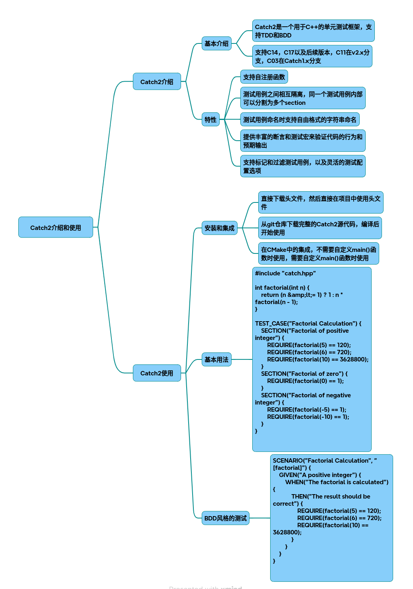

# Catch2

### 一、框架简介
Catch2 是一个基于 C++ 的现代化单元测试框架，支持 TDD（测试驱动开发）和 BDD（行为驱动开发）模式。其核心优势在于：

* 单头文件设计：v2.x 版本仅需包含 catch.hpp 即可使用
* 自然语法：测试用例命名支持自由格式字符串，断言使用标准 C++ 运算符
* 零外部依赖：仅需 C++11 及以上标准库支持
* 多维度覆盖：支持异常测试、基准测试、Matchers 匹配器等高级功能

官方网站[Catch2](https://github.com/catchorg/Catch2)

### 二、环境配置
~~~bash
# CMake 集成示例（v2.x 版本）
cmake_minimum_required(VERSION 3.10)
project(Catch2_Demo)
 
# 下载 Catch2 单头文件 
include(FetchContent)
FetchContent_Declare(
  Catch2
  URL https://github.com/catchorg/Catch2/releases/download/v3.8.0/catch_amalgamated.hpp  
)
FetchContent_MakeAvailable(Catch2)
 
add_executable(tests 
  src/main.cpp  
  src/tests.cpp  
)
target_include_directories(tests PRIVATE ${CMAKE_CURRENT_SOURCE_DIR}/include)
~~~

### 三、核心功能实现
1. 基础测试结构
~~~cpp
// tests.cpp  
#define CATCH_CONFIG_MAIN 
#include <catch.hpp> 
 
int factorial(int n) {
    if(n <= 0) return 1;
    return n * factorial(n - 1);
}
 
TEST_CASE("阶乘基础测试", "[math][factorial]") {
    SECTION("正整数值验证") {
        REQUIRE(factorial(5) == 120);
        CHECK(factorial(6) == 720);  // 非致命断言 
    }
    
    SECTION("边界条件验证") {
        REQUIRE(factorial(0) == 1);
        REQUIRE(factorial(-1) == 1);
    }
}
~~~
2. BDD 风格测试
~~~cpp
SCENARIO("用户登录流程验证", "[auth][bdd]") {
    GIVEN("已注册用户凭证") {
        std::string username = "test_user";
        std::string password = "P@ssw0rd";
        
        WHEN("输入正确密码") {
            bool result = authenticate(username, password);
            
            THEN("应返回认证成功") {
                REQUIRE(result == true);
            }
        }
        
        WHEN("输入错误密码") {
            bool result = authenticate(username, "wrong_pass");
            
            THEN("应返回认证失败") {
                REQUIRE_FALSE(result);
            }
        }
    }
}
~~~
3. 高级验证功能
~~~cpp
// 异常测试 
TEST_CASE("异常处理验证", "[exceptions]") {
    REQUIRE_THROWS_AS(throw std::runtime_error("错误"), std::runtime_error);
    CHECK_THROWS_WITH(throw "Error!", Catch::Contains("Error"));
}
 
// 浮点近似比较 
TEST_CASE("精度计算验证", "[math][approx]") {
    double pi = 3.14159265359;
    REQUIRE(pi == Approx(3.14159).epsilon(0.0001));
}
 
// Matchers 匹配器
TEST_CASE("字符串验证", "[strings]") {
    using namespace Catch::Matchers;
    std::string url = "https://api.example.com/v1"; 
    
    REQUIRE_THAT(url, 
        StartsWith("https") && 
        EndsWith("v1") && 
        Contains("example"));
}
~~~
4. 基准测试
~~~cpp
TEST_CASE("性能基准测试", "[!benchmark]") {
    BENCHMARK("向量插入 1000 元素") {
        std::vector<int> v;
        for(int i = 0; i < 1000; ++i) {
            v.push_back(i); 
        }
    };
}
~~~
### 四、进阶使用技巧
* 测试过滤：通过标签执行特定测试
~~~bash
./tests "[math]"          # 执行所有数学测试 
./tests "~[slow]"         # 排除标记为 slow 的测试 
~~~
* 自定义 Main 函数（需配置 CATCH_CONFIG_RUNNER）：
~~~cpp
int main(int argc, char* argv[]) {
    Catch::Session session;
    
    // 添加全局配置 
    session.configData().showDurations  = Catch::ShowDurations::Always;
    
    return session.run(argc,  argv);
}
~~~
* 参数化测试：
~~~cpp
TEST_CASE_METHOD(TestFixture, "参数化测试", "[params]") {
  auto [input, expected] = GENERATE(
      std::make_tuple(2, 4),
      std::make_tuple(3, 9),
      std::make_tuple(5, 25)
  );
  
  REQUIRE(square(input) == expected);
}
~~~
### 五、最佳实践建议
* 测试组织结构：
~~~bash
tests/
├── unit/        # 单元测试 
├── integration/ # 集成测试 
└── benchmark/   # 性能测试 
~~~
* CI/CD 集成：
~~~bash
# GitHub Actions 示例 
jobs:
  test:
    runs-on: ubuntu-latest 
    steps:
      - uses: actions/checkout@v2
      - run: |
          mkdir build 
          cd build 
          cmake ..
          make 
          ./tests -r compact 
~~~

## 完整代码
[Github](https://github.com/zhengtianzuo/zhengtianzuo.github.io/tree/master/code/010-Catch2)
