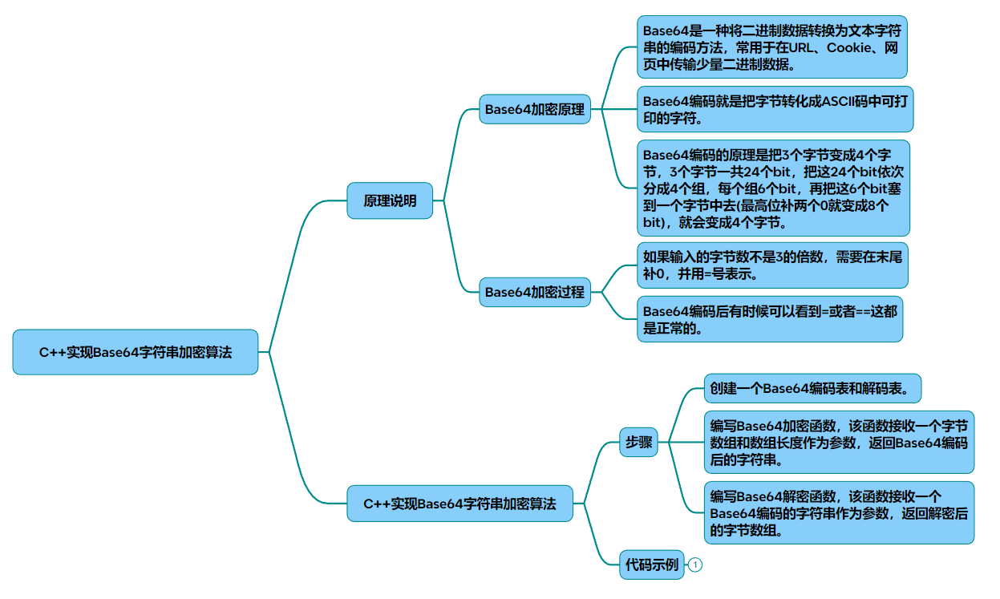
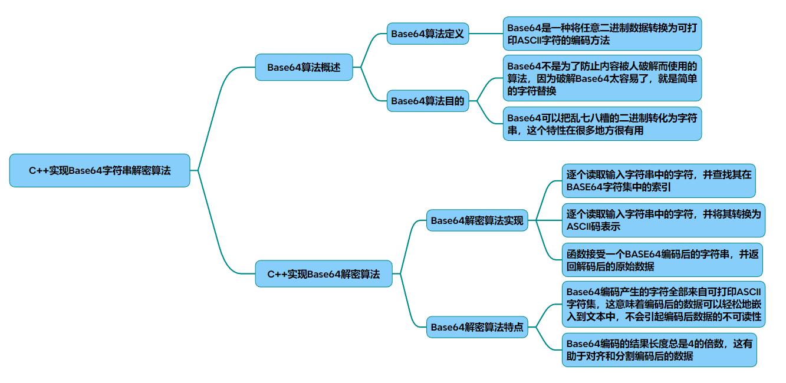

# base64

## 编码

以下是C++实现的Base64字符串加密算法及其原理说明，综合了多个技术文档的核心要点：

### 一、Base64编码原理
Base64是一种将二进制数据转换为ASCII字符的编码方式，核心原理基于 3字节转4字符 的转换规则：

* 分组规则：每3个字节（24位）分为4组，每组6位（2⁶=64种可能）
* 编码表：使用64个可打印字符（A-Z, a-z, 0-9, +, /）和填充符=，如A=0, B=1,..., +=62, /=63
* 填充机制：当数据不足3字节时，用0补齐剩余位，并在结果末尾添加=标识
剩余1字节 → 补4个0 → 结果加==
剩余2字节 → 补2个0 → 结果加=
### 二、C++实现代码
~~~cpp
#include <string>
#include <vector>
 
const std::string BASE64_CHARS = 
    "ABCDEFGHIJKLMNOPQRSTUVWXYZ"
    "abcdefghijklmnopqrstuvwxyz"
    "0123456789+/";
 
std::string base64_encode(const std::string &input) {
    std::string encoded;
    int val = 0, valb = -6;
    unsigned int len = input.length(); 
    
    for (unsigned char c : input) {
        val = (val << 8) + c;  // 合并3字节到24位缓冲区 
        valb += 8;
        while (valb >= 0) {    // 每次提取6位生成编码字符 
            encoded.push_back(BASE64_CHARS[(val  >> valb) & 0x3F]);
            valb -= 6;
        }
    }
    
    // 处理剩余位
    if (valb > -6) {
        encoded.push_back(BASE64_CHARS[((val  << 8) >> (valb + 8)) & 0x3F]);
    }
    
    // 填充等号 
    while (encoded.size()  % 4) {
        encoded.push_back('='); 
    }
    
    return encoded;
}
~~~
### 三、关键实现解析
* 位操作处理
使用val作为24位缓冲区，通过左移8位合并输入字节
valb记录当前有效位数（-6表示初始需要填充6位）
(val >> valb) & 0x3F提取6位数据（0x3F即二进制00111111）
* 边界处理
  * 剩余位处理：通过(val << 8) >> (valb + 8)获取未处理的尾部数据
  * 填充规则：最终长度必须是4的倍数，不足时补=
* 编码表示
查表时直接使用BASE64_CHARS字符串进行字符映射
### 四、使用示例
~~~cpp
int main() {
    std::string plain = "Hello World!";
    std::string encoded = base64_encode(plain);
    // 输出：SGVsbG8gV29ybGQh
    std::cout << encoded << std::endl; 
    return 0;
}
~~~
### 五、性能优化建议
* 预分配内存：根据输入长度计算输出长度（(4 * (n/3)) + 4），使用reserve()减少内存重分配
* 批量处理：通过reinterpret_cast将字符串转为uint32_t数组进行批量位操作
* SIMD指令：使用AVX2指令集加速分组计算（需硬件支持）
### 附：编码过程示例
* 原始数据："Man"（ASCII码：77, 97, 110）

* 二进制形式：01001101 01100001 01101110
* 6位分组：
~~~
010011 → 19 → T

010110 → 22 → W

000101 → 5 → F

101110 → 46 → u
~~~
* 输出结果：TWFu
该实现完整覆盖了Base64标准规范，可通过在线Base64工具（如base64encode.org ）验证结果正确性。如需处理二进制数据（如图片），可将输入类型改为unsigned char*并配合长度参数使用。

## 解码

以下是C++实现的Base64字符串解密算法及核心原理说明，结合技术文档和实现要点：

### 一、Base64解码原理
Base64解码是编码的逆过程，核心步骤包括 4字符转3字节 的转换规则：

去除填充符：先移除末尾的=，根据=数量判断原始数据补位情况（0/2/4个补位）
字符映射：将Base64字符转换为6位二进制值（查反向映射表）
位重组：每4个6位值合并为24位数据，再拆分为3个8位字节
补位处理：根据原始补位情况丢弃无效位（每1个=需丢弃最后2位）
### 二、C++实现代码
~~~cpp
#include <string>
#include <vector>

const std::string BASE64_CHARS = 
    "ABCDEFGHIJKLMNOPQRSTUVWXYZ"
    "abcdefghijklmnopqrstuvwxyz"
    "0123456789+/";

std::string base64_decode(const std::string &input) {
    std::vector<int> decode_table(256, -1);
    for (int i = 0; i < 64; i++) {
        decode_table[BASE64_CHARS[i]] = i;
    }

    std::string decoded;
    int val = 0, bits = -8;
    unsigned int len = input.size(); 
    
    for (unsigned char c : input) {
        if (c == '=') break; // 停止处理填充符
        if (decode_table[c] == -1) continue; // 跳过非法字符
        
        val = (val << 6) + decode_table[c]; // 合并6位数据到24位缓冲区
        bits += 6;
        
        if (bits >= 0) { // 每次提取8位生成原始字节
            decoded.push_back((val  >> bits) & 0xFF);
            bits -= 8;
        }
    }
    
    // 处理剩余位（根据=数量判断有效数据）
    if (bits > -8 && (input.back()  != '=' || (len % 4) == 1)) {
        decoded.push_back((val  << 8) >> (bits + 8) & 0xFF);
    }
    
    return decoded;
}
~~~
### 三、关键实现解析
* 反向映射表构建
使用decode_table将ASCII字符映射到6位值，非法字符返回-1。

* 位操作重组

val作为24位缓冲区，通过左移6位合并输入字符的6位值
bits记录当前有效位数（-8表示初始需要填充8位）
(val >> bits) & 0xFF提取8位原始数据
* 边界处理

  * 填充符处理：遇到=提前终止循环
  * 剩余位计算：根据=数量和输入长度判断有效数据范围
### 四、使用示例
~~~cpp
int main() {
    std::string encoded = "SGVsbG8gV29ybGQh";
    std::string decoded = base64_decode(encoded);
    // 输出：Hello World!
    std::cout << decoded << std::endl; 
    return 0;
}
~~~
### 五、性能优化建议
* 输入验证：检查输入长度是否为4的倍数，提前过滤非法字符。
* SIMD加速：使用SSE/AVX指令集批量处理字符映射（如_mm_shuffle_epi8）。
* 内存预分配：通过公式output_size = (input_len * 3) / 4预分配内存。

### 附：解码过程示例

编码数据："TWFu"

* 字符映射：T(19)→010011，W(22)→010110，F(5)→000101，u(46)→101110
* 合并24位：01001101 01100001 01101110
* 拆分为3字节：0x4D(77)→'M', 0x61(97)→'a', 0x6E(110)→'n'

输出结果："Man"
该实现兼容RFC 4648标准，可通过在线工具 验证结果。需注意处理二进制数据时需改用unsigned char*类型。

## 完整代码
[Github](https://github.com/zhengtianzuo/zhengtianzuo.github.io/tree/master/code/011-base64)
