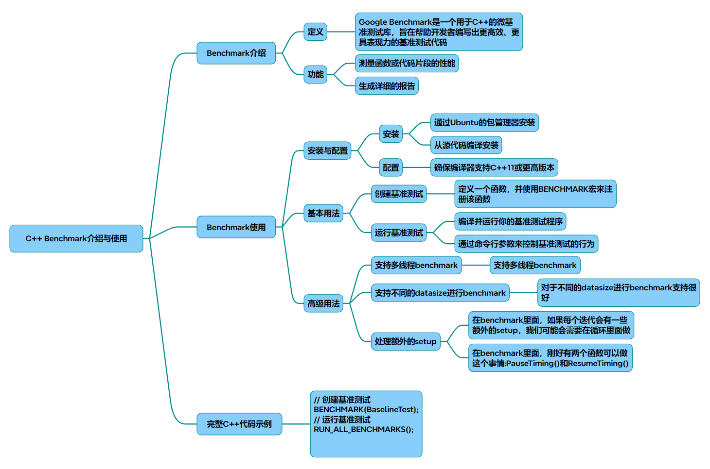

# Benchmark

以下是一篇关于Google Benchmark库的全面介绍及使用指南，包含完整C++代码示例和核心功能覆盖：

Google Benchmark：C++ 性能基准测试指南

### 一、库简介
Google Benchmark 是一个专为 C++ 设计的微基准测试库，用于精确测量代码片段的执行效率。其核心特性包括：

* 多维度测试：支持参数化测试、多线程场景和自定义数据规模
* 智能迭代：自动计算最佳迭代次数保证统计显著性
* 精准计时：提供真实时间（wall time）和 CPU 时间双维度测量
* 跨平台支持：兼容 Linux/Windows/macOS，支持 CMake 构建
### 二、环境安装
通过源码编译（推荐）：
#### 1. 安装依赖 
~~~bash
sudo apt install git cmake build-essential 
~~~
#### 2. 克隆仓库 
~~~bash
git clone https://github.com/google/benchmark.git  
cd benchmark 
~~~
#### 3. 构建安装 
~~~bash
cmake -E make_directory build 
cmake -S . -B build -DBENCHMARK_DOWNLOAD_DEPENDENCIES=ON 
cmake --build build --config Release 
sudo cmake --install build 
~~~
### 三、基础使用
* 示例1：基本性能测试
~~~cpp
#include <benchmark/benchmark.h>
 
static void BM_StringCreation(benchmark::State& state) {
    for (auto _ : state) {
        std::string empty_string;
        benchmark::DoNotOptimize(empty_string); // 防止编译器优化 
    }
}
BENCHMARK(BM_StringCreation);
 
static void BM_StringCopy(benchmark::State& state) {
    std::string x = "hello";
    for (auto _ : state) {
        std::string copy(x);
        benchmark::ClobberMemory(); // 强制内存操作计入计时 
    }
}
BENCHMARK(BM_StringCopy);
 
BENCHMARK_MAIN();
~~~
输出解读：
~~~Plaintext
BM_StringCreation        3.27 ns         3.27 ns    210470863 
BM_StringCopy           21.35 ns        21.35 ns     32765432 
~~~
* 第一列：测试名称
* 第二列：每次迭代实际耗时（纳秒）
* 第三列：CPU 时间
* 第四列：自动计算的迭代次数
### 四、进阶功能
1. 参数化测试
~~~cpp
static void BM_VectorPushBack(benchmark::State& state) {
    for (auto _ : state) {
        std::vector<int> v;
        v.reserve(state.range(0)); 
        for (int i = 0; i < state.range(0);  ++i) {
            v.push_back(i); 
        }
    }
    state.SetComplexityN(state.range(0));  // 复杂度分析 
}
// 测试不同数据规模：8, 64, 512, 4096
BENCHMARK(BM_VectorPushBack)->RangeMultiplier(8)->Range(8, 4096)->Complexity();
 
// 多参数测试 
BENCHMARK(BM_SomeFunc)->Args({128, 256})->Args({512, 1024});
~~~
2. 多线程测试
~~~cpp
static void BM_AtomicIncrement(benchmark::State& state) {
    std::atomic<int> val(0);
    for (auto _ : state) {
        benchmark::DoNotOptimize(val.fetch_add(1)); 
    }
    state.SetItemsProcessed(state.iterations()); 
}
BENCHMARK(BM_AtomicIncrement)->Threads(2)->Threads(4)->UseRealTime();
~~~
3. 计时控制
~~~cpp
static void BM_PausedTiming(benchmark::State& state) {
    std::vector<int> data;
    for (auto _ : state) {
        state.PauseTiming(); // 暂停计时 
        data = GenerateRandomData(1000);
        state.ResumeTiming(); // 恢复计时 
        ProcessData(data);
    }
}
BENCHMARK(BM_PausedTiming);
~~~
### 五、完整测试案例
~~~cpp
#include <benchmark/benchmark.h>
#include <vector>
#include <algorithm>
 
// 测试不同排序算法的性能 
template <typename T>
static void BM_Sort(benchmark::State& state) {
    std::vector<T> data(state.range(0)); 
    std::generate(data.begin(),  data.end(),  []{ return rand() % 1000; });
    
    for (auto _ : state) {
        state.PauseTiming();
        auto temp = data; // 复制数据避免原地排序影响 
        state.ResumeTiming();
        
        std::sort(temp.begin(),  temp.end()); 
    }
    state.SetBytesProcessed(state.iterations()  * data.size()  * sizeof(T));
}
 
BENCHMARK_TEMPLATE(BM_Sort, int)->Range(1<<10, 1<<20)->Unit(benchmark::kMillisecond);
 
// 多线程版本 
static void BM_ParallelSort(benchmark::State& state) {
    std::vector<int> data(state.range(0)); 
    std::generate(data.begin(),  data.end(),  []{ return rand() % 1000; });
    
    for (auto _ : state) {
        auto temp = data;
        benchmark::DoNotOptimize(temp.data()); 
        std::sort(std::execution::par, temp.begin(),  temp.end()); 
    }
}
BENCHMARK(BM_ParallelSort)->Range(1<<20, 1<<24)->Threads(4)->UseRealTime();
 
BENCHMARK_MAIN();
~~~
### 六、最佳实践
* 避免优化干扰：使用 benchmark::DoNotOptimize() 和 benchmark::ClobberMemory()
* 合理设置范围：通过 ->Range() 和 ->Arg() 覆盖典型用例和边界条件
* 复杂度分析：结合 SetComplexityN() 和 ->Complexity() 进行算法复杂度验证
* 资源统计：使用 SetBytesProcessed() 和 SetItemsProcessed() 统计吞吐量
* 结果可视化：通过 --benchmark_format=console|json 输出格式控制
### 七、扩展功能
* 自定义报告格式：继承 benchmark::ConsoleReporter 实现自定义输出
* 内存统计：集成 benchmark::MemoryManager 跟踪内存使用情况
* 对比测试：使用 BENCHMARK_MAIN() 自动生成的对比表格
* Python集成：通过 pybind11 实现 Python 脚本控制测试流程
通过以上方法和示例，开发者可以全面掌握代码性能特征，做出基于数据的优化决策。Google Benchmark 的详细文档可通过其 GitHub 仓库获取。

## 完整代码
[Github](https://github.com/zhengtianzuo/zhengtianzuo.github.io/tree/master/code/012-Benchmark)
