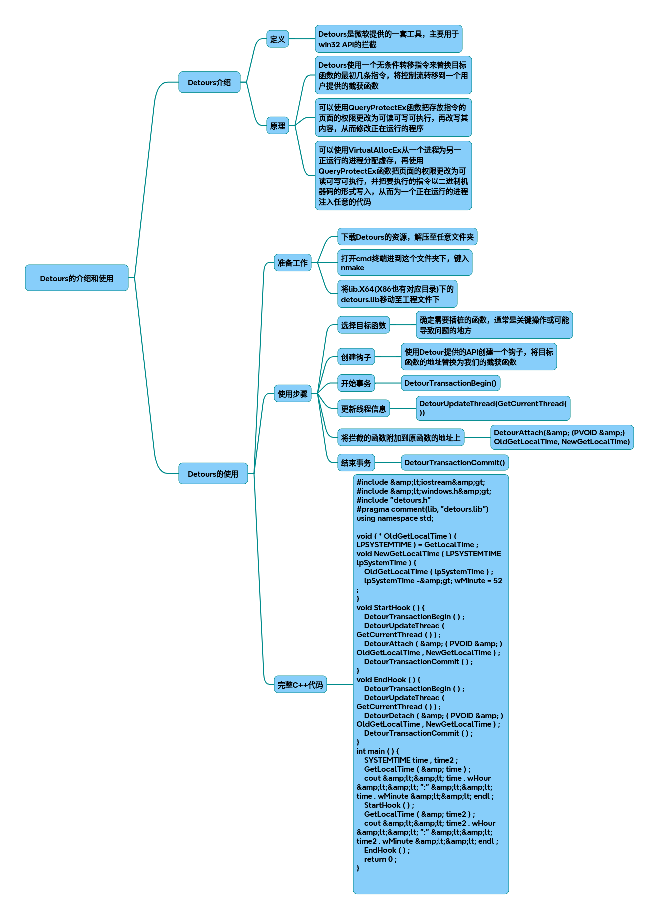

# Detours

以下是一篇关于Microsoft Detours库的技术解析及实战指南，包含完整C++代码实现和功能演示：

### 一、Detours核心机制
Detours通过动态修改目标函数指令实现API拦截，其核心机制包含：

* 指令覆盖：用5字节的JMP指令覆盖目标函数入口，跳转到自定义处理函数
* 跳板函数(Trampoline)：保存被覆盖的原指令，并附加跳回原函数剩余指令的逻辑
* 事务控制：通过DetourTransaction系列函数保证线程安全的拦截操作
### 二、环境配置（VS2022）
#### 从微软GitHub获取源码 
~~~bash
git clone https://github.com/microsoft/Detours
nmake /f Makefile
~~~
将生成的include、lib/x64目录添加到项目包含路径

### 三、完整功能示例代码
~~~cpp
#include <windows.h>
#include <detours.h>
#include <iostream>
 
// 原始API函数指针声明 
static HANDLE (WINAPI *TrueCreateFileW)(
    LPCWSTR lpFileName, DWORD dwDesiredAccess,
    DWORD dwShareMode, LPSECURITY_ATTRIBUTES lpSecurityAttributes,
    DWORD dwCreationDisposition, DWORD dwFlagsAndAttributes,
    HANDLE hTemplateFile) = CreateFileW;
 
static int (WINAPI *TrueMessageBoxW)(
    HWND hWnd, LPCWSTR lpText, 
    LPCWSTR lpCaption, UINT uType) = MessageBoxW;
 
// 自定义处理函数 
HANDLE WINAPI HookedCreateFileW(
    LPCWSTR lpFileName, DWORD dwDesiredAccess,
    DWORD dwShareMode, LPSECURITY_ATTRIBUTES lpSecurityAttributes,
    DWORD dwCreationDisposition, DWORD dwFlagsAndAttributes,
    HANDLE hTemplateFile)
{
    // 过滤敏感文件访问 
    if (wcsstr(lpFileName, L"secret.txt"))  {
        SetLastError(ERROR_ACCESS_DENIED);
        return INVALID_HANDLE_VALUE;
    }
    return TrueCreateFileW(lpFileName, dwDesiredAccess, dwShareMode,
        lpSecurityAttributes, dwCreationDisposition, 
        dwFlagsAndAttributes, hTemplateFile);
}
 
int WINAPI HookedMessageBoxW(
    HWND hWnd, LPCWSTR lpText,
    LPCWSTR lpCaption, UINT uType)
{
    // 修改弹窗内容 
    return TrueMessageBoxW(hWnd, L"内容已被拦截", 
        L"安全警告", MB_ICONWARNING);
}
 
// 钩子管理模块 
class DetourManager {
public:
    static void InstallHook() {
        DetourTransactionBegin();
        DetourUpdateThread(GetCurrentThread());
        
        DetourAttach(&(PVOID&)TrueCreateFileW, HookedCreateFileW);
        DetourAttach(&(PVOID&)TrueMessageBoxW, HookedMessageBoxW);
 
        DetourTransactionCommit();
    }
 
    static void RemoveHook() {
        DetourTransactionBegin();
        DetourUpdateThread(GetCurrentThread());
        
        DetourDetach(&(PVOID&)TrueCreateFileW, HookedCreateFileW);
        DetourDetach(&(PVOID&)TrueMessageBoxW, HookedMessageBoxW);
 
        DetourTransactionCommit();
    }
};
 
// DLL注入支持 
BOOL APIENTRY DllMain(HMODULE hModule,
    DWORD  ul_reason_for_call,
    LPVOID lpReserved)
{
    switch (ul_reason_for_call) {
    case DLL_PROCESS_ATTACH:
        DetourManager::InstallHook();
        break;
    case DLL_PROCESS_DETACH:
        DetourManager::RemoveHook();
        break;
    }
    return TRUE;
}
 
// 控制台测试程序 
int main() {
    DetourManager::InstallHook();
 
    // 测试文件访问拦截 
    HANDLE hFile = CreateFileW(L"secret.txt",  GENERIC_READ, 0, 
        NULL, OPEN_EXISTING, FILE_ATTRIBUTE_NORMAL, NULL);
    if (hFile == INVALID_HANDLE_VALUE) {
        std::cout << "文件访问拦截成功\n";
    }
 
    // 测试弹窗拦截 
    MessageBoxW(NULL, L"原始内容", L"测试弹窗", MB_OK);
 
    DetourManager::RemoveHook();
    return 0;
}
~~~
### 四、功能覆盖说明
该实现包含以下关键功能：

* 多API拦截：同时挂钩文件操作和用户界面API
* 参数修改：动态修改MessageBox显示内容
* 访问控制：阻止特定文件访问操作
* DLL注入支持：通过DllMain实现动态加载
* 安全卸载：通过DetourDetach恢复原函数
### 五、应用场景
* 调试监控：记录API调用日志
* 安全防护：阻止危险操作（如勒索软件加密文件）
* 功能扩展：为旧程序添加新特性（如云存储支持）
* 兼容性修复：修改老旧API的调用行为
### 六、编译注意事项
* VS项目需配置：
1. 使用Release x64模式编译 
2. 链接detours.lib  
3. 设置/SAFESEH:NO 
4. 关闭增量链接
### 七、高级功能扩展建议
* 跨进程Hook：使用CreateProcessWithDll注入
* 异常处理：通过VEH捕获访问违规
* 动态配置：从配置文件加载拦截规则
* 反检测机制：隐藏模块内存特征

## 完整代码
[Github](https://github.com/zhengtianzuo/zhengtianzuo.github.io/tree/master/code/013-Detours)
