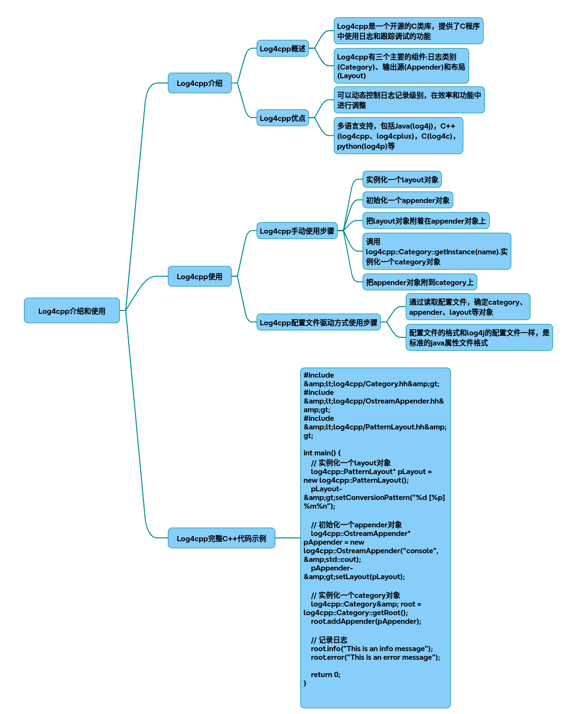

# log4cpp

Log4cpp 全功能开发指南
Log4cpp是C++领域最成熟的日志管理库之一，移植自Java生态的log4j，支持动态优先级控制、多输出源、自定义格式等功能。

### 一、核心组件
* Category（日志类别）
管理日志分类和优先级过滤机制，采用树形继承结构，支持日志级别：
DEBUG < INFO < WARN < ERROR < FATAL

* Appender（输出源）
    定义日志输出目标：
  * FileAppender 文件输出
  * RollingFileAppender 滚动文件（自动分割）
  * ConsoleAppender 控制台输出
  * SyslogAppender 系统日志
* Layout（布局）
控制日志格式：

// 典型Pattern格式 
"%d [%p] %c: %m%n" 
// 对应：日期 [优先级] 类目: 消息+换行[1]()
### 二、环境配置
#### Linux安装 
~~~bash
wget https://sourceforge.net/projects/log4cpp/files/log4cpp-1.1.3.tar.gz  
tar zxvf log4cpp-1.1.3.tar.gz  
cd log4cpp && ./configure && make && make install 
~~~
#### Windows编译 
~~~
使用VS打开msvc6/log4cpp.sln
~~~
### 三、完整代码示例
~~~cpp
#include <log4cpp/Category.hh> 
#include <log4cpp/FileAppender.hh> 
#include <log4cpp/RollingFileAppender.hh> 
#include <log4cpp/PatternLayout.hh> 
#include <log4cpp/PropertyConfigurator.hh> 
 
// 基础配置初始化 
void initBasicLog() {
    // 创建格式化器
    PatternLayout* layout = new PatternLayout();
    layout->setConversionPattern("%d{%Y-%m-%d %H:%M:%S.%l} [%p] %m%n");

    // 控制台输出 
    Appender* consoleApp = new OstreamAppender("console", &std::cout);
    consoleApp->setLayout(layout);

    // 创建格式化器
    PatternLayout* layout1 = new PatternLayout();
    layout1->setConversionPattern("%d{%Y-%m-%d %H:%M:%S.%l} [%p] %m%n");

    // 文件输出（自动滚动）
    RollingFileAppender* fileApp = new RollingFileAppender("fileApp", "demo.log",  10*1024*1024, 5);
    fileApp->setLayout(layout1);

    // 配置主日志器
    Category& root = Category::getRoot();
    root.setPriority(Priority::DEBUG); 
    root.addAppender(consoleApp); 
    root.addAppender(fileApp); 
}
 
// 配置文件加载 
void initConfigLog() {
    try {
        log4cpp::PropertyConfigurator::configure("log4cpp.conf"); 
    } catch(log4cpp::ConfigureFailure& f) {
        std::cerr << "配置加载失败: " << f.what()  << std::endl;
    }
}
 
int main() {
    // 初始化方式任选其一 
    initBasicLog();    // 代码初始化 
    // initConfigLog(); // 文件配置初始化 
 
    log4cpp::Category& logger = log4cpp::Category::getInstance("MainModule");
    
    // 多级别日志记录 
    logger.debug(" 调试信息: 变量x=%d", 42);
    logger.info(" 系统启动完成");
    logger.warn(" 磁盘空间剩余10%%");
    logger.error(" 数据库连接失败");
    
    // NDC诊断上下文（多线程追踪）
    log4cpp::NDC::push("RequestID:1001");
    logger << log4cpp::Priority::INFO << "处理用户请求";
    log4cpp::NDC::pop();
 
    log4cpp::Category::shutdown();
    return 0;
}
~~~
### 四、配置文件示例（log4cpp.conf ）
#### 定义输出源
~~~
log4cpp.appender.file=RollingFileAppender  
log4cpp.appender.file.fileName=app.log  
log4cpp.appender.file.maxFileSize=10485760  
log4cpp.appender.file.maxBackupIndex=5  
log4cpp.appender.file.layout=PatternLayout  
log4cpp.appender.file.layout.conversionPattern=%d  [%p] %c: %m%n

#### 设置日志级别和输出源
log4cpp.rootCategory=DEBUG,  file 
log4cpp.category.Network=INFO  
~~~
### 五、高级功能
* 动态配置重载
通过PropertyConfigurator::watch()实现运行时配置更新

* 多线程安全
所有组件线程安全，支持高并发日志写入

* 自定义Appender
继承log4cpp::AppenderSkeleton实现自定义输出目标（如数据库）

* 日志过滤器
使用Filter实现基于内容的正则过滤

### 六、性能优化建议
生产环境建议使用RollingFileAppender限制日志大小
非调试阶段设置rootCategory=WARN减少IO消耗
避免高频次DEBUG日志影响程序性能

## 完整代码
[Github](https://github.com/zhengtianzuo/zhengtianzuo.github.io/tree/master/code/014-log4cpp)
