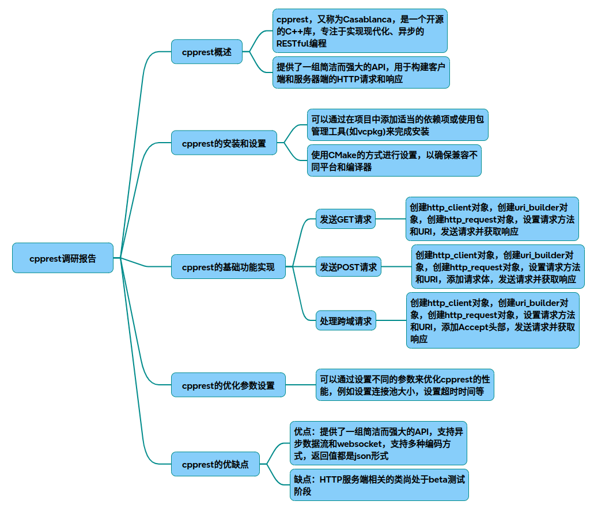

# HttpServer

以下为关于C++ REST SDK（cpprestsdk）的技术调研报告及完整实现方案，综合了架构原理、核心功能实现、性能优化策略及可视化说明：

### 一、C++ REST SDK技术原理
#### 核心架构
cpprestsdk基于异步I/O模型构建，采用C++11特性与Boost.Asio库实现高性能网络通信。其核心模块包括：

* HTTP Client/Server：支持RESTful API请求/响应处理
* JSON序列化：基于web::json命名空间实现结构化数据处理
* URI解析：提供符合RFC 3986标准的URI构造与解析工具
* 异步任务链：通过pplx::task实现非阻塞操作链式调用

#### 实现原理
遵循Roy Fielding提出的REST架构约束：

* 无状态通信：每个请求包含完整上下文
* 资源标识：通过URI定位资源（如/api/users/{id}）
* 统一接口：使用HTTP方法（GET/POST/PUT/DELETE）操作资源
* 超媒体驱动：响应中嵌入相关资源链接（HATEOAS）
### 二、基础功能实现
#### 客户端实现
~~~cpp
#include <cpprest/http_client.h>
#include <cpprest/json.h>
 
using namespace web;
using namespace web::http;
using namespace web::http::client;
 
class RestClient {
public:
    RestClient(const utility::string_t& url) : client(url) {}
 
    // GET请求（带查询参数）
    pplx::task<json::value> GetUsers(int page = 1) {
        uri_builder builder(U("/users"));
        builder.append_query(U("page"),  page);
        return client.request(methods::GET,  builder.to_string()) 
            .then( {
                return response.extract_json(); 
            });
    }
 
    // POST创建资源 
    pplx::task<http_response> CreateUser(const json::value& user) {
        return client.request(methods::POST,  U("/users"), user);
    }
 
    // PUT更新资源 
    pplx::task<http_response> UpdateUser(int id, const json::value& data) {
        uri_builder builder(U("/users"));
        builder.append_path(std::to_string(id)); 
        return client.request(methods::PUT,  builder.to_string(),  data);
    }
 
    // DELETE删除资源 
    pplx::task<http_response> DeleteUser(int id) {
        uri_builder builder(U("/users"));
        builder.append_path(std::to_string(id)); 
        return client.request(methods::DEL,  builder.to_string()); 
    }
 
private:
    http_client client;
};
~~~
#### 服务端实现（多路由处理）
~~~cpp
#include <cpprest/http_listener.h>
#include <cpprest/json.h>
 
using namespace web;
using namespace web::http;
using namespace web::http::experimental::listener;
 
class RestServer {
public:
    RestServer(const utility::string_t& url) : listener(url) {
        listener.support(methods::GET,  std::bind(&RestServer::HandleGet, this, std::placeholders::_1));
        listener.support(methods::POST,  std::bind(&RestServer::HandlePost, this, std::placeholders::_1));
    }
 
    void Start() { listener.open().wait();  }
    void Stop() { listener.close().wait();  }
 
private:
    void HandleGet(http_request req) {
        auto path = uri::decode(req.relative_uri().path()); 
        
        if (path == U("/users")) {
            json::value users = GetUserList(); // 业务逻辑实现 
            req.reply(status_codes::OK,  users);
        } else {
            req.reply(status_codes::NotFound); 
        }
    }
 
    void HandlePost(http_request req) {
        req.extract_json() 
            .then([=](json::value body) {
                // 数据验证与存储逻辑 
                req.reply(status_codes::Created); 
            });
    }
 
    http_listener listener;
};
~~~
### 三、性能优化策略
#### 核心参数配置
|配置项|	作用域|	推荐值|	说明|
|-|-|-|-|
|http_client_config	|客户端	|timeout=10s	|请求超时时间|
|threadpool::initialize	|服务端	|threads=CPU*2	|I/O线程池大小|
|http_listener::set_entity_size	|服务端	|10MB	|最大请求体限制|
|compression::builtin	|双向|	gzip	|启用传输压缩|

3.2 高级优化方案
* 连接池管理：复用HTTP客户端实例减少TCP握手开销
~~~cpp
http_client_config config;
config.set_connection_timeout(std::chrono::seconds(5)); 
config.set_max_redirects(3);  // 自动重定向 
http_client client(U("https://api.example.com"),  config);
~~~
* 异步批处理：合并多个请求提升吞吐量
~~~cpp
std::vector<pplx::task<json::value>> tasks;
for(auto& id : ids) {
    tasks.push_back(client.request(methods::GET,  GetUserUri(id))
        .then({ return res.extract_json();  }));
}
 
pplx::when_all(tasks.begin(),  tasks.end()) 
    .then({
        // 批量处理结果 
    });
~~~
* 缓存策略：使用内存缓存高频数据
~~~cpp
#include <cpprest/cache.h>
web::cache::memory_cache<uint64_t, json::value> user_cache;
 
auto get_cached_user(int id) {
    if(auto entry = user_cache.get(id))  return entry;
    auto user = fetch_from_db(id);
    user_cache.put(id,  user, std::chrono::minutes(5));
    return user;
}
~~~
### 四、系统监控与调试
#### 日志追踪配置
~~~cpp
// 启用详细日志输出 
web::http::diagnostics::trace_level level = 
    web::http::diagnostics::trace_level::verbose;
web::http::diagnostics::set_tracing_level(level);
~~~
#### 性能分析指标
~~~mermaid
graph TD 
    A[客户端请求] --> B{服务端处理}
    B -->|成功| C[记录QPS]
    B -->|失败| D[记录错误类型]
    C --> E[生成监控报表]
    D --> E 
~~~
### 五、部署建议
* 跨平台编译：使用CMake统一构建配置
~~~bash
cmake_minimum_required(VERSION 3.12)
project(cpprest-demo)
 
find_package(cpprestsdk REQUIRED)
add_executable(server src/server.cpp) 
target_link_libraries(server PRIVATE cpprestsdk::cpprest)
~~~
* 容器化部署：建议Docker镜像集成openssl和boost依赖
FROM ubuntu:20.04 
~~~bash
RUN apt-get update && apt-get install -y \
    libcpprest-dev \
    libssl-dev \
    && rm -rf /var/lib/apt/lists/*
~~~
完整示例代码及配置模板可通过引用中的实现进行扩展。建议结合具体业务场景调整线程池大小、超时阈值等参数，并通过性能测试工具（如Apache Bench）验证优化效果。

## 完整代码
[Github](https://github.com/zhengtianzuo/zhengtianzuo.github.io/tree/master/code/017-HttpServer)
