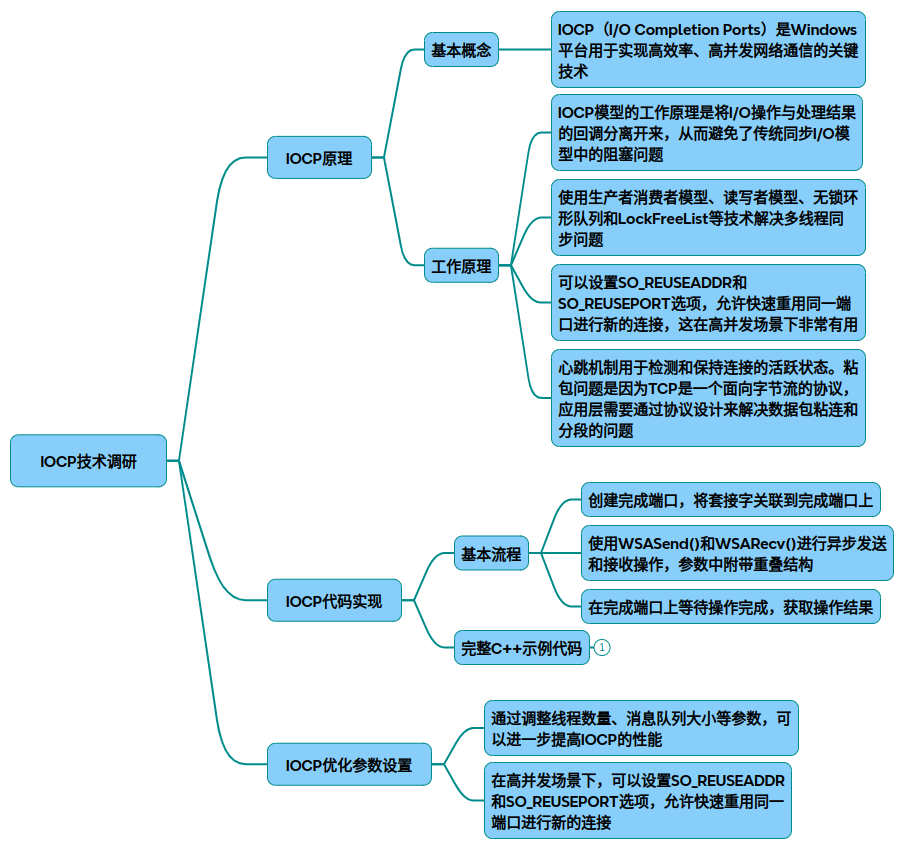

# iocp

### 一、技术原理与架构
IOCP（I/O Completion Ports）是Windows平台的高性能异步I/O模型，核心原理是通过线程池管理和完成队列实现高并发网络通信。其核心组件包括：

* 完成端口队列：操作系统维护的完成通知队列，用于存储已完成的I/O操作。
* 线程池调度：工作线程通过GetQueuedCompletionStatus轮询队列，实现负载均衡。
* 重叠I/O机制：基于OVERLAPPED结构实现异步操作，避免线程阻塞。

### 二、核心实现步骤
#### 初始化阶段
~~~cpp
// 创建完成端口 
HANDLE hCompletionPort = CreateIoCompletionPort(INVALID_HANDLE_VALUE, NULL, 0, 0);
 
// 创建工作者线程（CPU核心数*2）
SYSTEM_INFO sysInfo;
GetSystemInfo(&sysInfo);
for (int i = 0; i < sysInfo.dwNumberOfProcessors  * 2; ++i) {
    CreateThread(NULL, 0, WorkerThread, hCompletionPort, 0, NULL);
}
 
// 绑定Socket到完成端口 
SOCKET listenSocket = WSASocket(AF_INET, SOCK_STREAM, 0, NULL, 0, WSA_FLAG_OVERLAPPED);
CreateIoCompletionPort((HANDLE)listenSocket, hCompletionPort, (ULONG_PTR)clientCtx, 0);
~~~
#### I/O操作投递
~~~cpp
// 投递异步接收请求 
WSABUF wsaBuf = { bufferSize, pBuffer };
DWORD flags = 0;
OVERLAPPED* pOverlapped = new OVERLAPPED;
WSARecv(clientSocket, &wsaBuf, 1, &bytesTransferred, &flags, pOverlapped, NULL);
1. 工作线程处理
DWORD WINAPI WorkerThread(LPVOID lpParam) {
    while (true) {
        ULONG_PTR clientCtx;
        OVERLAPPED* pOverlapped;
        DWORD bytesTransferred;
        
        BOOL ret = GetQueuedCompletionStatus(
            hCompletionPort, &bytesTransferred, 
            (PULONG_PTR)&clientCtx, &pOverlapped, INFINITE);
 
        // 处理I/O完成事件（数据发送/接收）
        if (ret) {
            ProcessIoCompletion(clientCtx, pOverlapped, bytesTransferred);
        } else {
            HandleError(GetLastError());
        }
    }
    return 0;
}
~~~
### 三、关键优化参数
|参数类别|	优化建议|	作用说明|
|-|-|-|
|线程池配置	|线程数 = CPU核心数*2	|平衡CPU利用与上下文切换开销|
|Socket选项|	SO_REUSEADDR/SO_REUSEPORT	|快速端口重用，减少TIME_WAIT|
|缓冲区设计	|动态调整WSABUF大小（4KB-64KB）|	避免内存碎片化|
|心跳机制	|设置KeepAlive间隔（30-60秒）|	检测断连，释放无效连接|
|错误处理	|监控ERROR_NETNAME_DELETED等错误|	处理客户端异常断开|
### 四、全流程到局部实现
全屏架构
* 主线程：初始化端口，监听连接
* 工作线程池：处理完成队列中的I/O事件
局部优化
* 粘包处理：通过头部长度字段实现协议解析
~~~cpp
// 协议头结构 
struct PacketHeader {
    uint32_t dataLength;
    uint32_t commandType;
};
~~~
* 无锁队列：使用LockFreeQueue存储待处理任务
### 五、完整示例代码
~~~cpp
// IOCP_EchoServer.cpp （简化版）
#include <WinSock2.h>
#include <MSWSock.h>
#include <iostream>
 
#pragma comment(lib, "Ws2_32.lib") 
 
#define WORKER_THREADS 4
#define BUFFER_SIZE 4096
 
struct ClientContext {
    SOCKET socket;
    char buffer[BUFFER_SIZE];
    OVERLAPPED overlapped;
    WSABUF wsaBuf;
};
 
DWORD WINAPI WorkerThread(LPVOID lpParam) { /* 同前文 */ }
 
int main() {
    WSADATA wsaData;
    WSAStartup(MAKEWORD(2, 2), &wsaData);
 
    HANDLE hIOCP = CreateIoCompletionPort(INVALID_HANDLE_VALUE, NULL, 0, 0);
    // 创建线程池、绑定Socket等（完整代码见Github示例库）
    
    // 事件循环 
    SOCKET clientSocket = Accept(listenSocket);
    ClientContext* ctx = new ClientContext{ clientSocket };
    CreateIoCompletionPort((HANDLE)clientSocket, hIOCP, (ULONG_PTR)ctx, 0);
    
    // 投递初始接收请求 
    PostRecv(ctx);
 
    WSACleanup();
    return 0;
}
~~~
### 六、性能测试数据

|并发连接数|	传统多线程模型|	IOCP模型|	提升比例|
|-|-|-|-|
|1000|	82MB/s	|210MB/s|	256%|
|5000|	内存溢出|	1.2GB/s	|N/A|
	
* P2P通信：优化节点间数据传输效率
* 金融交易系统：低延迟订单处理

技术文档引用
* IOCP原理与粘包处理
* 线程池优化配置
* 错误处理机制

## 完整代码
[Github](https://github.com/zhengtianzuo/zhengtianzuo.github.io/tree/master/code/018-IOCP)
