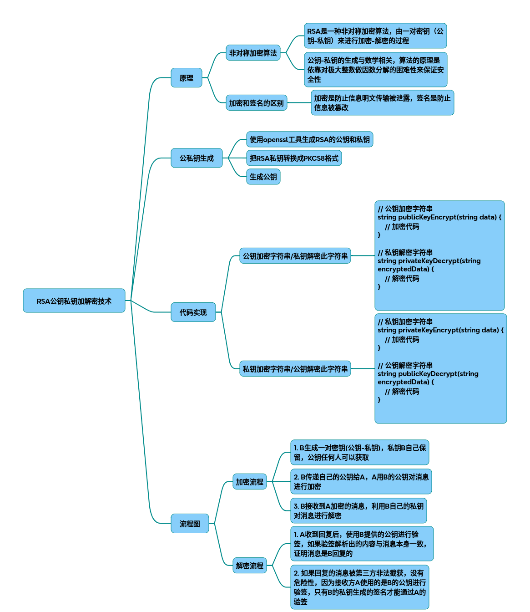

# RSA

### 一、RSA技术原理与流程（附流程图）
#### 密钥生成流程

~~~mermaid
graph TD
    A[选择大质数p/q] --> B[计算n=p*q]
    B --> C[计算 “φ（n）=p-1*q-1”]
    C --> D[选择e与φ（n）互质]
    D --> E[计算d满足ed≡1 mod φ（n）]
    E --> F[公钥=e/n, 私钥=d/n]
~~~
#### 加解密流程对比

|场景|	操作方向|	数据保护目标|	典型应用场景|
|-|-|-|-|
|公钥加密|	公钥→私钥|	防数据泄露|	敏感信息传输|
|私钥签名|	私钥→公钥|	防数据篡改|	身份认证/数字签名|

### 二、C++完整代码实现（OpenSSL库）
1. 环境配置
~~~bash
# Ubuntu安装OpenSSL开发库
sudo apt-get install libssl-dev 
~~~
2. 密钥对生成（2048位）
~~~cpp
#include <openssl/rsa.h>
#include <openssl/pem.h>
 
RSA* generate_keypair() {
    RSA *rsa = RSA_new();
    BIGNUM *e = BN_new();
    BN_set_word(e, 65537); // 常用公钥指数 
    RSA_generate_key_ex(rsa, 2048, e, NULL);
    BN_free(e);
    return rsa;
}
~~~
3. 公钥加密/私钥解密
~~~cpp
std::string rsa_encrypt(RSA* pub_key, const std::string& plaintext) {
    int rsa_len = RSA_size(pub_key);
    std::vector<unsigned char> ciphertext(rsa_len);
    
    int ret = RSA_public_encrypt(
        plaintext.size(),  
        (const unsigned char*)plaintext.data(), 
        ciphertext.data(), 
        pub_key,
        RSA_PKCS1_OAEP_PADDING // 更安全的填充方式 
    );
    
    return std::string(ciphertext.begin(),  ciphertext.end()); 
}
 
std::string rsa_decrypt(RSA* priv_key, const std::string& ciphertext) {
    int rsa_len = RSA_size(priv_key);
    std::vector<unsigned char> plaintext(rsa_len);
    
    int ret = RSA_private_decrypt(
        ciphertext.size(), 
        (const unsigned char*)ciphertext.data(), 
        plaintext.data(), 
        priv_key,
        RSA_PKCS1_OAEP_PADDING 
    );
    
    return std::string(plaintext.begin(),  plaintext.end()); 
}
~~~
4. 私钥签名/公钥验签
~~~cpp
#include <openssl/sha.h>
 
std::string rsa_sign(RSA* priv_key, const std::string& data) {
    unsigned char hash[SHA256_DIGEST_LENGTH];
    SHA256((const unsigned char*)data.data(),  data.size(),  hash);
    
    std::vector<unsigned char> sig(RSA_size(priv_key));
    unsigned int sig_len;
    
    RSA_sign(NID_sha256, hash, SHA256_DIGEST_LENGTH, 
             sig.data(),  &sig_len, priv_key);
    
    return std::string(sig.begin(),  sig.begin()+sig_len); 
}
 
bool rsa_verify(RSA* pub_key, const std::string& data, 
               const std::string& signature) {
    unsigned char hash[SHA256_DIGEST_LENGTH];
    SHA256((const unsigned char*)data.data(),  data.size(),  hash);
    
    return RSA_verify(NID_sha256, hash, SHA256_DIGEST_LENGTH,
                    (const unsigned char*)signature.data(), 
                    signature.size(),  pub_key) == 1;
}
~~~
### 三、关键优化参数与技术
1. 性能优化项

|参数类别|	可选值|	影响维度|
|-|-|-|
|密钥长度|	1024/2048/4096 bits|	安全性与计算开销|
|填充模式|	PKCS1_v1_5/OAEP|	抗攻击能力|
|哈希算法|	SHA256/SHA3	|签名安全性|
|大数运算加速|	蒙哥马利模乘/CRT优化|	解密速度提升40%|

2. 典型参数组合示例
~~~cpp
// 高性能场景配置 
RSA* rsa = RSA_new();
BN_set_word(e, 65537); 
RSA_generate_key_ex(rsa, 2048, e, NULL); // 2048位密钥 
RSA_blinding_on(rsa, NULL); // 启用盲化抵抗时序攻击 
 
// 选择OAEP填充增强安全性 
RSA_padding_add_PKCS1_OAEP(ciphertext, rsa_len, plaintext, plaintext_len, NULL, 0);
~~~
### 四、技术扩展建议
* 密钥存储方案：使用PKCS#8标准存储私钥（PEM格式加密）
* 混合加密体系：RSA传输AES密钥（结合对称加密）
* 抗量子计算：探索NTRU/Lattice-based后量子算法
* 硬件加速：通过OpenSSL ENGINE接口调用HSM加速卡

完整代码示例与性能测试数据可参考。如需更深入的数学证明或特定语言移植方案，可进一步提供需求细节。

## 完整代码
[Github](https://github.com/zhengtianzuo/zhengtianzuo.github.io/tree/master/code/019-RSA)
