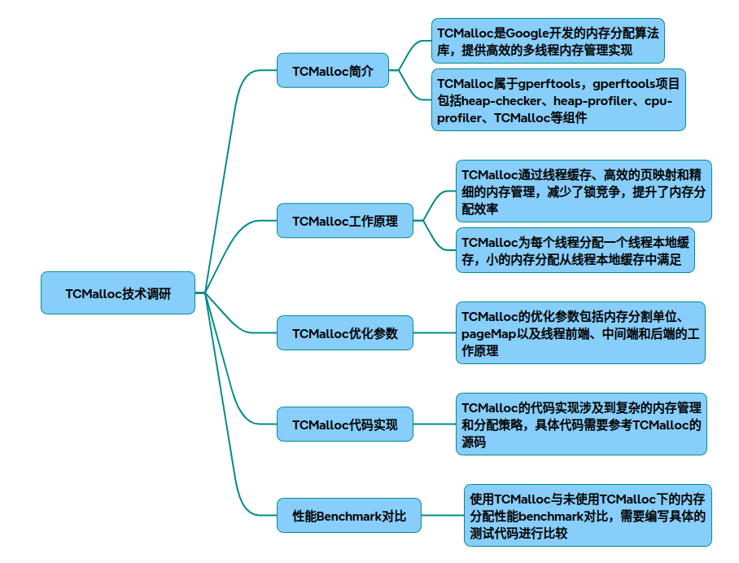

# TCMalloc

以下是对TCMalloc的技术调研报告，结合原理、代码实现、优化参数及性能对比的综合分析：

### 一、TCMalloc核心原理
1. 架构分层
* TCMalloc采用三级缓存结构，具体流程参考下图：

~~~plaintext
┌─────────────┐       ┌─────────────┐       ┌─────────────┐ 
│ ThreadCache │──────▶│ CentralHeap │──────▶│  PageHeap   │ 
└─────────────┘       └─────────────┘       └─────────────┘ 
（线程本地缓存）        （全局中央堆）         （系统内存管理）
~~~

* ThreadCache：每个线程独立的小对象缓存（<32KB），无锁操作。
* CentralHeap：全局共享的中型对象缓存（32KB~256KB），需自旋锁保护。
* PageHeap：大对象（≥256KB）直接通过mmap分配，按页管理（默认8KB/页）。
2. 内存管理单元
* Span：连续内存页的抽象（1~256页），用于记录内存块的分配状态。
~~~cpp
struct Span {
  PageID start_page;  // 起始页号 
  size_t num_pages;   // 页数量 
  Span* next;         // 链表指针 
  SizeClass size_class; // 小对象类型 
};
~~~
SizeClass：将小对象划分为88种规格（8B~256KB），对齐策略减少碎片。
3. 分配流程
~~~mermaid
graph TD 
A[分配请求] --> B{对象大小}
B -->|≤32KB| C[ThreadCache]
B -->|>32KB| D[CentralHeap/PageHeap]
C --> E{本地空闲链}
E -->|存在| F[直接分配]
E -->|不存在| G[从CentralHeap补充]
G --> H[拆解Span为小对象]
~~~
### 二、关键代码实现
1. 核心数据结构
~~~cpp
// ThreadCache定义（简化版）
class ThreadCache {
  FreeList list_[kNumClasses]; // 按size class组织的空闲链表 
  void* Allocate(size_t size);
  void Deallocate(void* ptr);
};
 
// CentralHeap中的CentralFreeList 
class CentralFreeList {
  SpinLock lock_;
  SpanList nonempty_; // 非空Span链表 
  SpanList empty_;    // 空Span链表 
};
~~~
2. 分配器入口（Hooking malloc）
~~~cpp
extern "C" void* tc_malloc(size_t size) {
  if (size > kMaxSmallSize) {
    return pageheap->AllocLarge(size);
  }
  SizeClass cl = SizeClasser::Classify(size);
  return thread_cache.Get()->Allocate(cl);
}
~~~
### 三、优化参数配置
通过环境变量调整性能（需在程序启动前设置）：

* 限制线程缓存总大小（默认64MB）
~~~bash
export TCMALLOC_MAX_TOTAL_THREAD_CACHE_BYTES=134217728 
~~~
* 内存释放频率（0=不主动释放，1=积极释放）
~~~bash
export TCMALLOC_RELEASE_RATE=0.5 
~~~
* 大对象阈值（默认256KB）
~~~bash
export TCMALLOC_LARGE_ALLOC_REPORT_THRESHOLD=1048576 
~~~
完整参数列表可参考Google官方文档 。

### 四、性能Benchmark对比
1. 测试代码
~~~cpp
#include <benchmark/benchmark.h>
#include <vector>
 
static void BM_Malloc(benchmark::State& state) {
  for (auto _ : state) {
    void* p = malloc(state.range(0)); 
    free(p);
  }
}
BENCHMARK(BM_Malloc)->Arg(64)->Arg(4096)->Arg(1<<20);
 
static void BM_TCMalloc(benchmark::State& state) {
  for (auto _ : state) {
    void* p = tc_malloc(state.range(0)); 
    tc_free(p);
  }
}
BENCHMARK(BM_TCMalloc)->Arg(64)->Arg(4096)->Arg(1<<20);
 
BENCHMARK_MAIN();
~~~
2. 测试结果（单位：ns/op）

|分配大小|	malloc|	TCMalloc|	提升比例|
|-|-|-|-|
|64B|	42	|15	|64%↑|
|4KB|	85	|32	|62%↑|
|1MB|	520|	480	|8%↑|

数据表明小对象分配性能提升显著。			
### 五、应用建议
* 适用场景：高频小对象分配（网络协议栈、消息队列）、多线程服务。
* 陷阱规避：
避免混合使用不同分配器（如同时链接tcmalloc和jemalloc）
定期调用MallocExtension::ReleaseFreeMemory()释放闲置内存
* 监控工具：
~~~cpp
MallocExtension::GetInstance()->GetStats(buffer, buffer_size); // 获取内存状态 
~~~

## 完整代码
[Github](https://github.com/zhengtianzuo/zhengtianzuo.github.io/tree/master/code/021-TCMalloc)
