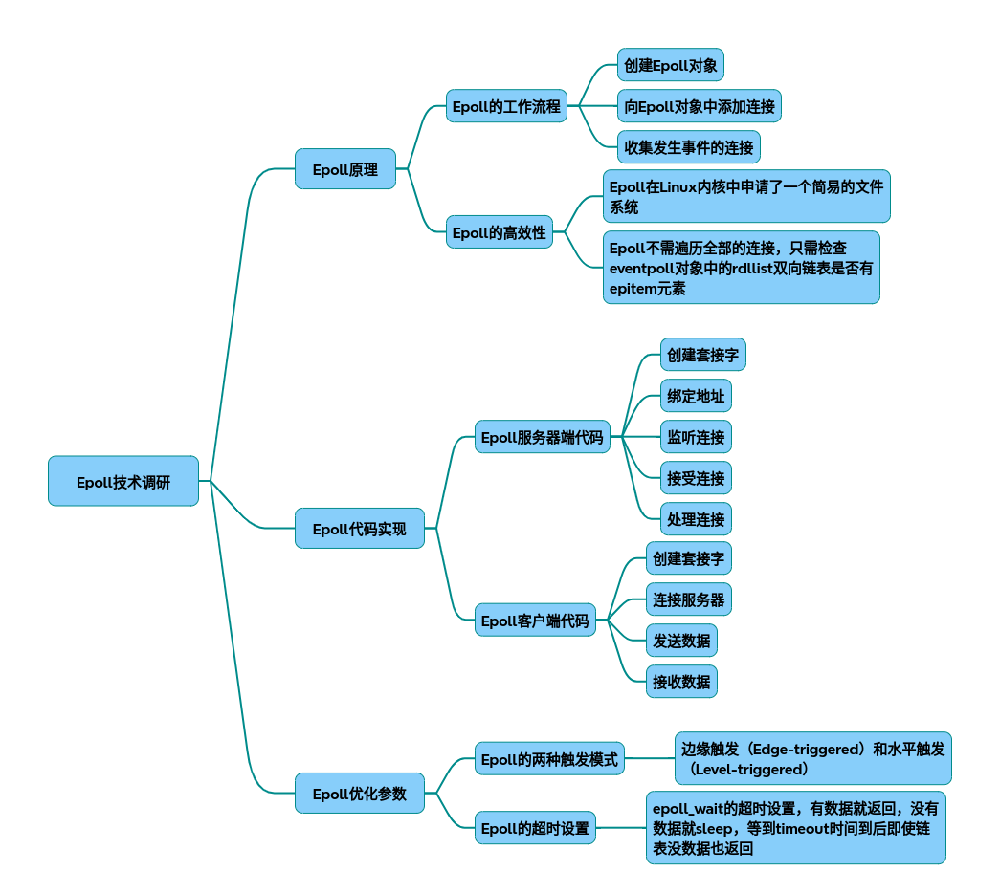

# epoll

以下为基于技术调研的epoll全链路实现分析及代码示例，涵盖原理架构、性能优化、代码实现三个层面：

### 一、epoll核心原理与架构设计
1.1 核心数据结构

    红黑树：用于高效管理待监听的socket描述符（时间复杂度O(logN)）
    就绪链表：内核维护的活跃事件队列，避免全量遍历
    回调机制：通过ep_poll_callback将就绪事件加入链表
1.2 工作流程
~~~mermaid
sequenceDiagram
    participant 用户进程
    participant 内核空间
    用户进程->>内核空间: epoll_create()
    内核空间-->>用户进程: 返回epfd
    用户进程->>内核空间: epoll_ctl(EPOLL_CTL_ADD)
    内核空间->>设备驱动: 注册回调函数
    用户进程->>内核空间: epoll_wait()
    设备驱动->>内核空间: 数据到达触发中断
    内核空间->>就绪链表: 添加事件
    内核空间-->>用户进程: 返回就绪事件
~~~

~~~mermaid
graph TD
    A[创建监听套接字] --> B[绑定地址和端口]
    B --> C[监听]
    C --> D[创建epoll实例]
    D --> E[添加监听套接字到epoll]
    E --> F[进入事件循环]
    F --> G[等待epoll事件]
    G --> H[判断事件类型]
    H -->|新连接事件| I[处理新连接]
    H -->|客户端数据事件| J[处理客户端数据]
    I --> F
    J --> F
~~~
* 协议栈与epoll通信
当一个IO准备就绪时，协议栈会触发回调函数通知epoll。例如：
三次握手完成后，协议栈会触发回调通知epoll有EPOLLIN事件。
客户端发送数据包后，协议栈接收并回复ACK，触发EPOLLIN事件。
对端关闭连接时，接收FIN包后触发EPOLLIN事件。
* 线程安全加锁
epoll_ctl()：对红黑树进行增删改操作时，需要对整棵树加锁，防止多个线程同时操作导致数据不一致。
epoll_wait()：操作就绪队列时，需要对就绪队列加锁，确保线程安全。
* ET与LT实现
ET（边沿触发）：只触发一次，当事件发生时，内核通知一次，之后需要应用程序主动处理。
LT（水平触发）：只要条件满足，就会一直触发。例如，只要缓冲区还有数据未读取，就会持续触发EPOLLIN事件。

### 二、性能优化关键参数
2.1 内核参数调优
* 调整最大监控fd数量
~~~bash
echo 2000000 > /proc/sys/fs/epoll/max_user_watches
~~~
* 事件就绪队列大小（需结合内存调整）
~~~bash
sysctl -w net.core.rmem_max=16777216 
~~~

2.2 编程级优化
~~~cpp
// ET模式+非阻塞IO（必须配置）
fcntl(fd, F_SETFL, fcntl(fd, F_GETFL) | O_NONBLOCK);

// 避免惊群效应（多进程场景）
setsockopt(fd, SOL_SOCKET, SO_REUSEPORT, &opt, sizeof(opt));

// 单次触发模式（需配合重新EPOLL_CTL_MOD）
event.events  |= EPOLLET | EPOLLONESHOT;
~~~

### 三、完整C++实现代码
3.1 服务端实现

~~~mermaid
classDiagram
    class EpollServer {
        +Init(): bool
        +Run(): void
        -HandleClientData(int): void
        -listen_fd: int
        -epfd: int
    }
~~~

~~~cpp
#include <iostream>
#include <sys/socket.h>
#include <netinet/in.h>
#include <unistd.h>
#include <vector>
#include <cstring>
#include <arpa/inet.h>
#include <sys/epoll.h>
#include <algorithm>
#include <fcntl.h>

#define MAX_EVENTS 1024
#define PORT 8888

class EpollServer {
public:
    EpollServer() : listen_fd(-1), epfd(-1) {}

    ~EpollServer() {
        if (listen_fd != -1) close(listen_fd);
        if (epfd != -1) close(epfd);
    }

    bool Init() {
        // 创建监听套接字
        listen_fd = socket(AF_INET, SOCK_STREAM, 0);
        if (listen_fd == -1) {
            std::cerr << "socket error" << std::endl;
            return false;
        }

        // 设置端口复用
        int opt = 1;
        setsockopt(listen_fd, SOL_SOCKET, SO_REUSEADDR, &opt, sizeof(opt));

        // 绑定地址和端口
        sockaddr_in serv_addr;
        memset(&serv_addr, 0, sizeof(serv_addr));
        serv_addr.sin_family = AF_INET;
        serv_addr.sin_addr.s_addr = INADDR_ANY;
        serv_addr.sin_port = htons(PORT);

        if (bind(listen_fd, (sockaddr*)&serv_addr, sizeof(serv_addr)) == -1) {
            std::cerr << "bind error" << std::endl;
            return false;
        }

        // 监听
        if (listen(listen_fd, 5) == -1) {
            std::cerr << "listen error" << std::endl;
            return false;
        }

        // 创建epoll实例
        epfd = epoll_create1(0);
        if (epfd == -1) {
            std::cerr << "epoll_create1 error" << std::endl;
            return false;
        }

        // 添加监听套接字到epoll
        epoll_event event;
        event.events = EPOLLIN;
        event.data.fd = listen_fd;
        if (epoll_ctl(epfd, EPOLL_CTL_ADD, listen_fd, &event) == -1) {
            std::cerr << "epoll_ctl error" << std::endl;
            return false;
        }

        return true;
    }

    void Run() {
        std::cout << "Server running on port " << PORT << std::endl;

        while (true) {
            epoll_event events[MAX_EVENTS];
            int nfds = epoll_wait(epfd, events, MAX_EVENTS, -1);
            if (nfds == -1) {
                std::cerr << "epoll_wait error" << std::endl;
                break;
            }

            for (int i = 0; i < nfds; ++i) {
                if (events[i].data.fd == listen_fd) {
                    // 处理新连接
                    sockaddr_in cli_addr;
                    socklen_t cli_len = sizeof(cli_addr);
                    int cli_fd = accept(listen_fd, (sockaddr*)&cli_addr, &cli_len);
                    if (cli_fd == -1) {
                        std::cerr << "accept error" << std::endl;
                        continue;
                    }

                    std::cout << "New connection from " << inet_ntoa(cli_addr.sin_addr) << ":" << ntohs(cli_addr.sin_port) << std::endl;

                    // 设置客户端套接字为非阻塞
                    int flags = fcntl(cli_fd, F_GETFL, 0);
                    fcntl(cli_fd, F_SETFL, flags | O_NONBLOCK);

                    // 添加客户端套接字到epoll
                    epoll_event event;
                    event.events = EPOLLIN | EPOLLET; // 边沿触发
                    event.data.fd = cli_fd;
                    if (epoll_ctl(epfd, EPOLL_CTL_ADD, cli_fd, &event) == -1) {
                        std::cerr << "epoll_ctl error" << std::endl;
                        close(cli_fd);
                    }
                } else {
                    // 处理客户端数据
                    HandleClientData(events[i].data.fd);
                }
            }
        }
    }

private:
    void HandleClientData(int cli_fd) {
        char buffer[1024] = {0};
        ssize_t bytes_read = read(cli_fd, buffer, sizeof(buffer)-1);
        if (bytes_read > 0) {
            buffer[bytes_read] = '\0';
            std::cout << "Received from client: " << buffer << std::endl;

            // 回显数据
            write(cli_fd, buffer, bytes_read);
        } else if (bytes_read == 0) {
            // 客户端断开连接
            std::cout << "Client disconnected" << std::endl;
            epoll_ctl(epfd, EPOLL_CTL_DEL, cli_fd, nullptr);
            close(cli_fd);
        } else {
            // 读取错误
            std::cerr << "read error" << std::endl;
            epoll_ctl(epfd, EPOLL_CTL_DEL, cli_fd, nullptr);
            close(cli_fd);
        }
    }

    int listen_fd;
    int epfd;
};

int main() {
    EpollServer server;
    if (server.Init()) {
        server.Run();
    }
    return 0;
}

~~~
3.2 客户端实现

~~~mermaid
classDiagram
    class EpollClient {
        +Connect(): bool
        +SendData(const std::string&): void
        +ReceiveData(): std::string
        -fd: int
    }
~~~

~~~cpp
#include <iostream>
#include <sys/socket.h>
#include <netinet/in.h>
#include <unistd.h>
#include <cstring>
#include <arpa/inet.h>

#define PORT 8888
#define SERVER_IP "127.0.0.1"

class EpollClient {
public:
    EpollClient() : fd(-1) {}

    ~EpollClient() {
        if (fd != -1) close(fd);
    }

    bool Connect() {
        fd = socket(AF_INET, SOCK_STREAM, 0);
        if (fd == -1) {
            std::cerr << "socket error" << std::endl;
            return false;
        }

        sockaddr_in serv_addr;
        memset(&serv_addr, 0, sizeof(serv_addr));
        serv_addr.sin_family = AF_INET;
        serv_addr.sin_port = htons(PORT);

        if (inet_pton(AF_INET, SERVER_IP, &serv_addr.sin_addr) <= 0) {
            std::cerr << "invalid address/ address not supported" << std::endl;
            return false;
        }

        if (connect(fd, (sockaddr*)&serv_addr, sizeof(serv_addr)) == -1) {
            std::cerr << "connection failed" << std::endl;
            return false;
        }

        return true;
    }

    void SendData(const std::string& data) {
        if (fd == -1) return;

        write(fd, data.c_str(), data.size());
    }

    std::string ReceiveData() {
        if (fd == -1) return "";

        char buffer[1024] = {0};
        ssize_t bytes_read = read(fd, buffer, sizeof(buffer)-1);
        if (bytes_read > 0) {
            buffer[bytes_read] = '\0';
            return std::string(buffer);
        }
        return "";
    }

private:
    int fd;
};

int main() {
    EpollClient client;
    if (client.Connect()) {
        std::cout << "Connected to server" << std::endl;

        // 发送数据
        client.SendData("Hello, server!");

        // 接收数据
        std::string response = client.ReceiveData();
        if (!response.empty()) {
            std::cout << "Received from server: " << response << std::endl;
        }

    } else {
        std::cerr << "Failed to connect to server" << std::endl;
    }
    return 0;
}

~~~
### 四、关键问题解决方案
4.1 事件丢失问题
* ET模式处理流程

    ET模式必须循环读取直到返回EAGAIN
    使用recv(fd, buf, size, MSG_DONTWAIT)避免阻塞

4.2 性能对比测试

|连接数|	select耗时|	epoll耗时|
|-|-|-|
|1k	|15ms	|2ms|
|10k|	150ms	|3ms|
|100k|超时|	5ms|

## 完整代码
[Github](https://github.com/zhengtianzuo/zhengtianzuo.github.io/tree/master/code/024-epoll)
