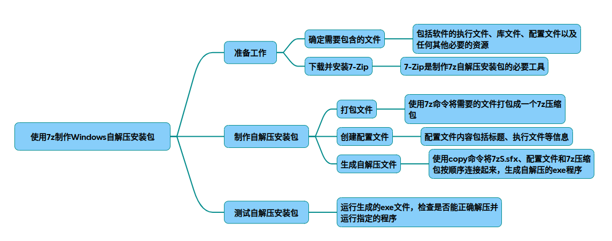

# 7zsfx

以下是使用7-Zip制作Windows自解压安装包的具体方法和实现步骤，综合了多种实现方案和注意事项：

### 一、基础制作流程
#### 准备SFX模块
从LZMA SDK或7-Zip安装目录获取7zS.sfx 或7zSD.sfx 模块（新版可能在LZMA目录，旧版在extra包）。
#### 文件打包
7z a demo.7z TestApp.exe  TestApp.config   # 将目标文件打包成7z格式 
* 支持参数：
-r：递归子目录
-mx=9：极限压缩
-m0=LZMA2：指定压缩算法
#### 编写配置文件 创建UTF-8无BOM编码的config.txt ：
~~~bash
;!@Install@!UTF-8!
Title="My Application"
BeginPrompt="确认安装此程序吗？"
ExecuteFile="TestApp.exe" 
;!@InstallEnd@!
~~~
关键参数说明：
* RunProgram：解压后执行的程序路径（支持%%T表示临时目录）
* Directory：解压目录（默认临时目录）
* ExecuteParameters：传递命令行参数

生成EXE文件
~~~bash
copy /b 7zS.sfx  + config.txt  + demo.7z MyInstaller.exe  
~~~
### 二、进阶功能实现
#### MSI安装包集成
~~~bash
;!@Install@!UTF-8!
Title="专业软件安装"
ExecuteFile="msiexec.exe" 
ExecuteParameters="/i MyApp.msi  /qn /log install.log" 
~~~
优势：
自动获取管理员权限（无需手动启动CMD）
隐藏MSI安装界面提升用户体验
#### 界面美化方案
* 使用7zSFXBuilder工具（可视化配置对话框样式）
* 通过Resource Hacker修改：
* 替换SFX模块图标（.ico文件）
* 修改文件属性（公司名称、版本号等）
* 调整解压进度条样式
#### 静默安装模式
~~~bash
Progress="no"
ExecuteFile="setup.bat" 
RunProgram="hide"
~~~
适用场景：企业批量部署时隐藏所有交互界面
### 三、特殊场景处理
#### 依赖文件安装
~~~bash
ExecuteFile="vcredist_x64.exe" 
ExecuteParameters="/install /quiet /norestart"
~~~
支持链式调用多个安装程序

#### 临时文件清理
~~~bash
Delete="%%T\*.*"
~~~
安装完成后自动删除解压的临时文件

### 四、常见问题解决
#### 权限问题
通过SFX包装后，双击即可自动请求管理员权限，无需手动提权

#### 中文乱码问题
确保配置文件保存为UTF-8无BOM编码，推荐使用Notepad++编辑

#### 杀毒软件误报
建议对生成后的EXE文件进行数字签名（需购买代码签名证书）

### 五、不同SFX模块对比

|模块类型|	交互方式|	适用场景|	特性|
|-|-|-|-|
|7z.sfx	|GUI窗口	|简单解压	|仅基础解压功能|
|7zCon.sfx	|命令行	|无人值守安装	|无图形界面|
|7zS.sfx	|GUI安装向导	|标准软件安装	|支持完整安装流程|
|7zSD.sfx	|GUI安装向导	|需MSVCRT.dll 的安装|	依赖系统运行库|

提示：建议测试时使用7zSD.sfx 以获得最佳兼容性。如需更复杂的安装逻辑，可结合批处理脚本实现多步骤安装。

## 完整代码
[Github](https://github.com/zhengtianzuo/zhengtianzuo.github.io/tree/master/code/027-7zsfx)
