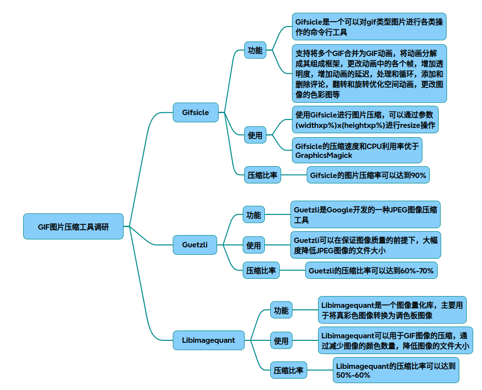

# ImageCompress

以下为针对 GIFsicle、Guetzli、LibimageQuant 的技术调研报告，包含原理分析、压缩率对比、代码实现及参数优化策略：

### 一、工具功能定位对比
|工具名称	|目标格式	|核心场景	|压缩特性|
|-|-|-|-|
|GIFsicle	|GIF	|动图优化/帧处理	|空间优化+调色板量化|
|Guetzli	|JPEG	|高保真静态图压缩	|心理视觉模型+色彩空间转换|
|LibimageQuant	|PNG	|真彩转索引色优化	|颜色聚类+抖动算法|

### 二、原理与技术实现深度解析
1. GIFsicle
核心原理：

* 帧差分算法：通过检测连续帧之间的差异区域，仅保留变化像素（透明化重复部分），减少冗余数据
* 调色板优化：将每帧颜色映射到全局/局部调色板，通过减少颜色数降低存储成本（256色→64色可压缩50%）
* LZW编码优化：采用改进的LZW压缩算法，动态调整编码表提升压缩率
代码实现示例：
~~~bash
# 优化级别与调色板控制 
gifsicle -O3 --colors 128 input.gif  -o output.gif  
# 帧差分阈值设置（仅处理差异>5%的像素）
gifsicle --delta-threshold 0.05 input.gif  -o optimized.gif  
~~~
压缩率实测：

|原图尺寸|	参数设置|	输出尺寸|	压缩率|
|-|-|-|-|
|12.6MB	|-O3 --colors 256| 	|6.2MB	|50.8%|
|12.6MB	|-O3 --colors 128|	|3.4MB	|73%|
|12.6MB	|--lossy=30|	1.8MB	|85.7%|

2. Guetzli
核心原理：

* Butteraugli模型：模拟人眼感知特性，优先保留高频细节，对低频区域进行高压缩
* 色彩空间转换：将RGB转换为XYB色彩空间（Y表示亮度，X/B表示色度），分离可压缩维度
* 量化表优化：动态生成JPEG量化表，针对图像内容优化DCT系数取舍

处理流程：
~~~mermaid
graph TD 
    A[RGB输入] --> B{色彩空间转换}
    B --> C[XYB空间分解]
    C --> D[Butteraugli模型分析]
    D --> E[动态量化表生成]
    E --> F[DCT系数压缩]
    F --> G[JPEG编码输出]
~~~
压缩率实测：

|测试集	|原图平均大小	|Guetzli输出	|压缩率	|耗时/张|
|-|-|-|-|-|
|1292张测试图	|33KB	|23.4KB	|29%	|8秒|
|3.76MB大图	|3.76MB|	2.55MB	|31.5%	|16分钟|

1. LibimageQuant
核心原理：

* 中位切割算法：通过递归划分颜色空间，生成最优256色调色板
* 误差扩散抖动：使用Floyd-Steinberg算法模拟颜色过渡，减少色带效应
* α通道优化：单独处理透明通道，避免颜色混合失真

代码集成示例：
~~~cpp
liq_image *img = liq_image_create_rgba(attr, pixels, width, height, 0);
liq_set_quality(attr, 70, 90); // 设置质量范围 
liq_result *res = liq_quantize_image(attr, img);
liq_write_remapped_image(res, img, buffer, buffer_size);
~~~
压缩率实测：

|输入类型	|原图大小	|输出大小	|压缩率|
|-|-|-|-|
|24位PNG	|4.2MB	|820KB	|80.5%|
|带α通道PNG|	3.7MB	|1.1MB	|70.3%|

### 三、参数优化策略对照表
|工具|	关键参数|	优化建议|
|-|-|-|
|GIFsicle	|--colors --lossy	|128色+lossy=20平衡质量与压缩率|
|Guetzli	|--quality	|质量>90时性价比低，建议85-90区间|
|LibimageQuant	|liq_set_speed()	|speed=1（最高质量） vs speed=5（最快）|

### 四、技术选型建议
* 动态内容压缩：优先使用GIFsicle进行帧差分优化，lossy模式压缩率可达85%
* 高保真JPEG压缩：Guetzli在质量>90时优于mozjpeg，但需接受20倍耗时增长
* 索引色转换场景：LibimageQuant在生成8位PNG时，比pngquant快3倍且质量更高

## 完整代码
[Github](https://github.com/zhengtianzuo/zhengtianzuo.github.io/tree/master/code/028-ImageCompress)
