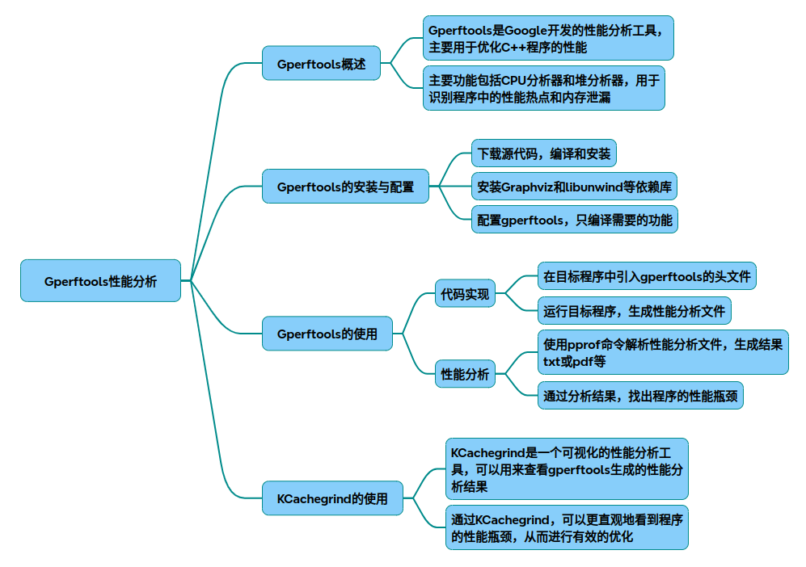

# gperftools

以下为针对gperftools的技术调研结果，涵盖原理、核心模块、优化参数、代码实现及可视化分析工具使用：

### 一、gperftools核心原理
#### 系统架构
gperftools由三个核心模块构成：

* CPU Profiler：基于采样的性能分析器，通过定时中断记录调用栈
* tcmalloc：线程缓存内存分配器，采用分层结构管理内存
* Heap Profiler：内存泄漏检测工具，跟踪内存分配路径

#### CPU Profiler实现原理
~~~cpp
// 伪代码实现采样逻辑
void SamplerThread() {
    while (running) {
        sleep(sampling_interval); // 默认10ms
        for (thread in all_threads) {
            CaptureCallStack(thread); // 获取调用栈
            UpdateProfileStats(stack); // 统计热点路径
        }
    }
}
~~~
流程图：
~~~plaintext
[启动Profiler] → [注册信号处理器] → [定时器中断] → [捕获调用栈] → [聚合统计] → [生成.prof文件]
~~~
#### tcmalloc内存管理

* ThreadCache：每个线程独立的小对象缓存（≤256KB）
* CentralFreeList：全局中大型对象内存池
* PageHeap：按页管理的内存分配器（1MB为单位）
### 二、代码实现与集成
#### 基础性能分析代码
~~~cpp
#include <gperftools/profiler.h>

void HeavyCalculation() { /* 耗时函数 */ }

int main() {
    ProfilerStart("output.prof");  // 启动分析
    HeavyCalculation();
    ProfilerStop(); // 停止分析
    return 0;
}
~~~
编译指令：
~~~bash
g++ -o demo demo.cpp  -lprofiler -fno-omit-frame-pointer
~~~
#### 高级使用（动态控制）
~~~cpp
#include <gperftools/profiler.h>
#include <signal.h>

void SignalHandler(int sig) {
    static bool is_profiling = false;
    if (!is_profiling) {
        ProfilerStart("dynamic.prof"); 
    } else {
        ProfilerStop();
    }
    is_profiling = !is_profiling;
}

int main() {
    signal(SIGUSR1, SignalHandler); // 通过kill -USR1触发
    while(true) { /* 业务逻辑 */ }
}
~~~
### 三、关键优化参数
#### 编译期参数
|参数	|作用	|示例|
|-|-|-|
|-fno-omit-frame-pointer	|保留栈帧指针	|g++ -fno-omit-frame-pointer|
|--enable-frame-pointers	|配置gperftools时启用	|./configure --enable-frame-pointers|

#### 运行时参数
|环境变量	|作用	|示例|
|-|-|-|
|CPUPROFILE	|指定输出文件	|CPUPROFILE=output.prof  ./demo|
|CPUPROFILE_FREQUENCY	|采样频率(Hz)	|CPUPROFILE_FREQUENCY=100|
|HEAPPROFILE	|内存分析文件	|HEAPPROFILE=heap.prof  ./demo|
### 四、可视化分析流程
#### 生成分析报告
~~~bash
pprof --callgrind ./demo output.prof  > output.callgrind 
kcachegrind output.callgrind 
~~~
#### kcachegrind界面解析

* 函数调用图：显示热点路径及耗时占比
* 源码关联：直接定位高消耗代码行
### 五、性能优化建议
* 热点函数优化：优先处理采样次数最多的函数
* 内存分配优化：
~~~cpp
// 使用tcmalloc替代标准malloc
#include <gperftools/tcmalloc.h>
void* ptr = tc_malloc(1024);
tc_free(ptr);
~~~
* 多线程优化：结合HEAP_CHECK_MAX_LEAKS检测内存泄漏
### 六、核心数据结构（部分源码解析）
~~~cpp
tcmalloc的CentralFreeList
class CentralFreeList {
    SpinLock lock_;
    SpanList free_spans_; // 空闲内存块链表
    size_t size_class_;   // 内存规格分类
    // 从PageHeap申请新内存页
    Span* NewSpan(size_t n);
};
~~~
参考资料：

* CPU Profiler实现细节
* tcmalloc内存管理策略
* 可视化工具集成方法

以上内容可通过扩展示例代码中的HeavyCalculation()函数进行实际验证，建议结合具体业务场景调整采样频率和分析粒度。

## 完整代码
[Github](https://github.com/zhengtianzuo/zhengtianzuo.github.io/tree/master/code/029-gperftools)
