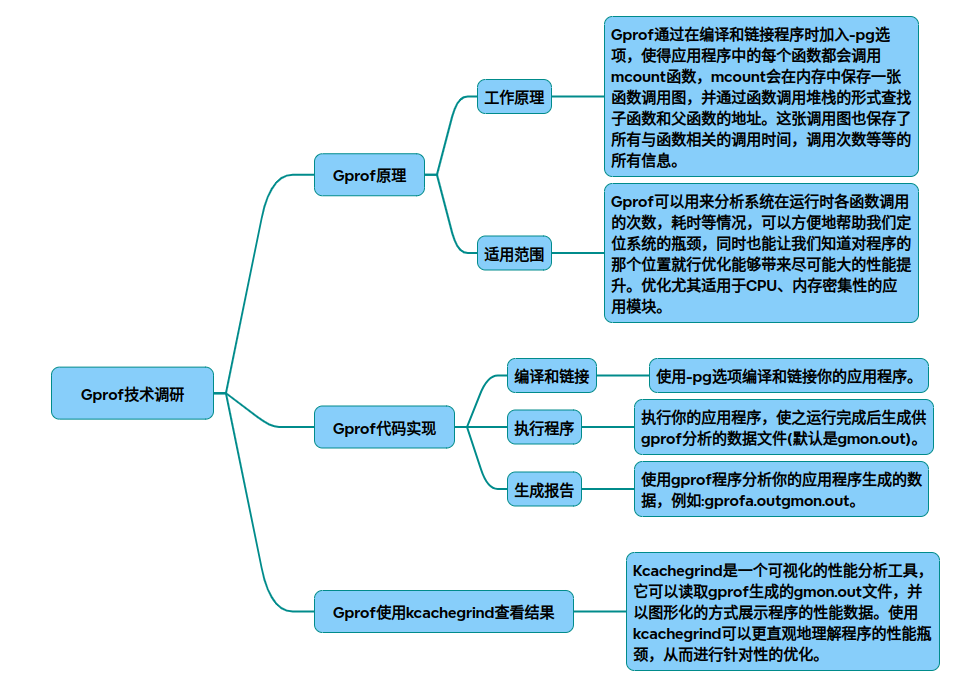

# gprof

以下是从原理到实现、从全局到细节的gprof技术调研报告，包含核心代码实现和可视化分析方案：

### 一、gprof核心原理与实现架构
1.1 系统架构图
~~~mermaid
graph TD 
    A[源代码] --> B[带-pg编译]
    B --> C[插入mcount函数]
    C --> D[运行时数据采集]
    D --> E[生成gmon.out] 
    E --> F[gprof分析]
    F --> G[Flat Profile]
    F --> H[Call Graph]
~~~
1.2 核心工作原理（参考）
代码插桩：编译时通过-pg参数在函数入口插入mcount调用
调用栈追踪：
~~~cpp
void __mcount (void *self_pc){
    // 获取调用者地址（通过寄存器或栈指针）
    void *from_pc = __builtin_return_address(0);
    // 记录调用关系图
    record_call_graph(from_pc, self_pc);
}
~~~
数据采集：
* 时间采样：每10ms中断记录当前PC值（参考）
* 调用计数：维护哈希表记录函数调用次数
* 动态内存分配结构：
~~~cpp
struct profile_data {
    unsigned long calls;  // 调用次数 
    double total_time;    // 总耗时 
    struct child *children; // 子调用节点 
};
~~~
### 二、完整C++示例代码
2.1 测试程序（参考）
~~~cpp
#include <iostream>
using namespace std;
 
void func3(int depth) {
    for(int i=0; i<10000*(depth+1); i++); // 耗时操作 
}
 
void func2() {
    for(int i=0; i<50000; i++);
    func3(1);
}
 
void func1() {
    for(int i=0; i<100000; i++);
    func3(0);
    func2();
}
 
int main() {
    for(int i=0; i<5; i++){
        func1();
        func2();
    }
    return 0;
}
~~~
2.2 编译与运行
~~~bash
g++ -pg -O2 test_gprof.cpp  -o test_gprof  # 带优化编译[8]()
./test_gprof  # 生成gmon.out  
~~~
### 三、性能分析进阶配置
3.1 关键优化参数（参考）

|参数组合	|作用	|注意事项|
|-|-|-|
|-pg -O2	|基础性能分析|	避免-O3导致插桩失效|
|-lc_p -pg	|分析C库函数	|需安装libc-profile|
|-fno-inline	|禁用内联	|确保函数可见|
|-static-libgcc|	静态链接|	避免动态库问题|

3.2 多线程支持方案
~~~bash
// 使用gprof-helper.c[1]()
gcc -shared -fPIC gprof-helper.c -o gprof-helper.so  -lpthread -ldl
export LD_PRELOAD=./gprof-helper.so  
~~~
### 四、可视化分析流程
4.1 Kcachegrind可视化（参考）
~~~mermaid
sequenceDiagram 
    程序运行->>gmon.out:  生成原始数据 
    gprof->>callgrind.out:  转换格式: gprof -b ./test_gprof | gprof2dot | dot -Tcallgrind -o callgrind.out  
    kcachegrind->>可视化: 加载callgrind.out  
~~~
4.2 关键分析视图
调用关系火焰图：
~~~bash
gprof2dot -f pstats gmon.out  | dot -Tsvg -o flame.svg  
~~~
### 五、技术局限与优化建议
5.1 已知缺陷（参考）
* 时间采样精度误差（±10%）
* 无法分析内核态耗时（需结合perf工具）
* 递归函数处理不完善（强连通分量压缩）
5.2 替代方案对比

|工具|	优势|	局限|
|-|-|-|
|gprof	|无需重新编译内核	|多线程支持差|
|perf	|支持硬件计数器	|学习曲线陡峭|
|Valgrind	|内存+性能综合分析	|运行速度慢10倍以上|

## 完整代码
[Github](https://github.com/zhengtianzuo/zhengtianzuo.github.io/tree/master/code/030-gprof)
