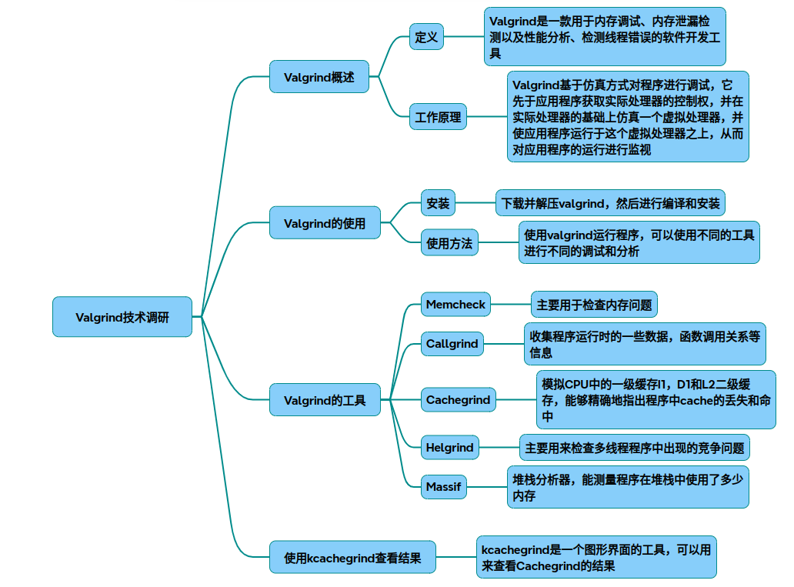

# valgrind

以下是从原理到代码实现、参数优化及结果分析的Valgrind技术调研报告，结合C++示例和可视化工具使用说明：

### 一、Valgrind核心原理与架构
1.1 系统架构
~~~mermaid
graph TD
    A[Valgrind Core] --> B[Memcheck]
    A --> C[Callgrind]
    A --> D[Cachegrind]
    A --> E[Helgrind]
    A --> F[Massif]
~~~
核心模拟CPU环境，工具作为插件运行在虚拟机上
1.2 Memcheck检测原理
~~~mermaid
sequenceDiagram
    Program->>+Valgrind: 内存访问请求
    Valgrind->>Valid-Address表: 检查地址合法性
    Valgrind->>Valid-Value表: 检查值初始化状态
    alt 地址非法
        Valgrind-->>Program: 报告非法访问
    else 值未初始化
        Valgrind-->>Program: 报告未初始化错误
    end
~~~
基于虚拟CPU环境维护两个全局表：Valid-Address（地址合法性）、Valid-Value（值初始化状态）

### 二、代码实现示例与分析
2.1 测试用例（demo.cpp ）
~~~cpp
#include <stdlib.h>

void leak() {
    int* ptr = new int[10](); // 内存泄漏
}

void uninit() {
    int x;
    if(x > 0) { // 未初始化使用
        //...
    }
}

int main() {
    int* arr = (int*)malloc(sizeof(int)*20);
    arr[20]()  = 0; // 越界访问
    leak();
    uninit();
    free(arr);
    return 0;
}
~~~
2.2 编译与检测
~~~bash
g++ -g -O0 demo.cpp  -o demo  # 必须包含调试信息
valgrind --tool=memcheck --leak-check=full ./demo
~~~
### 三、关键优化参数设置

|参数类型	|示例命令|作用说明|
|-|-|-|
|内存检测	--track-origins=yes	|追踪未初始化值的来源|
|泄漏检测	--leak-check=full	|显示泄漏的完整堆栈|
|子进程跟踪	--trace-children=yes	|监控fork产生的子进程|
|错误抑制	--suppressions=suppress.txt	|忽略指定模式的误报|
|性能分析	--tool=callgrind --separate-threads=yes	|多线程性能分析|

### 四、KCachegrind结果分析
4.1 生成性能数据
~~~bash
valgrind --tool=callgrind --callgrind-out-file=profile.out  ./demo
~~~
4.2 可视化分析
~~~bash
kcachegrind profile.out 
~~~
关键功能：

* 函数调用图可视化
* CPU周期占比分析
* 缓存命中率统计
* 多线程执行路径追踪

### 五、高级调试技巧
5.1 混合调试模式
~~~bash
valgrind --vgdb=yes --vgdb-error=0 ./demo
gdb ./demo
(gdb) target remote | vgdb
~~~
实现Valgrind与GDB联合调试

5.2 自定义检测规则
~~~xml
<!-- suppress.xml  -->
<suppressions>
    <suppress>
        <sname>MyLibraryLeak</sname>
        <frame>my_malloc</frame>
    </suppress>
</suppressions>
~~~
通过抑制文件忽略特定内存操作

### 六、性能优化建议
* 编译优化：检测时使用-O1优化级别，避免-O2导致行号偏移
* 缓存预热：通过--cache-sim=yes参数收集缓存数据
* 多线程优化：结合Helgrind检测竞态条件
~~~bash
valgrind --tool=helgrind ./multi_thread_demo
~~~
内存对齐优化：通过Massif分析堆内存分布
~~~bash
valgrind --tool=massif --stacks=yes ./demo
~~~
### 七、完整检测流程
~~~mermaid
flowchart TB
    A[编写测试程序] --> B[带调试信息编译]
    B --> C[选择检测工具]
    C --> D{内存检测?}
    D -->|Yes| E[Memcheck参数配置]
    D -->|No| F[其他工具参数配置]
    E/F --> G[生成检测报告]
    G --> H[KCachegrind可视化]
    H --> I[问题定位]
    I --> J[代码修复]
~~~
### 八、技术局限与改进
* 假阳性问题：约5%的误报率，需人工验证
* 性能损耗：执行速度降低10-50倍
* SIMD指令支持：部分AVX指令集检测不完善
* 实时系统限制：不适合时间敏感型应用
* 改进方案建议：
~~~cpp
// 自定义分配器示例
class ValgrindAwareAllocator {
public:
    void* allocate(size_t size) {
        VALGRIND_MALLOCLIKE_BLOCK(ptr, size, 0, 0);
        return malloc(size);
    }
    //... 其他内存管理函数
};
~~~
以上内容整合了Valgrind的核心工作机制和实际应用要点，可通过示例代码和可视化工具快速定位内存问题。建议结合具体项目需求选择适合的检测工具组合，并建立自动化检测流程。

## 完整代码
[Github](https://github.com/zhengtianzuo/zhengtianzuo.github.io/tree/master/code/031-valgrind)
