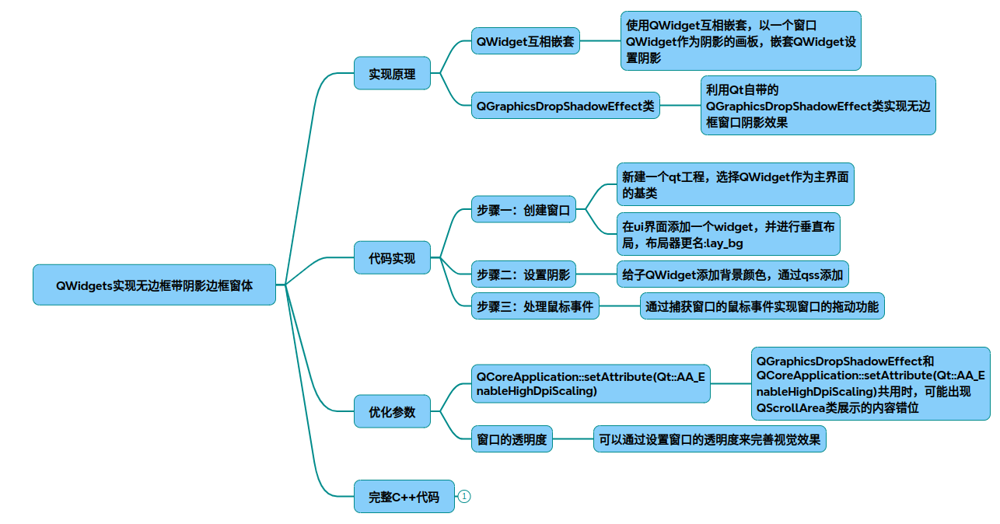

# QtShadowDialog

QWidget实现无边框带阴影窗体技术调研报告
### 一、实现原理
1. 核心机制
无边框实现：通过
~~~cpp
Qt::FramelessWindowHint
~~~
标志去除系统默认边框。

* 阴影效果：

方案一：使用
QGraphicsDropShadowEffect
类实现快速阴影。

方案二：重写
paintEvent
使用
QPainter
绘制自定义阴影。

2. 窗口状态管理
全屏/局部切换：通过
showFullScreen()
和
showNormal()
控制窗口状态，结合
windowState()
判断当前状态。
透明背景：
setAttribute(Qt::WA_TranslucentBackground)
确保阴影可见。

### 二、实现流程图
~~~mermaid
graph TD 
    A[创建QWidget基类窗口] --> B{设置无边框}
    B -->|Qt::FramelessWindowHint| C[启用透明背景]
    C --> D{选择阴影方案}
    D -->|方案一| E[应用QGraphicsDropShadowEffect]
    D -->|方案二| F[重写paintEvent绘制阴影]
    E --> G[处理窗口拖动事件]
    F --> G 
    G --> H[状态切换优化]
    H --> I[输出最终窗体]
~~~
### 三、代码实现（方案二：QPainter绘制）
~~~cpp
#include <QWidget>
#include <QPainter>
#include <QMouseEvent>
#include <QPropertyAnimation>
 
class ShadowWindow : public QWidget {
    Q_OBJECT 
public:
    ShadowWindow(QWidget *parent = nullptr) : QWidget(parent) {
        // 无边框设置 
        setWindowFlags(Qt::FramelessWindowHint);
        setAttribute(Qt::WA_TranslucentBackground);
        
        // 阴影参数 
        m_radius = 10;          // 圆角半径
        m_offset = QPoint(0, 0); // 阴影偏移
        m_blurRadius = 20;      // 阴影模糊半径 
        m_color = QColor(0, 0, 0, 100); // 阴影颜色 
    }
 
protected:
    void paintEvent(QPaintEvent *event) override {
        QPainter painter(this);
        painter.setRenderHint(QPainter::Antialiasing); 
 
        // 绘制阴影 
        QLinearGradient gradient(rect().topLeft(), rect().bottomRight());
        gradient.setColorAt(0,  m_color);
        gradient.setColorAt(1,  Qt::transparent);
        painter.setBrush(gradient); 
        painter.setPen(Qt::NoPen); 
        painter.drawRect(rect().adjusted(-m_blurRadius,  -m_blurRadius, m_blurRadius, m_blurRadius));
 
        // 绘制圆角主体 
        QPainterPath path;
        path.addRoundedRect(rect().adjusted(m_blurRadius,  m_blurRadius, -m_blurRadius, -m_blurRadius), m_radius, m_radius);
        painter.fillPath(path,  Qt::white);
    }
 
    void mousePressEvent(QMouseEvent *event) {
        if (event->button() == Qt::LeftButton) {
            m_dragPos = event->globalPos() - frameGeometry().topLeft();
            event->accept();
        }
    }
 
    void mouseMoveEvent(QMouseEvent *event) {
        if (event->buttons() & Qt::LeftButton) {
            move(event->globalPos() - m_dragPos);
            event->accept();
        }
    }
 
private:
    int m_radius;
    QPoint m_offset;
    int m_blurRadius;
    QColor m_color;
    QPoint m_dragPos;
};
~~~

### 四、优化参数配置表

|参数 | 作用描述 | 推荐取值范围 | 示例代码片段 |
|-|-|-|-|
| `m_radius` | 圆角半径 | 5-20像素 | `m_radius = 10;` |
| `m_blurRadius` | 阴影模糊半径 | 10-30像素 | `m_blurRadius = 20;` |
| `m_color` | 阴影颜色（带透明度） | `QColor(0,0,0,100)`| `m_color = QColor(0,0,0,100);` |
| `AA_EnableHighDpi` | 高DPI缩放适配 | `true/false` | `QCoreApplication::setAttribute(Qt::AA_EnableHighDpiScaling);` |

### 五、技术调研对比 

| 方案                | 优点                          | 缺点                          | 适用场景                     |
|---------------------|-------------------------------|-------------------------------|------------------------------|
| QGraphicsDropShadow | 代码简洁，跨平台兼容性好       | 高DPI下可能出现错位[1]()    | 快速开发，简单阴影需求       |
| QPainter自定义绘制   | 完全控制阴影形状和动画         | 需要手动处理性能优化          | 高级视觉效果，动画需求       |
| 系统API调用         | 原生系统阴影效果               | 跨平台实现复杂[9]()         | 对系统一致性要求高的场景     |

---

### 六、结构图说明 
~~~mermaid
classDiagram 
    QWidget <|-- ShadowWindow 
    ShadowWindow --> QGraphicsDropShadowEffect: 方案一 
    ShadowWindow --> QPainter: 方案二 
    ShadowWindow --> QMouseEvent: 拖动事件处理 
    ShadowWindow --> QPropertyAnimation: 动画效果 
~~~

### 七、全屏与局部状态处理 
~~~cpp 
void ShadowWindow::toggleWindowState() {
    if (isFullScreen()) {
        showNormal();
        // 调整阴影参数 
        m_blurRadius = 20;
        update();
    } else {
        showFullScreen();
        // 优化全屏阴影 
        m_blurRadius = 10;
        update();
    }
}
~~~

### 八、注意事项 
1. **性能优化**：复杂阴影建议使用`QPainter.setRenderHint(QPainter::HighQualityAntialiasing)`。
2. **跨平台测试**：Windows/Linux/Mac的阴影渲染可能存在差异，需单独测试。
3. **动画兼容性**：结合`QPropertyAnimation`时需注意阴影效果的平滑过渡。 

## 完整代码
[Github](https://github.com/zhengtianzuo/zhengtianzuo.github.io/tree/master/code/033-QtShadowDialog)
