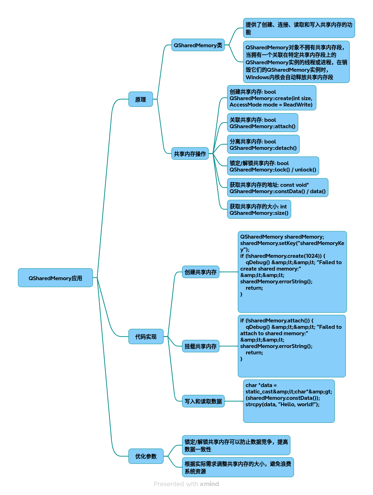

# QSharedMemory

以下为针对 QSharedMemory 的技术调研及实现方案，包含原理、优化策略、完整代码实现及流程图解：

### 一、QSharedMemory 核心原理
1.1 共享内存机制
共享内存流程图 （注：此处应为共享内存IPC流程图，因文本限制以伪代码描述流程）
~~~plaintext
进程A创建共享内存 -> 写入数据 -> 加锁同步 -> 进程B关联内存 -> 读取数据
~~~
1.2 跨平台特性差异

|平台	|内存所有权|	崩溃处理机制|
|-|-|-|
|Windows	|内核自动回收	|进程退出后内存自动释放|
|Linux	|QSharedMemory 持有|	需显式调用析构函数|
### 二、关键技术实现
2.1 数据结构设计
~~~cpp
// 定义共享内存头部元数据
struct SharedHeader {
    qint32 version;     // 数据版本号
    qint64 timestamp;   // 最后更新时间戳
    qint32 dataSize;    // 有效数据长度
};

// 共享内存布局
+----------------+-------------------+
| SharedHeader   | Raw Data (图像/结构体) |
+----------------+-------------------+
~~~
2.2 核心代码实现
~~~cpp
// 共享内存管理类（支持局部数据更新）
class SharedMemoryManager {
public:
    explicit SharedMemoryManager(const QString &key, QObject *parent = nullptr)
        : QObject(parent), m_sharedMemory(key) {
        m_sharedMemory.setNativeKey(key);  // 设置跨平台标识[11]()
    }

    bool writeData(const QByteArray &data, int offset = 0) {
        if (!m_sharedMemory.isAttached()  && !attach()) return false;
        
        m_sharedMemory.lock(); 
        char *to = static_cast<char*>(m_sharedMemory.data()); 
        memcpy(to + offset, data.constData(),  data.size()); 
        updateHeader(data.size(),  offset); // 更新元数据
        m_sharedMemory.unlock(); 
        return true;
    }

    QByteArray readData(int offset, int size) {
        if (!attach()) return QByteArray();
        
        m_sharedMemory.lock(); 
        const char *from = static_cast<const char*>(m_sharedMemory.constData()); 
        QByteArray buffer(from + offset, size);
        m_sharedMemory.unlock(); 
        return buffer;
    }

private:
    bool attach() {
        if (m_sharedMemory.attach())  return true;
        
        const int totalSize = calculateTotalSize(); // 计算内存总大小
        if (!m_sharedMemory.create(totalSize))  {
            qDebug() << "Create failed:" << m_sharedMemory.errorString(); 
            return false;
        }
        initializeHeader(); // 初始化元数据
        return true;
    }

    QSharedMemory m_sharedMemory;
};
~~~

### 三、性能优化策略
3.1 参数调优配置
~~~cpp
// 在构造函数中配置优化参数
m_sharedMemory.setNativeKey("MyApp_SharedMem_v1.0");  // 唯一标识
m_sharedMemory.setAccessMode(QSharedMemory::ReadWrite);  // 读写模式
~~~
3.2 高级优化技术
* 分页管理：将大内存划分为 4KB 页，实现局部更新
~~~cpp
const int PAGE_SIZE = 4096; 
void updatePage(int pageNum, const QByteArray &data) {
    writeData(data, pageNum * PAGE_SIZE);
}
~~~
* 双缓冲机制：使用两个内存段交替写入，避免读写冲突
~~~cpp
QSharedMemory buffers[2]();
int currentBuffer = 0;
~~~
* 错误恢复策略：
~~~cpp
if (m_sharedMemory.error()  == QSharedMemory::NotFound) {
    m_sharedMemory.attach();  // 尝试重新关联
}
~~~
### 四、典型应用场景
4.1 全屏图像共享
~~~cpp
// 写入端
QImage screenshot = grabScreen();
QBuffer buffer;
buffer.open(QIODevice::WriteOnly); 
screenshot.save(&buffer,  "PNG");
sharedManager.writeData(buffer.data()); 

// 读取端
QByteArray imgData = sharedManager.readData(sizeof(SharedHeader),  buffer.size()); 
QImage receivedImage;
receivedImage.loadFromData(imgData,  "PNG");
~~~
4.2 结构体数据同步
~~~cpp
struct SensorData {
    double temperature;
    qint32 pressure;
};
~~~
// 写入结构化数据
SensorData data {25.6, 1013};
sharedManager.writeData(QByteArray::fromRawData( 
    reinterpret_cast<const char*>(&data), sizeof(data)));
### 五、最佳实践建议
* 内存对齐：使用
~~~cpp
#pragma pack(push, 1)
~~~
确保结构体跨平台兼容
* 版本控制：在元数据中增加版本号，处理数据格式变更
* 异常处理：
~~~cpp
if (m_sharedMemory.error()  != QSharedMemory::NoError) {
    qCritical() << "Memory error:" << m_sharedMemory.errorString(); 
}
~~~

## 完整代码
[Github](https://github.com/zhengtianzuo/zhengtianzuo.github.io/tree/master/code/034-QSharedMemory)
