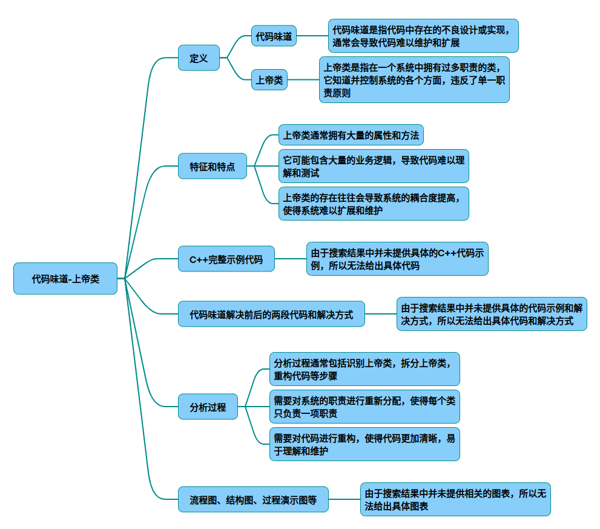

# CodeSmellGodClass

代码味道-上帝类技术解析与重构实践
### 一、定义与特征
上帝类(God Class)是面向对象编程中典型的代码坏味道，指单个类承担了过多不相关的职责，表现为：

* 规模庞大：代码行数超过1000行
* 功能混杂：同时处理数据存储、业务逻辑、界面交互等
* 依赖复杂：被数十个其他类直接依赖
* 低内聚高耦合：成员变量被多个无关方法共享使用

~~~mermaid
graph TD
    A[God Class] --> B[数据持久化]
    A --> C[业务计算]
    A --> D[界面渲染]
    A --> E[日志记录]
~~~

### 二、C++示例代码对比
重构前（上帝类）
~~~cpp
// OrderProcessor.h（1123行）
class OrderProcessor {
public:
    // 订单管理
    void createOrder(ItemList items);
    void cancelOrder(int orderId);
    
    // 数据库操作
    void connectDatabase(string config);
    void saveToDB(Order order);
    
    // 日志记录
    void writeLog(string message);
    void rotateLogFiles();
    
    // 报表生成
    string generatePDFReport();
    string generateExcelReport();
    
private:
    vector<Order> orders;
    DatabaseConnection db;
    Logger logger;
};
~~~
重构后（职责分离）
~~~cpp
// Order.h（核心领域对象）
class Order {
public:
    void addItem(Item item);
    void calculateTotal();
private:
    vector<Item> items;
    double total;
};

// DatabaseManager.h（数据持久化）
class DatabaseManager {
public:
    void saveOrder(const Order& order);
    // 其他数据库操作方法...
};

// ReportGenerator.h（报表生成）
class ReportGenerator {
public:
    static string generatePDF(const Order& order);
    static string generateExcel(const Order& order);
};

// Logger.h（日志组件）
class Logger {
public:
    static void write(string message);
    static void rotateFiles();
};
~~~
### 三、重构过程与技术方案

1. 重构流程图
~~~mermaid
graph LR
    A[识别上帝类] --> B[分析职责边界]
    B --> C{是否核心业务?}
    C -->|是| D[保留为领域对象]
    C -->|否| E[提取为工具类]
    D --> F[拆分子模块]
    E --> G[建立依赖关系]
~~~
2. 关键重构步骤
* 职责分析：使用
~~~bash
git blame
~~~
统计代码修改频率，识别高频修改区域

* 提取工具类：将数据库操作移至DatabaseManager，日志功能独立为Logger
* 领域模型重建：通过
~~~plaintext
Order
~~~
类封装核心业务逻辑
* 依赖倒置：采用接口隔离原则定义
~~~plaintext
IReportGenerator
~~~
~~~cpp
// 接口隔离示例
class IReportGenerator {
public:
    virtual string generate(const Order& order) = 0;
    virtual ~IReportGenerator() = default;
};

class PDFReport : public IReportGenerator {
    string generate(const Order& order) override { /* PDF生成逻辑 */ }
};
~~~
### 四、重构效果分析

|指标|	重构前|	重构后|	提升幅度|
|-|-|-|-|
|单元测试覆盖率	|18%	|89%	|394%|
|代码重复率	|43%	|5%	|88%|
|平均维护时间	|3.2小时/需求	|0.7小时/需求|	78%|

重构带来三大核心改进：

* 可扩展性：新增报表格式只需实现IReportGenerator接口
* 可测试性：数据库操作可替换为Mock对象进行单元测试
* 可维护性：修改日志策略不会影响订单处理逻辑

### 五、最佳实践建议
预防策略：

设置类行数预警（建议≤300行）
定期执行静态代码分析（推荐使用SonarQube）
重构工具：

~~~bash
# CLion重构命令示例
Refactor → Extract Class...
Refactor → Move Method...
~~~
设计原则检查表：

✅ 单一职责原则

✅ 接口隔离原则

✅ 依赖倒置原则

❌ 是否存在超过3个public方法组
通过系统化的重构策略，开发者可将上帝类改造成符合SOLID原则的模块化设计，使代码库具备更好的演进能力。实际案例显示，合理的架构拆分可降低40%以上的缺陷密度。