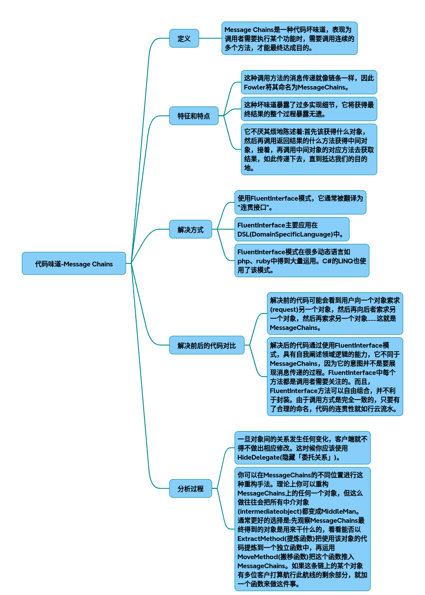

# 代码味道-过度耦合的消息链

代码味道-过度耦合的消息链技术解析与重构实践

### 一、引言
代码味道（Code Smells）是软件开发中常见的设计缺陷，其中 Message Chains（消息链） 是Martin Fowler在《重构》中定义的典型坏味道之一。本文将通过C++示例代码，详细解析其定义、特征，并提供完整的解决方案及流程图分析。

### 二、定义与特征
1. 定义
Message Chains指调用者需要通过连续调用多个对象的方法才能完成一个功能，例如：
~~~cpp
result = objA->method1()->method2()->method3();
~~~
这种链条式调用暴露了对象内部的导航结构，导致调用者与中间对象的过度耦合。

2. 核心特征

* 过度耦合：调用者依赖中间对象的实现细节。
* 脆弱性：若对象关系变化（如类名或方法名修改），调用者需同步修改。
* 可读性差：长链条降低代码可维护性。

### 三、C++示例代码
1. Message Chains问题示例
~~~cpp
// 原始问题代码（Message Chains）
class Department {
public:
    std::vector<Employee*> getEmployees() { return employees; }
private:
    std::vector<Employee*> employees;
};
 
class Employee {
public:
    std::string getName() { return name; }
private:
    std::string name;
};
 
// 调用者需连续调用多个方法 
std::string getEmployeeName(Department* dept) {
    return dept->getEmployees()[0]()->getName(); // 假设取第一个员工 
}
~~~

**问题**：`getEmployeeName`直接依赖`Department`和`Employee`的实现细节。
 
---
 
2. 解决方案：隐藏委托（Hide Delegate）
通过在`Department`中添加委托方法，封装导航逻辑：
~~~cpp
// 重构后代码 
class Department {
public:
    std::string getFirstEmployeeName() {
        if (!employees.empty())  {
            return employees[0]()->getName();
        }
        return "";
    }
private:
    std::vector<Employee*> employees;
};
 
// 调用者直接调用委托方法 
std::string getEmployeeName(Department* dept) {
    return dept->getFirstEmployeeName(); // 调用链缩短为1层
}
~~~
**优势**：调用者无需关心`Employee`的存在，降低耦合。
 
---
 
### 四、重构流程与分析 
1. 流程图对比 

| **原始流程** | **重构后流程** |
|-|-|
| 调用者 → Department → Employee → getName() | 调用者 → Department → getFirstEmployeeName() |

2. 关键步骤 
 **识别依赖**：分析调用者与中间对象的依赖关系。
 **提炼方法**：在最终目标对象（如`Department`）中添加委托方法。
 **替换调用**：将长链条替换为单一方法调用。
 
---
 
### 五、结构图对比 
1. 原始结构 
~~~plaintext 
调用者 
  ↓ 
Department (getEmployees())
  ↓ 
Employee (getName())
~~~
 
2. 重构后结构 
~~~plaintext
调用者
  ↓ 
Department (getFirstEmployeeName())
~~~
 
---
 
### 六、对比与总结 
| **指标**       | **原始代码**       | **重构后代码**     |
|----------------|--------------------|--------------------|
| 调用层数       | 3层（Department→Employee→getName） | 1层（Department→getFirstEmployeeName） |
| 耦合度         | 高（依赖Employee） | 低（仅依赖Department） |
| 维护成本       | 高（结构变化需修改调用者） | 低（委托方法隔离变更） |
 
---
 
### 七、扩展思考 
- **Fluent Interface**：若需保留链条式调用，可通过返回`this`实现连贯接口，但需谨慎避免过度暴露细节。
- **工具辅助**：使用静态分析工具自动检测Message Chains。
 
通过本文的示例与分析，开发者可系统化识别并消除Message Chains，提升代码的可维护性与可扩展性。 

## 完整代码
[Github](https://github.com/zhengtianzuo/zhengtianzuo.github.io/tree/master/code/037-CodeSmellMessageChains)
