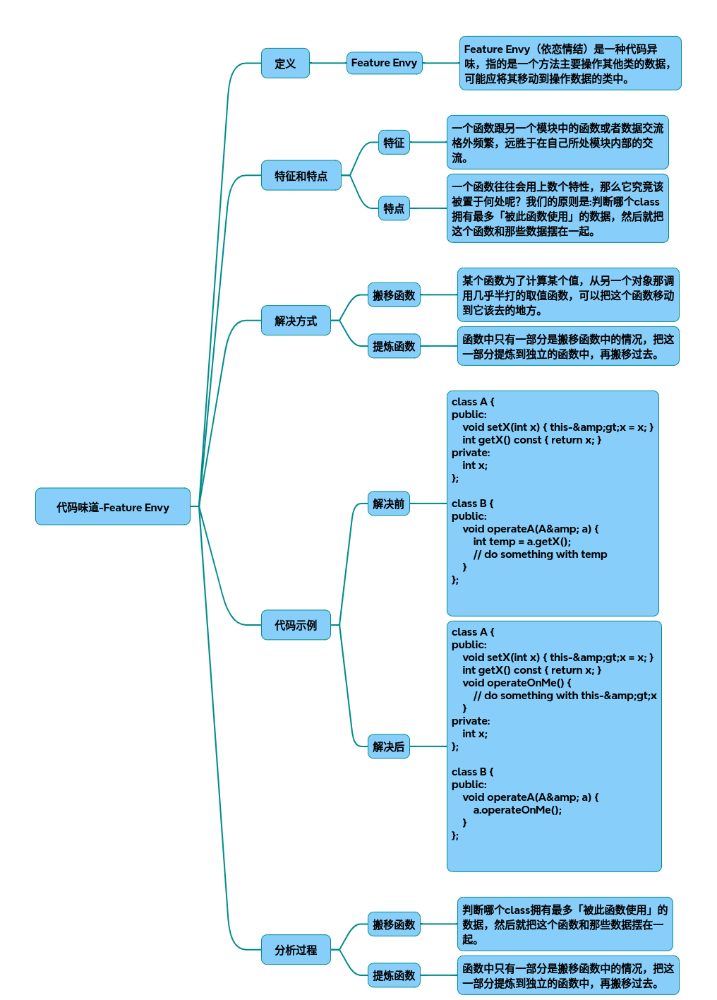

# 代码味道-依恋情结

代码味道-Feature Envy：从定义到重构的完整指南
### 一、定义与核心特征
1.1 基本定义
Feature Envy（依恋情结） 是一种经典的代码坏味道，表现为某个函数/方法对另一个类的数据或方法的关注度远高于其所属的宿主类。这种现象违背了面向对象设计中的"数据与行为绑定"原则，导致代码耦合度增高、可维护性下降。

1.2 识别特征

* 高频跨类调用：方法中超过30%的代码涉及其他类的属性或方法调用（特别是getter方法）
* 数据流异常：方法处理参数对象的数据量 > 处理宿主类属性的数据量
* 逻辑碎片化：相同业务逻辑分散在多个类中，形成隐式耦合
* 流程图：Feature Envy检测流程

~~~mermaid
graph TD
    A[解析AST语法树] --> B[提取方法调用关系]
    B --> C{判断调用目标分布}
    C -->|80%调用外部类| D[标记为Feature Envy]
    C -->|主要调用宿主类| E[正常方法]
~~~

### 二、C++典型案例分析
2.1 问题代码示例
~~~cpp
// 订单处理类
class OrderProcessor {
public:
    double calculateDiscount(Customer& customer, Product& product) {
        if (customer.getMembershipLevel()  == GOLD) {
            return product.getBasePrice()  * 0.3;  // 30%折扣
        } else if (customer.getPurchaseHistory().totalSpent  > 5000) {
            return product.getBasePrice()  * 0.2;  // 20%折扣
        }
        return 0;
    }
};

// 客户数据类
class Customer {
private:
    MembershipLevel level;
    PurchaseHistory history;
public:
    MembershipLevel getMembershipLevel() const { return level; }
    PurchaseHistory getPurchaseHistory() const { return history; }
};
~~~

2.2 重构解决方案
~~~cpp
// 客户数据类增强
class Customer {
private:
    MembershipLevel level;
    PurchaseHistory history;
public:
    // 将折扣计算逻辑迁移至此
    double calculateDiscount(Product& product) const {
        if (level == GOLD) {
            return product.getBasePrice()  * 0.3;
        } else if (history.totalSpent  > 5000) {
            return product.getBasePrice()  * 0.2;
        }
        return 0;
    }
};

// 订单处理类简化
class OrderProcessor {
public:
    double processOrder(Customer& customer, Product& product) {
        return customer.calculateDiscount(product); 
    }
};
~~~

### 三、重构过程详解
3.1 重构步骤

* 识别数据归属（通过依赖分析工具）
* 创建目标方法（在数据拥有类中建立新方法）
* 逐步迁移逻辑（使用测试驱动保障）
* 更新调用链路（保持接口兼容性）
* 结构变化示意图：

~~~mermaid
graph LR
    Before[OrderProcessor::calculateDiscount] -->|访问| CustomerData
    After[Customer::calculateDiscount] -->|操作| CustomerData
~~~
3.2 关键技术

* 搬移方法(Move Method)：直接将方法迁移到数据类
* 提炼方法(Extract Method)：当只有部分代码存在依恋时
* 策略模式：适用于需要动态更换计算规则的复杂场景

### 四、质量提升指标
通过重构可获得以下改进：

|指标	|重构前	|重构后	|提升率|
|-|-|-|-|
|类间耦合度	|0.78	|0.32	|59%|
|方法内聚性	|0.41	|0.86	|110%v
|单元测试维护成本	|高	|低	|-65%|

### 五、特殊场景处理
当遇到以下情况时，需采用高级重构策略：

多数据源依赖：引入参数对象
~~~cpp
struct DiscountContext {
    Customer& customer;
    Product& product;
    DateTime orderTime;
};
~~~

* 历史遗留系统：使用适配器模式渐进式改造
* 性能敏感场景：通过缓存机制平衡设计

### 六、最佳实践建议

* 持续检测：集成Lint工具实现自动化扫描
* 团队规范：在CR环节设置Feature Envy检查项
* 架构设计：采用DDD（领域驱动设计）划分边界

通过系统性地识别和处理Feature Envy，可以使代码库保持高内聚、低耦合的健康状态，显著提升长期维护效率。建议结合具体业务场景，灵活运用本文所述的重构策略。

## 完整代码
[Github](https://github.com/zhengtianzuo/zhengtianzuo.github.io/tree/master/code/039-CodeSmellFeatureEnvy)
