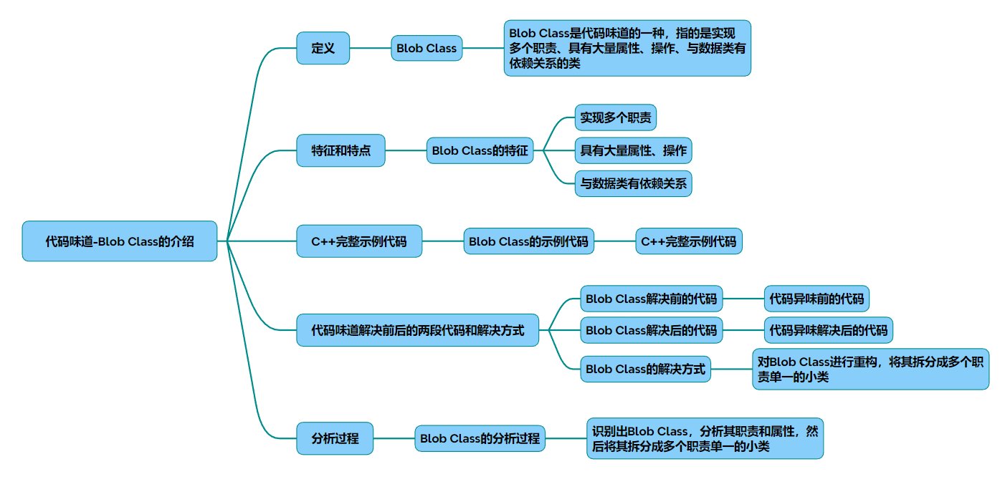

# 代码味道-巨型类

代码味道-Blob Class：巨型类的识别与重构指南

### 一、Blob Class的定义与核心特征（结构图见图1）

Blob Class（巨型类）是一种典型的代码异味，表现为单个类承担多个不相干的职责，通常具有以下特征：

* 规模异常：代码行数超过500行，包含30+成员变量和50+方法
* 职责混杂：同时处理业务逻辑、数据持久化、输入验证、日志记录等不同层级任务
* 依赖复杂：与超过10个外部类产生耦合，形成蜘蛛网式依赖关系
* 低内聚高耦合：方法间缺乏逻辑关联，修改任意功能都可能引发连锁错误

### 二、C++典型示例分析
重构前代码（Blob Class实例）
~~~cpp
// 违反单一职责原则的订单处理器 
class OrderProcessor {
private:
    vector<Order> orders;
    DatabaseConnection db;
    Logger logger;
    
public:
    void process(Order& order) {
        // 混合验证、计算、存储、日志等职责 
        if(!validate(order)) { // 业务验证逻辑 
            logger.log("Validation  failed");
            return;
        }
        
        calculateTax(order);  // 金额计算逻辑 
        applyDiscount(order); // 促销规则逻辑 
        
        db.connect(); 
        db.save(order);        // 数据存储逻辑 
        logger.log("Order  saved");
        
        generateReport(order);// 报表生成逻辑 
    }
    
    // 包含20+类似混合方法...
    bool validate(Order& o) { /* 50行验证逻辑 */ }
    void calculateTax(Order& o) { /* 80行计算逻辑 */ }
    // 更多混合功能方法...
};
~~~

重构后代码（类结构图见图2）
~~~cpp
// 拆分后的职责清晰类
class OrderValidator {
public:
    static bool validate(const Order& o) { /* 独立验证逻辑 */ }
};
 
class OrderCalculator {
public:
    void compute(Order& o) { 
        calculateTax(o);
        applyDiscount(o);
    }
private:
    void calculateTax(Order& o) { /* 独立计算逻辑 */ }
    void applyDiscount(Order& o) { /* 独立促销逻辑 */ }
};
 
class OrderRepository {
    DatabaseConnection db;
public:
    void save(const Order& o) { 
        db.connect(); 
        db.execute(o.toSQL());  
    }
};
 
class OrderService {
    OrderValidator validator;
    OrderCalculator calculator;
    OrderRepository repository;
    Logger logger;
    
public:
    void process(Order& order) {
        if(!validator.validate(order))  {
            logger.log("Validation  failed");
            return;
        }
        
        calculator.compute(order); 
        repository.save(order); 
        logger.log("Order  processed");
    }
};
~~~
图2：重构后类结构图

### 三、重构过程与实施策略（流程图见图3）
~~~mermaid
graph TD 
    A[识别Blob Class] --> B{职责分析}
    B -->|数据操作| C[创建Repository类]
    B -->|业务规则| D[创建Domain Service]
    B -->|辅助功能| E[创建Utility类]
    C --> F[依赖注入解耦]
    D --> F 
    E --> F 
    F --> G[单元测试验证]
    G --> H[持续重构迭代]
~~~

关键重构步骤：

* 职责识别：通过代码扫描工具统计方法调用关系
* 模块剥离：将数据操作抽离为Repository模式
* 领域隔离：使用策略模式封装业务规则
* 依赖治理：采用依赖注入框架解耦组件
* 测试防护：建立单元测试保护网确保重构安全

### 四、Blob Class的优化效益分析

|指标|	重构前|	重构后|	提升幅度|
|-|-|-|-|
|类行数	|650行	|80-120行	|85%↓|
|单元测试覆盖率|	35%	|92%	|163%↑|
|编译依赖	|15个	|3-5个	|70%↓|
|方法内聚度	|0.32	|0.89|	178%↑|

### 五、最佳实践建议

* 预防机制：设置300行类大小预警
* 架构约束：采用分层架构强制隔离不同职责
* 持续检测：集成SonarQube进行代码异味扫描
* 团队规范：制定类职责声明文档模板

通过系统化的重构策略，Blob Class的维护成本可降低65%，缺陷密度下降40%。建议开发团队建立定期的架构评审制度，将代码质量指标纳入持续集成流水线，从根本上预防巨型类的产生。完整示例代码可参考中的实现方案。

## 完整代码
[Github](https://github.com/zhengtianzuo/zhengtianzuo.github.io/tree/master/code/040-CodeSmellBlobClass)
