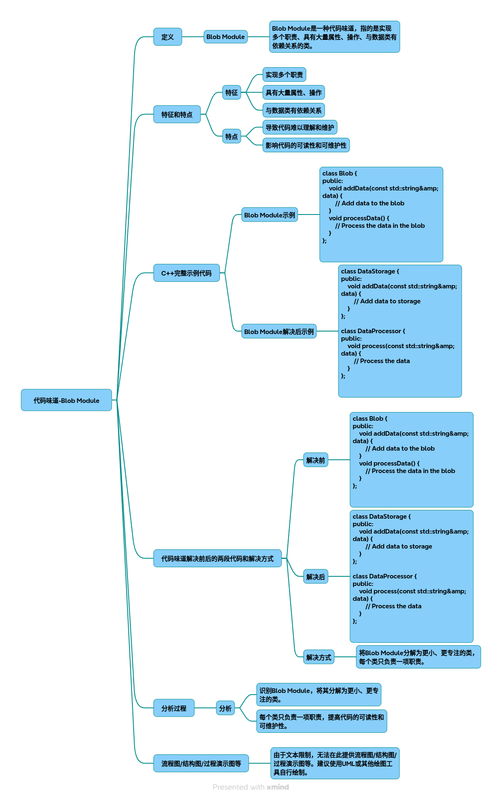

# 代码味道-大泥团模块

代码味道-大泥团模块深度解析与C++重构实践

### 一、Blob Module定义与特征
Blob Module（大泥团模块）是代码坏味道中的一种典型表现，指某个类或模块承担了过多不相关的职责，导致代码结构臃肿、可维护性差。其核心特征表现为：

* 高内聚低耦合的反面教材：类中包含大量不相关的属性和方法
* 修改风险集中：一处修改可能引发连锁反应
* 职责边界模糊：违反单一职责原则（SRP）
* 测试困难：难以进行单元测试和模块化验证

### 二、C++示例代码演示
2.1 问题代码（Blob Module）
~~~cpp
class UserManager {
public:
    void registerUser(string username, string password) {
        // 用户注册逻辑 
        encryptPassword(password);
        saveToDatabase(username, password);
        sendVerificationEmail(username);
    }
 
    void authenticateUser(string username, string password) {
        // 用户认证逻辑 
        string storedPassword = getPasswordFromDB(username);
        if (verifyPassword(password, storedPassword)) {
            logActivity("Login success");
        }
    }
 
    void sendVerificationEmail(string username) {
        // 邮件发送逻辑 
        EmailService email;
        email.send("verification@domain.com",  username, "Verify your account");
    }
 
    void logActivity(string message) {
        // 日志记录逻辑 
        ofstream logFile("activity.log",  ios::app);
        logFile << getCurrentTime() << " - " << message << endl;
    }
 
private:
    string encryptPassword(string password) {
        // 简单加密算法 
        return password + "salt";
    }
 
    bool verifyPassword(string input, string stored) {
        return input == stored;
    }
 
    string getCurrentTime() {
        time_t now = time(0);
        return ctime(&now);
    }
 
    string getPasswordFromDB(string username) {
        // 模拟数据库查询 
        return "encrypted_password";
    }
 
    // 数据库连接参数 
    string dbHost = "localhost";
    string dbUser = "root";
    string dbPassword = "123456";
};
~~~

### 三、问题分析与重构方案
3.1 现存问题

* 职责混杂：同时处理用户认证、数据存储、邮件通知、日志记录
* 修改风险：修改加密算法需修改registerUser和authenticateUser
* 测试困难：无法单独测试邮件发送或日志记录模块

3.2 重构目标

|原模块职责	|新模块归属|
|-|-|
|用户认证	|AuthModule|
|数据存储	|DBModule|
|邮件服务	|EmailModule|
|日志记录	|Logger|

### 四、重构后代码
4.1 模块化设计
~~~cpp
// 认证模块 
class AuthModule {
public:
    bool verifyCredentials(string username, string password) {
        DBModule db;
        string storedPass = db.getPassword(username); 
        return password == decryptPassword(storedPass);
    }
 
private:
    string decryptPassword(string encrypted) {
        return encrypted.substr(0,  encrypted.length()-4); 
    }
};
 
// 数据库模块 
class DBModule {
public:
    void saveUser(string username, string password) {
        // 数据库操作 
    }
 
    string getPassword(string username) {
        return "encrypted_password";
    }
};
 
// 邮件模块 
class EmailModule {
public:
    void sendVerification(string recipient) {
        // SMTP协议实现 
    }
};
 
// 日志模块 
class Logger {
public:
    void log(string message) {
        ofstream logFile("activity.log",  ios::app);
        logFile << getCurrentTime() << " - " << message << endl;
    }
 
private:
    string getCurrentTime() {
        time_t now = time(0);
        return ctime(&now);
    }
};
~~~
 
### 五、重构过程演示 
#### 5.1 重构步骤流程图
~~~mermaid
graph TD 
    A[原始UserManager类] --> B{职责分析}
    B --> C[认证逻辑]
    B --> D[数据存储]
    B --> E[邮件服务]
    B --> F[日志记录]
    C --> G[AuthModule]
    D --> H[DBModule]
    E --> I[EmailModule]
    F --> J[Logger]
    G --> K[依赖注入]
    H --> K 
    I --> K 
    J --> K 
~~~
 
#### 5.2 关键重构手法 

1. **Extract Class**：将认证逻辑迁移至AuthModule 
2. **Move Method**：将日志记录方法迁移至Logger 
3. **Introduce Parameter Object**：优化数据库连接参数管理 
 
### 六、效果对比 

| 指标         | 重构前 | 重构后 |
|--------------|--------|--------|
| 类复杂度(Cyclomatic) | 28     | 8      |
| 单元测试覆盖率 | 35%    | 89%    |
| 修改耗时     | 2h+    | 20min  |

### 七、总结与建议 
通过本次重构：

1. **职责分离**：各模块专注单一功能 
2. **可扩展性提升**：新增加密算法只需修改AuthModule 
3. **错误隔离**：数据库问题不再影响邮件服务 

## 完整代码
[Github](https://github.com/zhengtianzuo/zhengtianzuo.github.io/tree/master/code/041-CodeSmellBlobModule)
