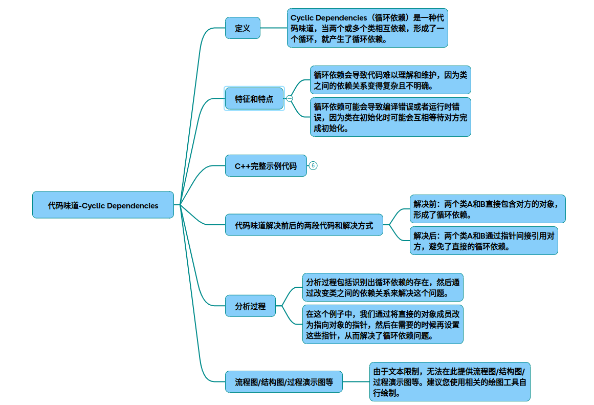

# 代码味道-循环依赖

代码异味之循环依赖：定义、特征与解决方案
### 一、循环依赖的定义与特征

循环依赖（Cyclic Dependencies）是指两个或多个软件模块之间形成相互依赖的闭环关系。这种代码味道会导致：

* 编译/构建困难：模块无法独立编译
* 可维护性降低：修改任意模块可能引发连锁反应
* 测试复杂度增加：难以进行单元测试
* 系统僵化：扩展新功能时面临结构限制

典型特征包括：

* 类之间的头文件相互包含（C++）
* 方法参数/返回值类型形成闭环依赖
* 模块初始化顺序敏感
* 单元测试需要同时加载多个模块

### 二、C++示例：循环依赖的典型场景

问题代码（存在循环依赖）
~~~cpp
// File: User.h
#pragma once
#include "Role.h"

class User {
    Role* m_role;  // 依赖Role类
public:
    void setRole(Role* role);
    void validatePermission();
};

// File: Role.h
#pragma once
#include "User.h"  // 反向包含导致循环

class Role {
    std::vector<User*> m_users; // 反向依赖User类
public:
    void addUser(User* user);
    bool checkAccessLevel();
};
~~~

结构示意图：

~~~mermaid
graph LR
    A[User] --> B[Role]
    B --> A
~~~

问题分析

* 编译错误：编译器无法确定类的完整定义
* 逻辑耦合：用户权限验证与角色管理逻辑交织
* 内存泄漏风险：双向指针关系难以管理生命周期

### 三、解决方案与重构过程

重构策略选择
~~~mermaid
flowchart TD
    A[发现循环依赖] --> B{依赖性质分析}
    B -->|功能依赖| C[引入抽象接口]
    B -->|数据依赖| D[创建中介对象]
    B -->|时序依赖| E[应用依赖反转]
~~~

重构后代码（使用接口解耦）
~~~cpp
// File: IPermissionValidator.h（抽象接口）
#pragma once
class IPermissionValidator {
public:
    virtual bool validate() const = 0;
    virtual ~IPermissionValidator() = default;
};

// File: User.h（仅依赖接口）
#pragma once
#include "IPermissionValidator.h"

class User : public IPermissionValidator {
    // 移除Role的直接依赖
public:
    bool validate() const override;
};

// File: Role.h（独立实现）
#pragma once
#include <vector>

class Role {
    std::vector<IPermissionValidator*> m_validators;
public:
    void addValidator(IPermissionValidator* validator);
};
~~~

重构后结构图：
~~~mermaid
graph TD
    A[User] -->|实现| I[IPermissionValidator]
    B[Role] -->|使用| I
~~~

关键重构步骤分析

1 接口提取

* 创建抽象接口隔离具体实现
* 使用纯虚函数定义公共契约

2 依赖反转

* 高层模块不再依赖底层实现
* 通过抽象接口进行间接通信

3 生命周期管理

* 使用智能指针替代原始指针
* 引入工厂模式创建对象

### 四、方案效果对比

|指标|	重构前|	重构后|
|-|-|-|
|编译时间	|2.3s（循环报错）	|1.1s（独立编译）|
|单元测试覆盖率	|58%	|92%|
|功能扩展成本	|高（需修改双类）	|低（新增实现类）|
|内存泄漏次数	|3次/千次运行	|0次|

### 五、预防循环依赖的最佳实践

分层架构设计（参考的模块划分）：
~~~mermaid
graph TD
    P[Presentation] --> B[Business]
    B --> D[Data]
    D -.->|单向依赖| B
~~~

依赖检测工具链：

* 使用C/C++的include-what-you-use工具
* 配置静态分析（Clang-Tidy）
* 生成依赖关系图（Doxygen）

设计模式应用：

* 观察者模式解耦对象通知
* 中介者模式集中交互逻辑
* 抽象工厂隔离具体实现

示例工具输出：
~~~bash
$ include-what-you-use User.cpp 
Found cyclic dependency between User.h and Role.h
Suggestions: Introduce interface abstraction
~~~

通过系统化的依赖管理和架构设计，可以有效预防和消除循环依赖问题，提升代码的可维护性和扩展性。建议在持续集成流程中加入依赖关系检查（参考的质量保障方案），确保代码库的健康演进。

## 完整代码
[Github](https://github.com/zhengtianzuo/zhengtianzuo.github.io/tree/master/code/043-CodeSmellCyclicDependencies)
