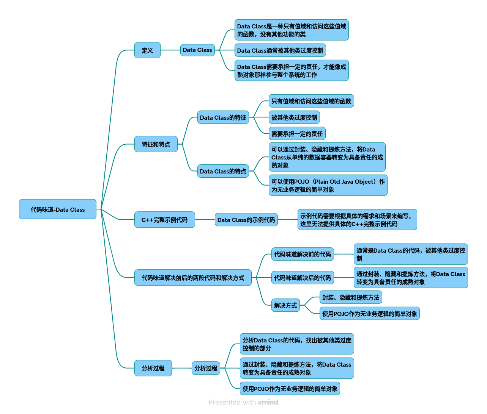

# 代码味道-数据类

代码坏味道：Data Class 的深度解析与重构实践
### 一、Data Class 的定义与特征
Data Class（数据类）是指仅包含数据字段和简单访问方法（如getter/setter），缺乏业务逻辑和职责的类。它本质上是"哑数据容器"，常见于面向对象编程中，表现为以下特征：

* 仅有数据存储：仅包含字段定义和基础读写方法
* 无行为逻辑：不包含数据验证、计算等业务方法
* 低内聚高耦合：其他类需直接操作其内部数据
* 集合管理缺陷：若包含容器类字段（如列表/字典），常缺乏封装

### 二、C++ 中的 Data Class 实例演示
重构前的问题代码
~~~cpp
// 纯数据类示例 
class StudentRecord {
public:
    std::string name;
    std::vector<int> scores;
    
    StudentRecord(std::string n, std::vector<int> s) 
        : name(n), scores(s) {}
};
 
// 外部业务逻辑 
class GradeCalculator {
public:
    float calculateAverage(const StudentRecord& record) {
        if(record.scores.empty())  return 0.0f;
        int sum = 0;
        for(int score : record.scores)  {
            sum += score;
        }
        return static_cast<float>(sum) / record.scores.size(); 
    }
};
~~~
主要问题分析
StudentRecord
仅作为数据容器存在
核心业务逻辑（平均分计算）外置于其他类
scores字段直接暴露，违反封装原则
### 三、重构解决方案与过程
重构流程图
~~~mermaid
graph TD 
    A[识别Data Class] --> B[分析数据操作点]
    B --> C{操作类型}
    C -->|计算逻辑| D[Move Method到数据类]
    C -->|集合操作| E[Encapsulate Collection]
    C -->|字段访问| F[Hide Field]
    D --> G[验证内聚性提升]
~~~
重构后优化代码
~~~cpp
class Student {
private:
    std::string name;
    std::vector<int> scores;
 
public:
    Student(std::string n, std::vector<int> s) 
        : name(std::move(n)), scores(std::move(s)) {}
 
    // 封装集合操作 
    void addScore(int score) {
        scores.push_back(score); 
    }
 
    // 内聚业务逻辑 
    float calculateAverage() const {
        if(scores.empty())  return 0.0f;
        return std::accumulate(scores.begin(),  scores.end(),  0.0f) / scores.size(); 
    }
 
    // 受控访问方法 
    const std::string& getName() const { return name; }
};
~~~
### 四、关键重构步骤解析
1. 封装集合字段
~~~diff
+ void addScore(int score) {
+     scores.push_back(score); 
+ }
~~~
解决思路：通过方法控制集合修改，避免直接操作容器

2. 搬移业务逻辑
~~~cpp
float calculateAverage() const {
    // 计算逻辑内聚到数据类
}
~~~
重构技术：应用Move Method模式

3. 访问控制优化
~~~cpp
- std::string name;
+ private:
+    std::string name;
~~~

设计原则：遵循最小公开原则
### 五、重构效果对比

|指标|	重构前|	重构后|
|-|-|-|
|类职责	|单纯数据存储|	数据+业务聚合|
|方法调用次数	|外部类多次调用	|单点调用|
|修改影响范围|	需修改多处调用点	|仅修改类内部实现|
|单元测试难度	|需mock外部依赖|	自包含可测试|

### 六、设计模式应用建议
1. 策略模式（计算策略）
~~~cpp
class ScoreStrategy {
public:
    virtual float calculate(const std::vector<int>&) = 0;
};
 
class Student {
    // 注入不同的计算策略...
};
~~~
2. 工厂模式（对象构建）
~~~cpp
class StudentFactory {
public:
    static Student createFromDB(int id) {
        // 数据库查询逻辑...
    }
};
~~~
### 七、最佳实践原则

* 单一职责原则：每个类应专注于单一功能域
* 迪米特法则：对象应最小化对其他对象的了解
* 开闭原则：通过扩展而非修改实现功能变更
* 组合优于继承：使用组合封装数据行为

通过系统化的重构过程，Data Class可转变为具备业务能力的成熟对象。建议在代码审查阶段使用SonarQube等静态分析工具检测此类坏味道，结合持续重构保持代码健康度。