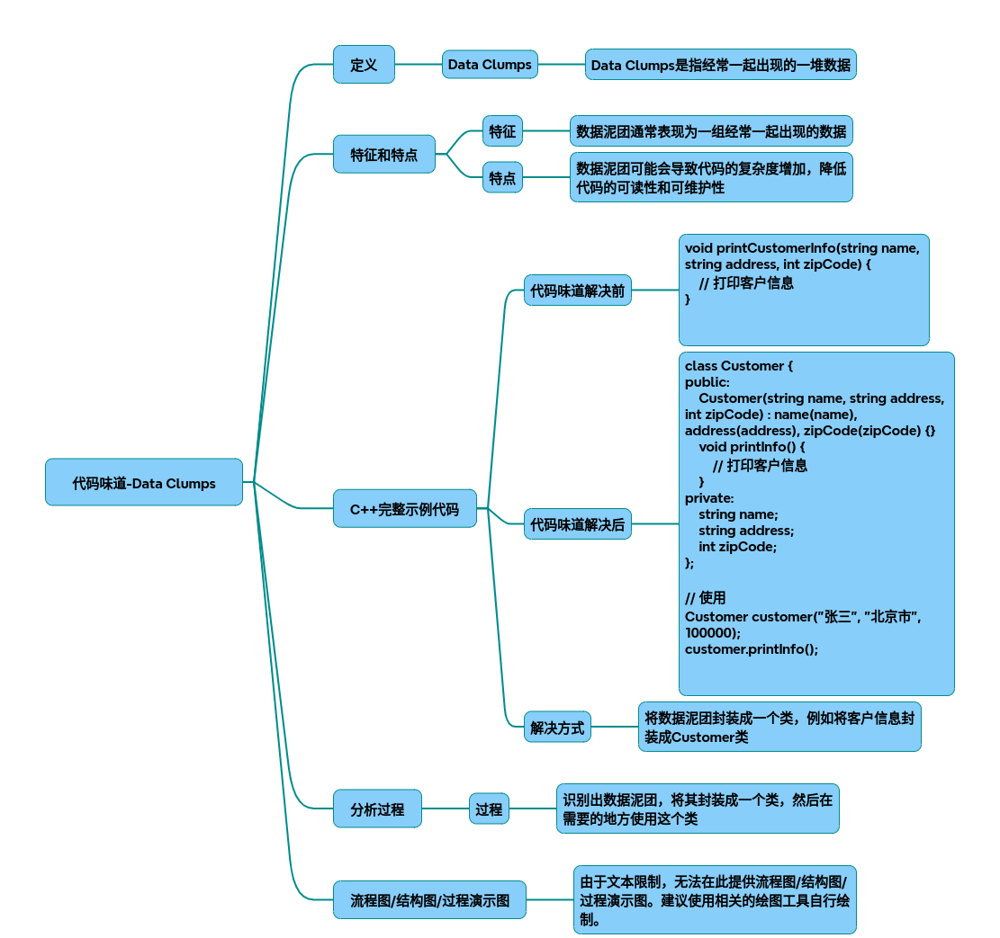

# 代码味道-数据泥团

代码味道之Data Clumps：数据泥团的识别与重构实践
### 一、定义与特征
Data Clumps（数据泥团）是代码异味中的一种典型表现，指一组数据元素（变量、参数等）频繁在多个地方成组出现，但未被封装为独立对象。其核心特征包括：

* 参数耦合：多个参数总是一起传递（如
void processOrder(int orderId, string userId, double amount, Date date)
）
* 成员变量散落：多个类中存在重复的变量组合（如订单号+用户ID+金额）
* 逻辑分散：对数据的操作分散在多个函数中

### 二、C++示例代码演示
问题代码（Data Clumps存在）
~~~cpp
// 订单处理类
class OrderProcessor {
public:
    void createOrder(int orderId, string userId, double amount, Date date) {
        validateOrder(orderId, userId, amount, date);
        saveToDatabase(orderId, userId, amount, date);
    }
 
    void updateOrder(int orderId, string userId, double amount, Date date) {
        // 重复的参数组合 
        checkUserCredit(userId, amount);
        updateDatabase(orderId, userId, amount, date);
    }
 
private:
    void validateOrder(int orderId, string userId, double amount, Date date) {
        // 验证逻辑 
    }
};
~~~
重构后代码（Data Clumps消除）
~~~cpp
// 封装订单数据 
struct OrderData {
    int orderId;
    string userId;
    double amount;
    Date date;
 
    bool isValid() const {
        // 集中式验证逻辑 
        return orderId > 0 && !userId.empty()  && amount > 0;
    }
};
 
// 重构后的订单处理类
class OrderProcessor {
public:
    void createOrder(const OrderData& data) {
        if (data.isValid())  {
            saveToDatabase(data);
        }
    }
 
    void updateOrder(const OrderData& data) {
        checkUserCredit(data.userId,  data.amount); 
        updateDatabase(data);
    }
 
private:
    void saveToDatabase(const OrderData& data) {
        // 数据库操作 
    }
};
~~~
 
### 三、重构过程分析 
 
#### 1. 识别数据泥团 
通过以下线索发现Data Clumps：
- **参数列表冗长**：`createOrder`和`updateOrder`均传递4个参数 
- **重复参数组合**：`userId`和`amount`在多个函数中成组出现 
- **验证逻辑分散**：订单有效性验证分布在多个函数中
 
#### 2. 封装策略 
采用**Introduce Parameter Object（引入参数对象）**模式：
1. 创建`OrderData`结构体封装相关字段 
2. 将分散的验证逻辑迁移至`OrderData`的`isValid()`方法 
3. 修改函数参数为`OrderData`对象 

#### 3. 改进效果 

| 指标                | 重构前 | 重构后 |
|---------------------|--------|--------|
| 函数参数数量        | 4      | 1      |
| 重复代码量          | 3处    | 0      |
| 维护成本            | 高     | 低     |
| 扩展性              | 差     | 优     |
 
---
 
### 四、解决方案总结 
 
#### 1. 核心原则 

- **单一职责**：数据操作与业务逻辑分离 
- **封装性**：通过对象隐藏数据细节 
- **DRY原则**：消除重复参数组合 
 
#### 2. 实践步骤 

1. **识别泥团**：通过参数列表、成员变量分布定位 
2. **创建对象**：将相关数据封装为独立类/结构体
3. **迁移逻辑**：将关联操作迁移到新对象中
4. **修改接口**：调整函数参数为新对象类型 
 
#### 3. 工具辅助 

- **静态分析工具**：SonarQube可检测长参数列表
- **IDE重构功能**：利用Extract Class等重构操作 
 
---
 
### 五、扩展思考 
当数据泥团涉及跨类操作时，可进一步采用**Domain-Driven Design（领域驱动设计）**模式，例如：
~~~cpp
// 领域对象设计 
class Order {
private:
    OrderData data;
    BillingService billing;
 
public:
    void placeOrder() {
        if (data.isValid())  {
            billing.processPayment(data.amount); 
            saveToRepository();
        }
    }
};
~~~
 
通过这种设计，数据泥团不仅被封装，还与业务逻辑形成有机整体，符合**高内聚低耦合**的设计原则。 
