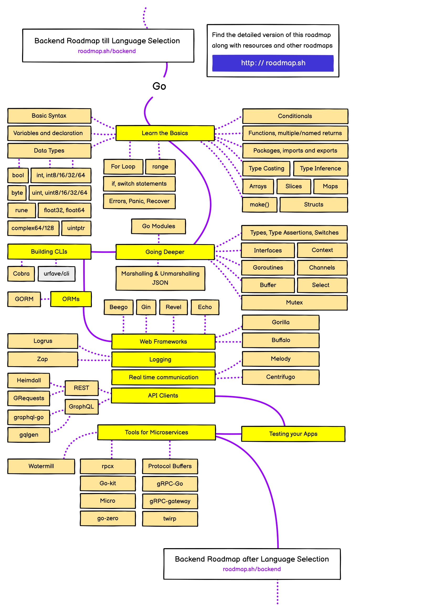

# Go

## 简介

Go语言是Google开发的一种静态强类型、编译型、并发型，并具有垃圾回收功能的编程语言，它用批判吸收的眼光，融合C语言、Java等众家之长，将简洁、高效演绎得淋漓尽致。

Go语言起源于2007年，当时Google的技术大神们备受C++越来越臃肿的困扰，决心开发一种新的语言来取代C++。他们认为：与其在臃肿的语言上不断增加新的特性，不如简化编程语言。于是，Golang这门新语言应运而生。

## 路线图:

