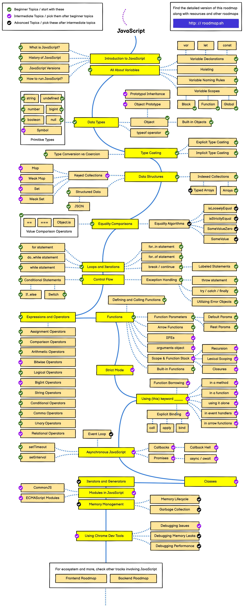

# JavaScript

## 简介

JavaScript是一种动态的编程语言，广泛应用于网页开发中，主要用于增强网页的交互性和动态性。作为Web开发的核心技术之一，它与HTML和CSS共同协作，HTML负责定义网页的内容结构，CSS处理样式和布局，而JavaScript则控制网页的行为和交互。用户可以利用JavaScript进行事件处理、表单验证、动画创建等多种功能。此外，JavaScript的应用已经扩展到服务器端（如Node.js）、移动应用开发和游戏开发等领域，成为现代编程环境中不可或缺的一部分。其跨平台和高适应性的特点，使得JavaScript成为全球最受欢迎和广泛使用的脚本语言之一。

## 路线图:

