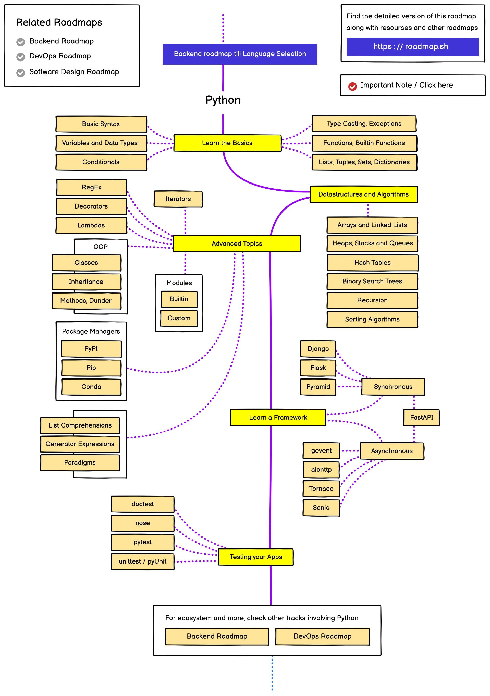

# Python

## 简介

Python（英国发音：/ˈpaɪθən/美国发音：/ˈpaɪθɑːn/）,是荷兰科学家吉多·范罗苏姆（Guido van Rossum），在1989年期间开发的计算机编程语言。在Python语言中，一切皆为对象，即使函数也是对象，有自身的属性。Python是解释型编程语言，运行Python程序时，需要将解释器翻译Python代码。

Python是一种不受局限、跨平台的开源编程语言，其数据处理速度快、功能强大且简单易学，在数据分析与处理中被广泛应用。而且，Python采用解释运行的方式，编写后无需进行编译即可直接通过解释器执行，具有典型的动态语言特点，编程效率极高。Python是完全面向对象的语言，数字、模块、字符串、数据结构都是对象，并且支持常见的类概念，如继承，重载，派生，多重继承。

2017年7月20日，IEEE发布2017年编程语言排行榜：Python高居首位。2018年3月，该语言作者在邮件列表上宣布Python 2.7将于2020年1月1日终止支持。用户如果想要在这个日期之后继续得到与Python 2.7有关的支持，则需要付费给商业供应商。

## 路线图:
