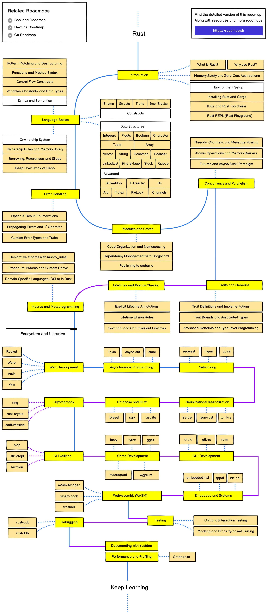

# Rust

## 简介

Rust是一种系统级编程语言，注重高性能、可靠性和生产力[1]，支持结构化编程、函数式编程、面向对象编程等多种编程范式。

Rust是编译型语言，没有运行时(Runtime)和垃圾回收(Garbage Collector)。Rust使用所有权机制来实现自动内存管理，并以此来保证内存安全。Rust是开源项目，目前托管在Github上，Rust和所有其他官方项目都采用Apache许可证2.0和MIT许可证双重许可[2]。Rust官方软件包管理器为Cargo。

## 路线图:

